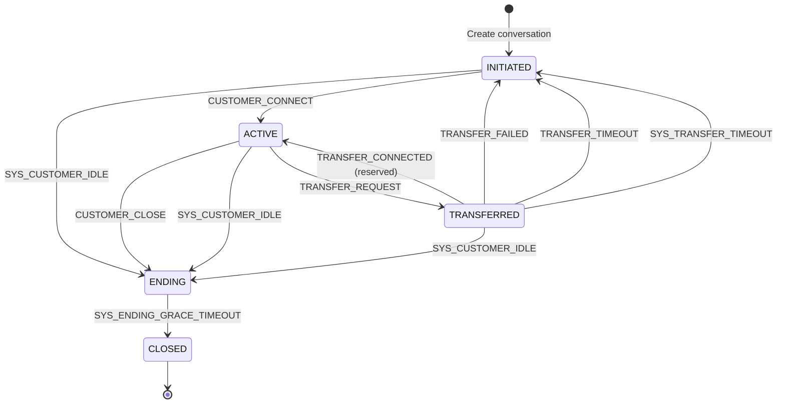
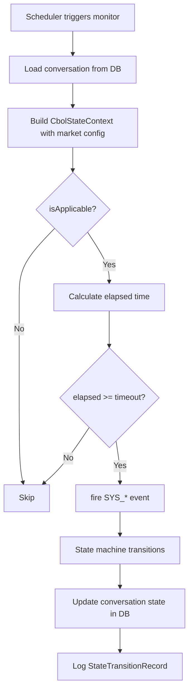
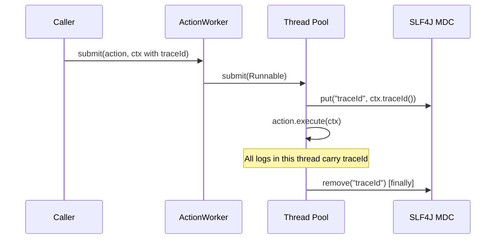
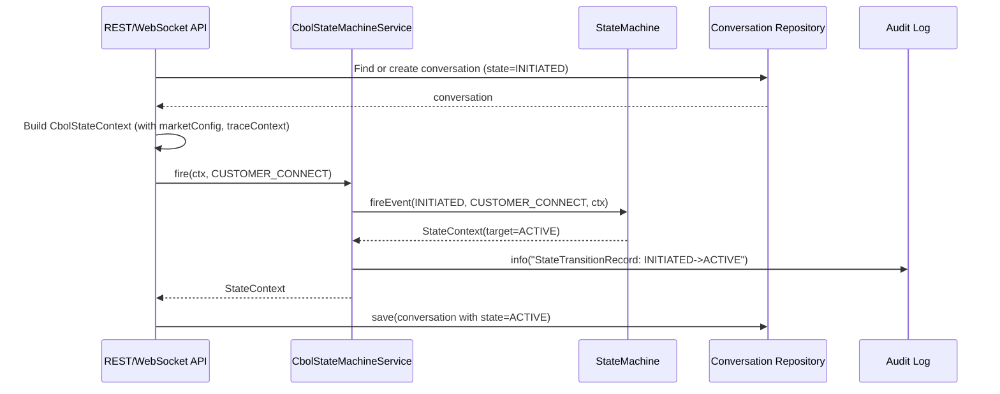
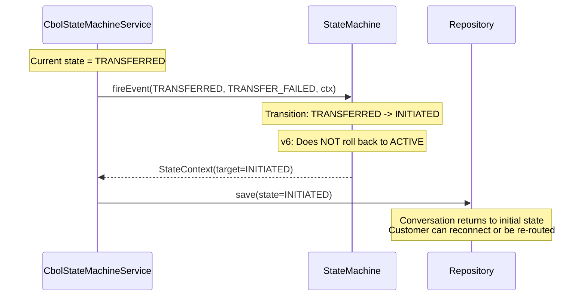

# CBOL Business Layer Design

> Version: 1.0 | Last Updated: 2026-09-01

## 1. Overview

The CBOL (AI Messaging Hub) business layer implements conversation lifecycle management using the core state machine framework. It models the flow of a customer conversation from initial connection through AI processing, agent transfer, and final closure.

**Key Characteristics:**
- **Dual-state model**: Conversation (business-level) + Interaction (channel-level, reserved)
- **Multi-market support**: Per-market configuration for timeouts and feature flags
- **Full-chain tracing**: TraceId propagation via SLF4J MDC across async boundaries
- **v6 design**: Transfer failures/timeouts return to INITIATED (no rollback to ACTIVE)
- **Automated monitors**: Three time-based monitors for idle detection, transfer timeout, and ending grace

## 2. Conversation State Model

### 2.1 States

```java
public enum ConversationState {
    INITIATED,    // Conversation created, waiting for customer connection
    ACTIVE,       // Customer connected, AI or agent actively handling
    TRANSFERRED,  // Transfer to human agent in progress
    ENDING,       // Conversation ending, grace period for survey/cleanup
    CLOSED        // Terminal state, conversation fully closed
}
```

### 2.2 State Descriptions

| State | Description | Entry Trigger | Exit Trigger |
|-------|-------------|---------------|--------------|
| INITIATED | Conversation created but customer not yet connected | System creates conversation | CUSTOMER_CONNECT |
| ACTIVE | Customer connected, active conversation | CUSTOMER_CONNECT | TRANSFER_REQUEST / CUSTOMER_CLOSE / SYS_CUSTOMER_IDLE |
| TRANSFERRED | Transfer to agent in progress | TRANSFER_REQUEST | TRANSFER_CONNECTED / TRANSFER_FAILED / TRANSFER_TIMEOUT / SYS_CUSTOMER_IDLE |
| ENDING | Grace period before closure | CUSTOMER_CLOSE / SYS_CUSTOMER_IDLE | SYS_ENDING_GRACE_TIMEOUT |
| CLOSED | Terminal state | SYS_ENDING_GRACE_TIMEOUT | (none) |

### 2.3 Events (ConversationFact)

```java
public enum ConversationFact {
    // LIFECYCLE
    CUSTOMER_CONNECT,      // Customer established connection
    AGENT_ATTACHED,        // Human agent joined (reserved)

    // TRANSFER
    TRANSFER_REQUEST,      // Request to transfer to human agent
    TRANSFER_CONNECTED,    // Agent successfully connected (reserved)
    TRANSFER_FAILED,       // Transfer failed (agent unavailable, rejected, etc.)
    TRANSFER_TIMEOUT,      // Transfer timed out waiting for agent

    // ENDING
    CUSTOMER_CLOSE,        // Customer explicitly closed
    AGENT_CLOSE,           // Agent closed (reserved)
    SURVEY_COMPLETE,       // Post-conversation survey completed (reserved)

    // SYSTEM (fired by monitors)
    SYS_CUSTOMER_IDLE,          // Customer idle threshold exceeded
    SYS_TRANSFER_TIMEOUT,       // Transfer duration exceeded threshold
    SYS_ENDING_GRACE_TIMEOUT    // Ending grace period exceeded
}
```

## 3. State Transition Diagram



### 3.1 Transition Table

| # | From | Event | To | Guard | Action | Notes |
|---|------|-------|-----|-------|--------|-------|
| 1 | INITIATED | CUSTOMER_CONNECT | ACTIVE | - | - | Customer connects |
| 2 | ACTIVE | TRANSFER_REQUEST | TRANSFERRED | transferEnabled | - | Request agent transfer |
| 3 | TRANSFERRED | TRANSFER_FAILED | INITIATED | - | - | v6: no rollback to ACTIVE |
| 4 | TRANSFERRED | TRANSFER_TIMEOUT | INITIATED | - | - | v6: no rollback to ACTIVE |
| 5 | TRANSFERRED | SYS_TRANSFER_TIMEOUT | INITIATED | - | - | Monitor-driven |
| 6 | ACTIVE | CUSTOMER_CLOSE | ENDING | - | - | Customer closes |
| 7 | INITIATED | SYS_CUSTOMER_IDLE | ENDING | - | - | Monitor-driven |
| 8 | ACTIVE | SYS_CUSTOMER_IDLE | ENDING | - | - | Monitor-driven |
| 9 | TRANSFERRED | SYS_CUSTOMER_IDLE | ENDING | - | - | Monitor-driven |
| 10 | ENDING | SYS_ENDING_GRACE_TIMEOUT | CLOSED | - | - | Monitor-driven, terminal |

## 4. Core Components

### 4.1 CbolStateContext

The aggregate context object passed through every state transition.

```java
@Builder
public record CbolStateContext(
    ConversationInstance conversation,      // Current conversation data
    InteractionInstance interaction,         // Channel/device data (reserved)
    StateMachineMarketConfig marketConfig,   // Market-level configuration
    TraceContext traceContext                // Trace identifiers
) {}
```

**Design Rationale:**
- Immutable record ensures thread safety
- Aggregates all data needed by guards, actions, and monitors in one object
- Market config is snapshot-based (captured at event time) to avoid mid-transition config changes

### 4.2 ConversationInstance

```java
@Builder
public record ConversationInstance(
    String conversationId,          // Unique conversation identifier
    ConversationState state,        // Current state (managed by caller)
    String market,                  // Market code (e.g., "HK", "SG", "UK")
    String customerId,              // Customer identifier
    String agentId,                 // Assigned agent (null if AI-only)
    Long lastActivityTs,            // Last customer activity timestamp
    Long transferStartTs,           // Transfer start timestamp (null if not transferring)
    Long endingStartTs              // Ending period start timestamp (null if not ending)
) {}
```

### 4.3 TraceContext

```java
@Builder
public record TraceContext(
    String traceId,                 // Full-chain trace identifier (UUID)
    String spanId,                  // Current span identifier (UUID)
    String parentSpanId,            // Parent span (null for root)
    long startTimeMs,               // Trace start timestamp
    Map<String, String> tags        // Additional trace metadata
) {
    public static TraceContext generate() { ... }
}
```

### 4.4 TraceMdcHelper

Utility for propagating trace context to SLF4J MDC (Mapped Diagnostic Context).

```java
public final class TraceMdcHelper {
    public static final String MDC_TRACE_ID = "traceId";
    public static final String MDC_SPAN_ID = "spanId";

    public static void set(TraceContext ctx) {
        if (ctx == null) return;
        MDC.put(MDC_TRACE_ID, ctx.traceId());
        MDC.put(MDC_SPAN_ID, ctx.spanId());
    }

    public static void clear() {
        MDC.remove(MDC_TRACE_ID);
        MDC.remove(MDC_SPAN_ID);
    }
}
```

**Usage Pattern (mandatory):**
```java
try {
    TraceMdcHelper.set(ctx.traceContext());
    // ... business logic ...
} finally {
    TraceMdcHelper.clear();  // MANDATORY: prevents memory leak in thread pools
}
```

## 5. Multi-Market Configuration

### 5.1 StateMachineMarketConfig

```java
@Builder
public record StateMachineMarketConfig(
    long customerIdleSeconds,       // Customer idle threshold (default: 300s = 5min)
    long transferTimeoutSeconds,     // Transfer timeout (default: 180s = 3min)
    long endingGraceSeconds,         // Ending grace period (default: 120s = 2min)
    boolean surveyEnabled,           // Whether post-conversation survey is enabled
    boolean transferEnabled,         // Whether human agent transfer is enabled
    boolean genesysEnabled,          // Whether Genesys integration is enabled
    String fallbackRoutingStrategy   // Strategy when transfer fails ("DROP", "RETRY", "QUEUE")
) {
    public static StateMachineMarketConfig defaultConfig() { ... }
}
```

### 5.2 MarketConfigProvider

```java
public interface MarketConfigProvider {
    StateMachineMarketConfig getConfig(String market);
    void invalidate(String market);

    class InMemoryProvider implements MarketConfigProvider {
        private final ConcurrentHashMap<String, StateMachineMarketConfig> cache;
        private final StateMachineMarketConfig fallback;

        public StateMachineMarketConfig getConfig(String market) {
            return cache.getOrDefault(market, fallback);
        }
        // ...
    }
}
```

**Design Notes:**
- `InMemoryProvider` is a reference implementation; production should use Redis-backed or config-center provider
- `invalidate(market)` allows cache refresh when config changes
- Fallback to `defaultConfig()` ensures no NPE for unknown markets

## 6. Monitors

### 6.1 AbstractTimeoutMonitor

Base class for all time-based monitors.

```java
public abstract class AbstractTimeoutMonitor {
    protected final CbolStateMachineService cbolStateMachineService;

    protected abstract boolean isApplicable(ConversationState state);
    protected abstract long timeoutSeconds(CbolStateContext ctx);
    protected abstract ConversationFact timeoutEvent();

    public void check(CbolStateContext ctx, long referenceTs) {
        if (!isApplicable(ctx.conversation().state())) return;
        long timeoutMs = TimeUnit.SECONDS.toMillis(timeoutSeconds(ctx));
        long elapsedMs = System.currentTimeMillis() - referenceTs;
        if (elapsedMs >= timeoutMs) {
            cbolStateMachineService.fire(ctx, timeoutEvent());
        }
    }
}
```

### 6.2 Monitor Implementations

| Monitor | Applicable States | Timeout Config | Event Fired | Reference Timestamp |
|---------|-------------------|----------------|-------------|---------------------|
| CustomerIdleMonitor | INITIATED, ACTIVE, TRANSFERRED | customerIdleSeconds | SYS_CUSTOMER_IDLE | lastActivityTs |
| TransferMonitor | TRANSFERRED | transferTimeoutSeconds | SYS_TRANSFER_TIMEOUT | transferStartTs |
| EndingGraceMonitor | ENDING | endingGraceSeconds | SYS_ENDING_GRACE_TIMEOUT | endingStartTs |

### 6.3 Monitor Execution Flow



## 7. ActionWorker (Async Execution)

### 7.1 Design

Executes state machine actions asynchronously with a bounded thread pool.

```java
public class ActionWorker {
    private final ExecutorService executor;

    public ActionWorker() {
        this(Runtime.getRuntime().availableProcessors(),  // core
             Runtime.getRuntime().availableProcessors() * 2,  // max
             60L,    // keepAlive seconds
             1000);  // queue capacity
    }

    public void submit(CbolAction action, CbolStateContext ctx) {
        executor.submit(() -> {
            try {
                TraceMdcHelper.set(ctx.traceContext());  // MDC propagation
                action.execute(ctx);
            } catch (RuntimeException e) {
                log.error("Action execution failed, conversationId={}", ..., e);
            } finally {
                TraceMdcHelper.clear();  // MANDATORY cleanup
            }
        });
    }
}
```

### 7.2 Thread Pool Configuration

| Parameter | Default Value | Rationale |
|-----------|--------------|-----------|
| corePoolSize | CPU cores | Minimum threads for baseline load |
| maximumPoolSize | CPU cores * 2 | Handles bursty IO-bound action workloads |
| keepAliveTime | 60s | Idle thread reclamation |
| queueCapacity | 1000 | Bounded queue prevents OOM |
| rejectionPolicy | CallerRunsPolicy | Backpressure: caller thread executes task |
| threadFactory | NamedThreadFactory | Thread names for debugging ("cbol-action-worker-N") |

### 7.3 MDC Propagation



## 8. CbolStateMachineService

### 8.1 Main Entry Point

```java
public class CbolStateMachineService {
    private final StateMachine<ConversationState, ConversationFact, CbolStateContext> convSm;

    public CbolStateMachineService() {
        this.convSm = CbolStateMachineRegistry.get(ConversationStateMachineFactory.MACHINE_ID);
    }

    public StateContext<ConversationState, ConversationFact, CbolStateContext> fire(
            CbolStateContext ctx, ConversationFact fact) {
        // Null validation
        Objects.requireNonNull(ctx, "ctx must not be null");
        Objects.requireNonNull(fact, "fact must not be null");

        TraceMdcHelper.set(ctx.traceContext());
        long start = System.currentTimeMillis();
        try {
            ConversationState from = ctx.conversation().state();
            StateContext<...> result = convSm.fireEvent(from, fact, ctx);

            // Audit logging
            StateTransitionRecord record = StateTransitionRecord.builder()
                .businessId(ctx.conversation().conversationId())
                .fromState(from.name())
                .toState(result.getTargetState().name())
                .fact(fact.name())
                .guardResult(result.isTransitionAccepted())
                .timestampMs(System.currentTimeMillis())
                .traceId(ctx.traceContext().traceId())
                .durationMs(System.currentTimeMillis() - start)
                .build();
            log.info("StateTransitionRecord: {}", record);
            return result;
        } finally {
            TraceMdcHelper.clear();
        }
    }
}
```

### 8.2 StateTransitionRecord (Audit)

```java
@Builder
public record StateTransitionRecord(
    String businessId,        // conversationId
    String fromState,         // source state name
    String toState,           // target state name
    String fact,              // event name
    boolean guardResult,      // whether transition was accepted
    long timestampMs,         // event timestamp
    String traceId,           // trace identifier
    long durationMs           // processing duration
) {}
```

## 9. Factory & Registry

### 9.1 ConversationStateMachineFactory

Builds and registers the conversation state machine with all 10 transition rules.

```java
public class ConversationStateMachineFactory {
    public static final String MACHINE_ID = "conversation";

    public static StateMachine<ConversationState, ConversationFact, CbolStateContext> build() {
        StateMachineBuilder<...> builder = StateMachineBuilder.builder(MACHINE_ID);

        // 1. INITIATED -> ACTIVE (customer connects)
        builder.transition().from(INITIATED).on(CUSTOMER_CONNECT).to(ACTIVE).and();

        // 2. ACTIVE -> TRANSFERRED (transfer requested)
        builder.transition().from(ACTIVE).on(TRANSFER_REQUEST).to(TRANSFERRED).and();

        // 3. TRANSFERRED -> INITIATED (transfer failed) [v6: no rollback]
        builder.transition().from(TRANSFERRED).on(TRANSFER_FAILED).to(INITIATED).and();

        // ... (all 10 transitions)

        StateMachine<...> sm = builder.build();
        CbolStateMachineRegistry.register(sm);
        return sm;
    }
}
```

### 9.2 CbolStateMachineRegistry

Singleton holder for the shared `StateMachineRegistry`.

```java
public final class CbolStateMachineRegistry {
    private static final StateMachineRegistry INSTANCE = new StateMachineRegistry();

    private CbolStateMachineRegistry() {}  // Singleton

    public static StateMachineRegistry getInstance() { return INSTANCE; }
    public static <S, E, C> void register(StateMachine<S, E, C> machine) { INSTANCE.register(machine); }
    public static <S, E, C> StateMachine<S, E, C> get(String machineId) { return INSTANCE.get(machineId); }
    public static void clear() { INSTANCE.clear(); }  // For test isolation
}
```

## 10. Typical Usage Flow

### 10.1 Customer Connects



### 10.2 Transfer Fails (v6 Behavior)



## 11. Error Handling

| Scenario | Exception | Handling |
|----------|-----------|----------|
| No transition for (state, event) | StateMachineException | Caller catches, returns 400 or logs warning |
| Guard condition fails | StateMachineException | Caller catches, returns 409 Conflict |
| Transition action fails | StateMachineException | Caller catches, retries or escalates |
| Entry/exit action fails | (none, best-effort) | Listener logs error, transition completes |
| Null context/event | NullPointerException | Fast-fail at service boundary |
| Async action fails | (logged only) | ActionWorker catches and logs with traceId |

## 12. Testing Strategy

| Level | Focus | Tools |
|-------|-------|-------|
| Unit | Individual transitions, guards, actions | JUnit 5 |
| Unit | Monitor timeout logic | JUnit 5 + Mock clock |
| Unit | MDC propagation in ActionWorker | JUnit 5 + CountDownLatch |
| Integration | Full conversation lifecycle | JUnit 5 + InMemoryProvider |
| Integration | Multi-market configuration | JUnit 5 + parameterized tests |

**Current Coverage:** 87% line / 71% branch (112 test cases)
