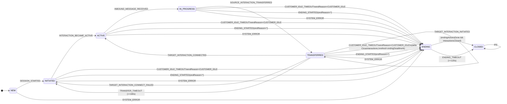
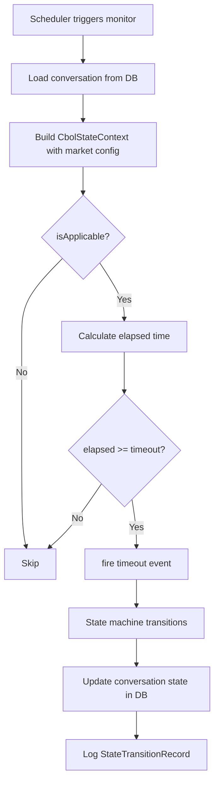
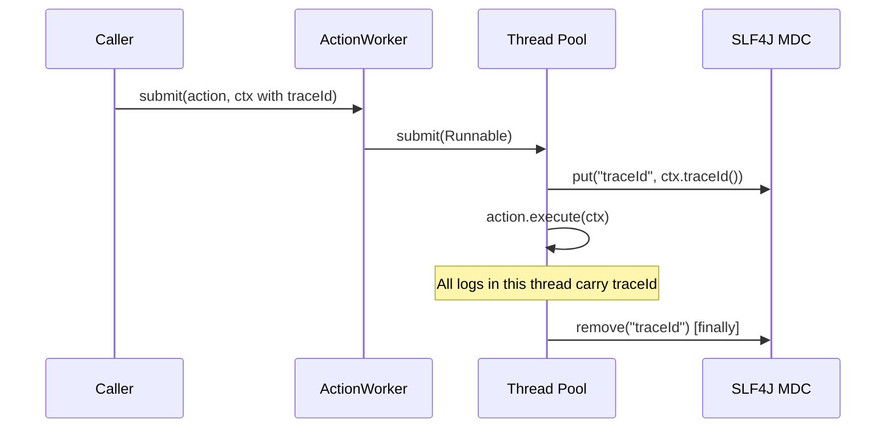
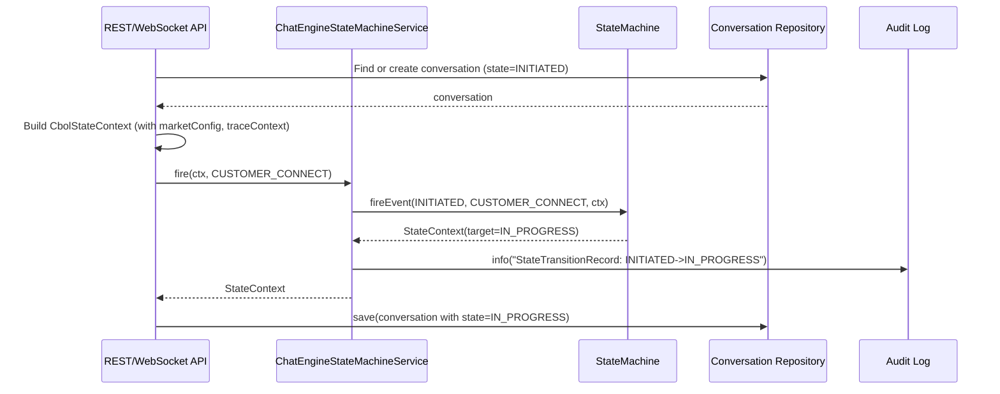
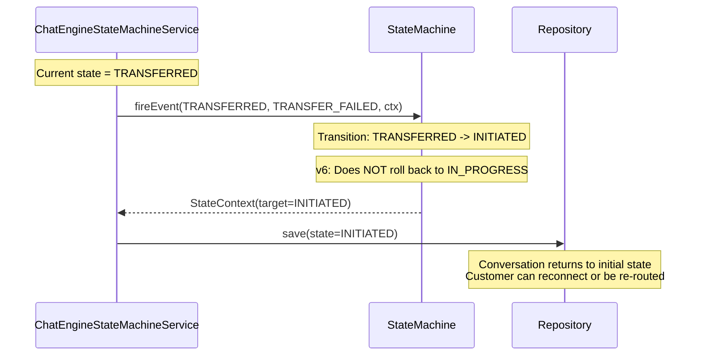

# Business Layer Design (Chat Engine + Agent Connector)

> Version: 4.0 | Last Updated: 2026-09-05
> Based on Alibaba COLA StateMachine: https://github.com/alibaba/COLA
> Aligned with Event-Driven Orchestration Design (v4.0)

## 1. Overview

The business layer implements conversation lifecycle management using **Alibaba COLA StateMachine** as the core engine. It is organized into **two separate modules** with clear system boundaries:

| Module | Package | Responsibility | External Systems |
|--------|---------|----------------|------------------|
| **chat-engine** | `com.selfdevelopment.chatengine` | Conversation state machine (business-level): 7 states (NEW, INITIATED, ACTIVE, IN_PROGRESS, TRANSFERRED, ENDING, CLOSED), 25+ events, 13 actions, multi-market config, monitors, repository | AIBot API, Chat History ODS |
| **agent-connector** | `com.selfdevelopment.agentconnector` | Interaction state machine (channel-level): 8 states (INITIATED, CONNECTED, IN_PROGRESS, DEGRADED, RECONNECTING, CONSULT_TRANSFER, TRANSFERRED, CLOSED), 20+ events, 14 actions, connector management | Genesys Cloud, Customer WebSocket |

**Key Characteristics:**
- **Powered by COLA StateMachine**: Uses `com.alibaba.cola.statemachine` as the core engine
- **Dual-state model**: Conversation (business-level) + Interaction (channel-level), each in its own module
- **Multi-market support**: Per-market configuration for timeouts and feature flags
- **Full-chain tracing**: TraceId propagation via SLF4J MDC across async boundaries
- **Event-Driven Orchestration (v4.0)**: Transfer failures/timeouts return to INITIATED (no rollback), Survey is field-based in ENDING, Customer Idle covers all wait states
- **Automated monitors**: Three time-based monitors for idle detection, transfer timeout, and ending grace
- **Action-first transition**: Actions execute before state change; if action fails, state does NOT change
- **Factory caching pattern**: COLA StateMachine does not allow rebuilding; factories use caching to prevent duplicate builds

## 2. Conversation State Model

### 2.1 States

```java
public enum ConversationState {
    NEW,                // Initial state, conversation created, waiting for interaction ready (or downstream assignment)
    INITIATED,          // Current bound interaction ready (InteractionState=CONNECTED)
    ACTIVE,             // Interaction became active, waiting for first inbound message
    IN_PROGRESS,        // Business in progress (first inbound message received)
    TRANSFERRED,        // CBOL cross-channel transfer phase (in-flight, waiting for target result or timeout)
    ENDING,             // Irreversible: pre-close orchestration (guarantees eventual CLOSED)
    CLOSED              // Final terminal state
}
```

### 2.2 State Descriptions

| State | Description | Entry Trigger | Exit Trigger |
|-------|-------------|---------------|--------------|
| NEW | Initial state, conversation created, preparation not done yet | System creates conversation record | SESSION_STARTED |
| INITIATED | Conversation initialized, downstream assignment done, waiting for interaction active | SESSION_STARTED | INTERACTION_BECAME_ACTIVE / ENDING_STARTED / CUSTOMER_IDLE_TIMEOUT / SYSTEM_ERROR |
| ACTIVE | Interaction became active, waiting for first inbound message | INTERACTION_BECAME_ACTIVE | INBOUND_MESSAGE_RECEIVED / ENDING_STARTED / CUSTOMER_IDLE_TIMEOUT / SYSTEM_ERROR |
| IN_PROGRESS | Business in progress, active messaging (includes survey as field in ENDING) | INBOUND_MESSAGE_RECEIVED / TARGET_INTERACTION_CONNECTED | SOURCE_INTERACTION_TRANSFERRED / ENDING_STARTED / CUSTOMER_IDLE_TIMEOUT / SYSTEM_ERROR |
| TRANSFERRED | Cross-channel transfer in-flight, waiting for target result or timeout | SOURCE_INTERACTION_TRANSFERRED | TARGET_INTERACTION_CONNECTED / TARGET_INTERACTION_CONNECT_FAILED / TRANSFER_TIMEOUT / ENDING_STARTED / CUSTOMER_IDLE_TIMEOUT / SYSTEM_ERROR |
| ENDING | Irreversible pre-close orchestration, guarantees eventual CLOSED | ENDING_STARTED / CUSTOMER_IDLE_TIMEOUT / SYSTEM_ERROR | ENDING_TIMEOUT (forced) / (endingActionsDone && interactionsClosed) |
| CLOSED | Final terminal state, conversation fully closed | ENDING_TIMEOUT / ENDING_ACTIONS_COMPLETED + ALL_INTERACTIONS_ENDED | (none) |

**Note**: Survey is field-based in ENDING, not a separate state. `SURVEY_SUBMITTED`, `SURVEY_TIMEOUT`, `SURVEY_SKIPPED` are internal transitions within ENDING (ENDING → ENDING).

### 2.3 Events (ConversationFact)

```java
public enum ConversationFact {
    // lifecycle
    SESSION_STARTED,
    ALL_INTERACTIONS_ENDED,

    // readiness & messaging
    INTERACTION_BECAME_ACTIVE,
    INBOUND_MESSAGE_RECEIVED,

    // ending
    ENDING_STARTED,              // payload: endReason
    ENDING_ACTIONS_COMPLETED,
    ENDING_TIMEOUT,              // force close at ending deadline

    // customer idle (ideal rule)
    CUSTOMER_IDLE_TIMEOUT,

    // survey (field in ENDING)
    SURVEY_SUBMITTED,
    SURVEY_TIMEOUT,              // endReason=CUSTOMER_IDLE
    SURVEY_SKIPPED,

    // transfer (cross-channel)
    SOURCE_INTERACTION_TRANSFERRED,
    TARGET_INTERACTION_INITIATED,
    TARGET_INTERACTION_CONNECTED,
    TARGET_INTERACTION_CONNECT_FAILED, // no rollback; conversation returns INITIATED
    TRANSFER_TIMEOUT,                 // no rollback; conversation returns INITIATED

    // genesys same-channel / consult (conversation no-op)
    GENESYS_CONSULT_TRANSFER_STARTED,
    GENESYS_CONSULT_TRANSFER_ENDED,
    GENESYS_AGENT_TRANSFER_STARTED,
    GENESYS_AGENT_TRANSFER_COMPLETED,
    GENESYS_AGENT_TRANSFER_FAILED,

    // system
    SYSTEM_ERROR,

    // downstream availability
    DOWNSTREAM_UNAVAILABLE
}
```

## 3. State Transition Diagram



### 3.1 Transition Table

| # | From | Event | To | Guard | Action | Notes |
|---|------|-------|-----|-------|--------|-------|
| 1 | NEW | SESSION_STARTED | INITIATED | - | SessionStartedAction | Initiate downstream assignment |
| 2 | INITIATED | INTERACTION_BECAME_ACTIVE | ACTIVE | - | InteractionBecameActiveAction | Set activeAt, send welcome |
| 3 | ACTIVE | INBOUND_MESSAGE_RECEIVED | IN_PROGRESS | - | InboundMessageReceivedAction | Set lastInboundAt |
| 4 | INITIATED | DOWNSTREAM_UNAVAILABLE | INITIATED | - | (no action) | Notify system unavailable |
| 5 | IN_PROGRESS | SOURCE_INTERACTION_TRANSFERRED | TRANSFERRED | transferEnabled | SourceInteractionTransferredAction | Set transferInFlight=true |
| 6 | TRANSFERRED | TARGET_INTERACTION_INITIATED | TRANSFERRED | - | TargetInteractionInitiatedAction | Internal, execute ConnectTargetCmd |
| 7 | TRANSFERRED | TARGET_INTERACTION_CONNECTED | ACTIVE | - | TargetInteractionConnectedAction | Set transferInFlight=false |
| 8 | TRANSFERRED | TARGET_INTERACTION_CONNECT_FAILED | INITIATED | - | TargetInteractionConnectFailedAction | v4.0: no rollback, re-route |
| 9 | TRANSFERRED | TRANSFER_TIMEOUT | INITIATED | - | TransferTimeoutAction | v4.0: no rollback, re-route |
| 10 | INITIATED/ACTIVE/IN_PROGRESS/TRANSFERRED | ENDING_STARTED | ENDING | - | EndingStartedAction | Set endReason, trigger ending actions |
| 11 | ANY (except CLOSED) | SYSTEM_ERROR | ENDING | - | SystemErrorAction | Set endReason=SYSTEM_ERROR |
| 12 | INITIATED/ACTIVE/IN_PROGRESS/TRANSFERRED | CUSTOMER_IDLE_TIMEOUT | ENDING | - | CustomerIdleTimeoutAction | endReason=CUSTOMER_IDLE |
| 13 | ENDING | ENDING_ACTIONS_COMPLETED | ENDING/CLOSED | - | (no action) | Set endingActionsDone=true |
| 14 | ENDING | ALL_INTERACTIONS_ENDED | ENDING/CLOSED | - | (no action) | Set interactionsClosed=true |
| 15 | ENDING | ENDING_TIMEOUT | CLOSED | - | EndingTimeoutAction | Forced close, record alert |
| 16 | ENDING | SURVEY_SUBMITTED | ENDING | - | (no action) | Internal, surveyStatus=SUBMITTED |
| 17 | ENDING | SURVEY_TIMEOUT | ENDING | - | (no action) | Internal, surveyStatus=TIMEOUT, endReason=CUSTOMER_IDLE |
| 18 | ENDING | SURVEY_SKIPPED | ENDING | - | (no action) | Internal, surveyStatus=SKIPPED |

## 4. Core Components

### 4.1 CbolStateContext

The aggregate context object passed through every state transition.

```java
@Builder
public record CbolStateContext(
    ConversationInstance conversation,      // Current conversation data
    InteractionInstance interaction,         // Channel/device data (reserved)
    StateMachineMarketConfig marketConfig,   // Market-level configuration
    TraceContext traceContext                // Trace identifiers
) {}
```

**Design Rationale:**
- Immutable record ensures thread safety
- Aggregates all data needed by guards, actions, and monitors in one object
- Market config is snapshot-based (captured at event time) to avoid mid-transition config changes

### 4.2 ConversationInstance

```java
@Builder
public record ConversationInstance(
    String conversationId,          // Unique conversation identifier
    ConversationState state,        // Current state (managed by caller)
    String market,                  // Market code (e.g., "HK", "SG", "UK")
    String customerId,              // Customer identifier
    String agentId,                 // Assigned agent (null if AI-only)
    Long lastActivityTs,            // Last customer activity timestamp
    Long transferStartTs,           // Transfer start timestamp (null if not transferring)
    Long endingStartTs              // Ending period start timestamp (null if not ending)
) {}
```

### 4.3 TraceContext

```java
@Builder
public record TraceContext(
    String traceId,                 // Full-chain trace identifier (UUID)
    String spanId,                  // Current span identifier (UUID)
    String parentSpanId,            // Parent span (null for root)
    long startTimeMs,               // Trace start timestamp
    Map<String, String> tags        // Additional trace metadata
) {
    public static TraceContext generate() { ... }
}
```

### 4.4 TraceMdcHelper

Utility for propagating trace context to SLF4J MDC (Mapped Diagnostic Context).

```java
public final class TraceMdcHelper {
    public static final String MDC_TRACE_ID = "traceId";
    public static final String MDC_SPAN_ID = "spanId";

    public static void set(TraceContext ctx) {
        if (ctx == null) return;
        MDC.put(MDC_TRACE_ID, ctx.traceId());
        MDC.put(MDC_SPAN_ID, ctx.spanId());
    }

    public static void clear() {
        MDC.remove(MDC_TRACE_ID);
        MDC.remove(MDC_SPAN_ID);
    }
}
```

**Usage Pattern (mandatory):**
```java
try {
    TraceMdcHelper.set(ctx.traceContext());
    // ... business logic ...
} finally {
    TraceMdcHelper.clear();  // MANDATORY: prevents memory leak in thread pools
}
```

## 5. Multi-Market Configuration

### 5.1 StateMachineMarketConfig

```java
@Builder
public record StateMachineMarketConfig(
    long customerIdleSeconds,       // Customer idle threshold (default: 300s = 5min)
    long transferTimeoutSeconds,     // Transfer timeout (default: 180s = 3min)
    long endingGraceSeconds,         // Ending grace period (default: 120s = 2min)
    boolean surveyEnabled,           // Whether post-conversation survey is enabled
    boolean transferEnabled,         // Whether human agent transfer is enabled
    boolean genesysEnabled,          // Whether Genesys integration is enabled
    String fallbackRoutingStrategy   // Strategy when transfer fails ("DROP", "RETRY", "QUEUE")
) {
    public static StateMachineMarketConfig defaultConfig() { ... }
}
```

### 5.2 MarketConfigProvider

```java
public interface MarketConfigProvider {
    StateMachineMarketConfig getConfig(String market);
    void invalidate(String market);

    class InMemoryProvider implements MarketConfigProvider {
        private final ConcurrentHashMap<String, StateMachineMarketConfig> cache;
        private final StateMachineMarketConfig fallback;

        public StateMachineMarketConfig getConfig(String market) {
            return cache.getOrDefault(market, fallback);
        }
        // ...
    }
}
```

**Design Notes:**
- `InMemoryProvider` is a reference implementation; production should use Redis-backed or config-center provider
- `invalidate(market)` allows cache refresh when config changes
- Fallback to `defaultConfig()` ensures no NPE for unknown markets

## 6. Monitors

### 6.1 AbstractTimeoutMonitor

Base class for all time-based monitors.

```java
public abstract class AbstractTimeoutMonitor {
    protected final ChatEngineStateMachineService ChatEngineStateMachineService;

    protected abstract boolean isApplicable(ConversationState state);
    protected abstract long timeoutSeconds(CbolStateContext ctx);
    protected abstract ConversationFact timeoutEvent();

    public void check(CbolStateContext ctx, long referenceTs) {
        if (!isApplicable(ctx.conversation().state())) return;
        long timeoutMs = TimeUnit.SECONDS.toMillis(timeoutSeconds(ctx));
        long elapsedMs = System.currentTimeMillis() - referenceTs;
        if (elapsedMs >= timeoutMs) {
            ChatEngineStateMachineService.fire(ctx, timeoutEvent());
        }
    }
}
```

### 6.2 Monitor Implementations

| Monitor | Applicable States | Timeout Config | Event Fired | Reference Timestamp |
|---------|-------------------|----------------|-------------|---------------------|
| CustomerIdleMonitor | INITIATED, ACTIVE, IN_PROGRESS, TRANSFERRED | customerIdleSeconds | CUSTOMER_IDLE_TIMEOUT | lastInboundAt/activeAt |
| TransferMonitor | TRANSFERRED | transferTimeoutSeconds | TRANSFER_TIMEOUT | transferDeadlineAt |
| EndingMonitor | ENDING | endingGraceSeconds | ENDING_TIMEOUT | endingDeadlineAt |

### 6.3 Monitor Execution Flow



## 7. ActionWorker (Async Execution)

> **[RESERVED UTILITY - Currently not used in production]**
>
> The current state machine uses **action-first transition** (synchronous execution before state change).
> This worker is reserved for future non-critical async actions (notifications, audit logging).

### 7.1 Design

Executes state machine actions asynchronously with a bounded thread pool.

```java
public class ActionWorker {
    private final ExecutorService executor;

    public ActionWorker() {
        this(Runtime.getRuntime().availableProcessors(),  // core
             Runtime.getRuntime().availableProcessors() * 2,  // max
             60L,    // keepAlive seconds
             1000);  // queue capacity
    }

    public void submit(Action<ConversationState, ConversationFact, CbolStateContext> action,
                       ConversationState from, ConversationState to,
                       ConversationFact event, CbolStateContext ctx) {
        executor.submit(() -> {
            try {
                TraceMdcHelper.set(ctx.traceContext());  // MDC propagation
                action.execute(from, to, event, ctx);  // COLA Action interface
            } catch (RuntimeException e) {
                log.error("Action execution failed, conversationId={}", ctx.conversation().conversationId(), e);
            } finally {
                TraceMdcHelper.clear();  // MANDATORY cleanup
            }
        });
    }
}
```

### 7.2 Thread Pool Configuration

| Parameter | Default Value | Rationale |
|-----------|--------------|-----------|
| corePoolSize | CPU cores | Minimum threads for baseline load |
| maximumPoolSize | CPU cores * 2 | Handles bursty IO-bound action workloads |
| keepAliveTime | 60s | Idle thread reclamation |
| queueCapacity | 1000 | Bounded queue prevents OOM |
| rejectionPolicy | CallerRunsPolicy | Backpressure: caller thread executes task |
| threadFactory | NamedThreadFactory | Thread names for debugging ("cbol-action-worker-N") |

### 7.3 MDC Propagation



### 7.4 Submission Modes

ActionWorker supports three submission modes for different use cases:

#### 7.4.1 Fire-and-Forget (`submit`)

Original mode for simple use cases where execution result is not needed. Exceptions are caught and logged only.

```java
// Fire-and-forget: exceptions are logged only
worker.submit(action, stateContext);
```

**Use case**: Non-critical background tasks where failure is acceptable (e.g., audit logging, metrics collection).

#### 7.4.2 Result Tracking (`submitWithResult`)

Returns a `CompletableFuture<Void>` that completes when the action finishes. Callers can track execution result and handle exceptions.

```java
// Result tracking: get CompletableFuture for result tracking
CompletableFuture<Void> future = worker.submitWithResult(action, stateContext);

// Chain operations
future.thenRun(() -> log.info("Action completed successfully"))
      .exceptionally(ex -> {
          log.error("Action failed", ex);
          // Handle failure (e.g., retry, alert, fallback)
          return null;
      });

// Or block and wait
try {
    future.get(3, TimeUnit.SECONDS);
} catch (ExecutionException e) {
    // Handle action exception
}
```

**Use case**: Critical business operations where failure needs to be handled (e.g., payment processing, state transitions that require confirmation).

#### 7.4.3 Callback-based (`submitWithCallback`)

Supports success and failure callbacks for event-driven programming style.

```java
// Callback-based: success/failure callbacks
worker.submitWithCallback(action, stateContext,
    ctx -> {
        // Success callback
        log.info("Action completed for conversation: {}", ctx.getBusinessContext().conversation().conversationId());
        // Trigger next step in workflow
    },
    ex -> {
        // Failure callback
        log.error("Action failed", ex);
        // Trigger error handling workflow
        alertService.notify("Action failed: " + ex.getMessage());
    });
```

**Use case**: Workflow orchestration where the next step depends on the execution result (e.g., saga pattern, event-driven architecture).

#### 7.4.4 Mode Comparison

| Mode | Return Value | Exception Handling | Use Case |
|------|-------------|-------------------|----------|
| `submit` | void | Logged only | Non-critical background tasks |
| `submitWithResult` | `CompletableFuture<Void>` | Propagated via Future | Critical operations needing result tracking |
| `submitWithCallback` | void | Via onFailure callback | Event-driven workflow orchestration |

### 7.5 Concrete Action Implementations

The chat-engine module provides **6 concrete action implementations** that directly implement the core `Action<ConversationState, ConversationFact, CbolStateContext>` interface. Each action encapsulates the business logic for a specific state transition.

> **Design principle**: Actions are the gatekeepers of state transitions. A transition from state A to state B only completes if the associated action executes successfully (action-first transition).

### 7.5.1 Action Overview

| Action Class | Transition | Business Logic |
|-------------|-----------|----------------|
| `CustomerConnectAction` | INITIATED → IN_PROGRESS | Create conversation record, send welcome message, initialize session, notify AI bot |
| `TransferRequestAction` | IN_PROGRESS → TRANSFERRED | Check agent availability, request routing to Genesys queue, notify customer, record transfer start |
| `TransferFailedAction` | TRANSFERRED → INITIATED | Record failure reason, cleanup transfer state, notify customer, trigger re-routing |
| `CustomerCloseAction` | IN_PROGRESS → ENDING | Mark conversation ending, send closing confirmation, release agent resources, record ending start |
| `SurveyStartAction` | IN_PROGRESS → IN_PROGRESS | Create survey record, send survey invitation, set survey timeout |
| `SurveyCompleteAction` | IN_PROGRESS → ENDING | Save survey results, calculate NPS/CSAT score, cancel survey timeout, trigger ending grace |

### 7.5.2 Action Implementation Pattern

All actions follow the same implementation pattern:

```java
@Slf4j
public class CustomerConnectAction 
    implements Action<ConversationState, ConversationFact, CbolStateContext> {

    @Override
    public void execute(ConversationState from, ConversationState to,
                        ConversationFact event, CbolStateContext ctx) {
        // 1. Extract data from context
        String conversationId = ctx.conversation().conversationId();
        
        // 2. Execute business logic (simulated in demo, real implementation calls services)
        createConversationRecord(ctx);
        sendWelcomeMessage(ctx);
        
        // 3. Log completion
        log.info("CustomerConnectAction completed: conversationId={}, {} -> {}",
                conversationId, from, to);
    }
}
```

### 7.5.3 Binding Actions to Transitions

Actions are bound to transitions in `ConversationStateMachineFactory` using the `.perform(action)` method:

```java
// Action instances (stateless, can be shared)
private static final CustomerConnectAction CUSTOMER_CONNECT_ACTION = new CustomerConnectAction();

// Bind action to transition
builder.transition()
    .from(ConversationState.INITIATED)
    .on(ConversationFact.CUSTOMER_CONNECT)
    .to(ConversationState.IN_PROGRESS)
    .perform(CUSTOMER_CONNECT_ACTION)  // Action executes before state change
    .and();
```

### 7.5.4 Action Failure Handling

When an action throws an unhandled `RuntimeException`:
1. The state does **NOT** change (source state is preserved) — COLA action-first principle
2. `StateMachineException` is thrown
3. The caller can catch and handle (retry, escalate, or trigger failover)
4. Implement failover in the business layer (catch `StateMachineException`, then fire `SYS_ACTION_FAILED` event → ERROR state)

```java
try {
    ConversationState newState = machine.fireEvent(state, event, ctx);
} catch (StateMachineException e) {
    // Action failed, state unchanged
    log.error("Transition failed: {}", e.getMessage());
    // Option 1: Retry
    // Option 2: Trigger failover (business layer fires SYS_ACTION_FAILED)
    // Option 3: Escalate to human
}
```

## 8. ChatEngineStateMachineService

### 8.1 Main Entry Point

```java
public class ChatEngineStateMachineService {
    private final StateMachine<ConversationState, ConversationFact, CbolStateContext> convSm;

    public ChatEngineStateMachineService() {
        this.convSm = StateMachineFactory.get(ConversationStateMachineFactory.MACHINE_ID);
    }

    public ConversationState fire(
            CbolStateContext ctx, ConversationFact fact) {
        // Null validation
        Objects.requireNonNull(ctx, "ctx must not be null");
        Objects.requireNonNull(fact, "fact must not be null");

        TraceMdcHelper.set(ctx.traceContext());
        long start = System.currentTimeMillis();
        try {
            ConversationState from = ctx.conversation().state();
            ConversationState to = convSm.fireEvent(from, fact, ctx);

            // Audit logging
            log.info("State transition: {} --({})--> {}, conversationId={}, traceId={}, durationMs={}",
                    from, fact, to,
                    ctx.conversation().conversationId(),
                    ctx.traceContext().traceId(),
                    System.currentTimeMillis() - start);
            return to;
        } finally {
            TraceMdcHelper.clear();
        }
    }
}
```

### 8.2 StateTransitionRecord (Audit)

```java
@Builder
public record StateTransitionRecord(
    String businessId,        // conversationId
    String fromState,         // source state name
    String toState,           // target state name
    String fact,              // event name
    boolean guardResult,      // whether transition was accepted
    long timestampMs,         // event timestamp
    String traceId,           // trace identifier
    long durationMs           // processing duration
) {}
```

## 9. Factory & Registry

### 9.1 ConversationStateMachineFactory

Builds and registers the conversation state machine with all 23 transition rules (T01-T23).

```java
public class ConversationStateMachineFactory {
    public static final String MACHINE_ID = "conversation";

    public static StateMachine<ConversationState, ConversationFact, CbolStateContext> build() {
        StateMachineBuilder<...> builder = StateMachineBuilder.builder(MACHINE_ID);

        // 1. INITIATED -> IN_PROGRESS (customer connects)
        builder.transition().from(INITIATED).on(CUSTOMER_CONNECT).to(IN_PROGRESS).and();

        // 2. IN_PROGRESS -> TRANSFERRED (transfer requested)
        builder.transition().from(IN_PROGRESS).on(TRANSFER_REQUEST).to(TRANSFERRED).and();

        // 3. TRANSFERRED -> INITIATED (transfer failed) [v6: no rollback]
        builder.transition().from(TRANSFERRED).on(TRANSFER_FAILED).to(INITIATED).and();

        // ... (all 10 transitions)

        StateMachine<...> sm = builder.build(MACHINE_ID);
        StateMachineFactory.register(sm);
        return sm;
    }
}
```

### 9.2 State Machine Factory (COLA)

The chat-engine module uses Alibaba COLA's `StateMachineFactory` for state machine registration and lookup. COLA StateMachine does NOT allow rebuilding a state machine with the same ID, so factories use a caching pattern.

```java
// Register a state machine
StateMachineFactory.register(machine);

// Look up a state machine by ID
StateMachine<ConversationState, ConversationFact, CbolStateContext> sm =
    StateMachineFactory.get(ConversationStateMachineFactory.MACHINE_ID);

// Factory caching pattern (recommended)
public static StateMachine<...> build() {
    try {
        StateMachine<...> existing = StateMachineFactory.get(MACHINE_ID);
        if (existing != null) return existing;
    } catch (Exception ignored) {
        // Not built yet
    }
    synchronized (Factory.class) {
        // Double-check + build + register
    }
}
```

**Design note**: Both chat-engine and agent-connector share the same `StateMachineFactory`. Since each state machine has a unique machine ID (`conversation` vs `interaction`), there are no conflicts. COLA's `StateMachineFactory` is a global singleton that simplifies the API and eliminates duplicate registry holder classes.

## 10. Typical Usage Flow

### 10.1 Customer Connects



### 10.2 Transfer Fails (v6 Behavior)



## 11. Error Handling

| Scenario | Exception | Handling |
|----------|-----------|----------|
| No transition for (state, event) | StateMachineException | Caller catches, returns 400 or logs warning |
| Guard condition fails | StateMachineException | Caller catches, returns 409 Conflict |
| Transition action fails | StateMachineException | Caller catches, retries or escalates |
| Entry/exit action fails | (none, best-effort) | Listener logs error, transition completes |
| Null context/event | NullPointerException | Fast-fail at service boundary |
| Async action fails | (logged only) | ActionWorker catches and logs with traceId |

## 12. Testing Strategy

| Level | Focus | Tools |
|-------|-------|-------|
| Unit | Individual transitions, guards, actions | JUnit 5 |
| Unit | Monitor timeout logic | JUnit 5 + Mock clock |
| Unit | MDC propagation in ActionWorker | JUnit 5 + CountDownLatch |
| Integration | Full conversation lifecycle | JUnit 5 + InMemoryProvider |
| Integration | Multi-market configuration | JUnit 5 + parameterized tests |

**Current Coverage:** 83% line / 71% branch (327 test cases)
