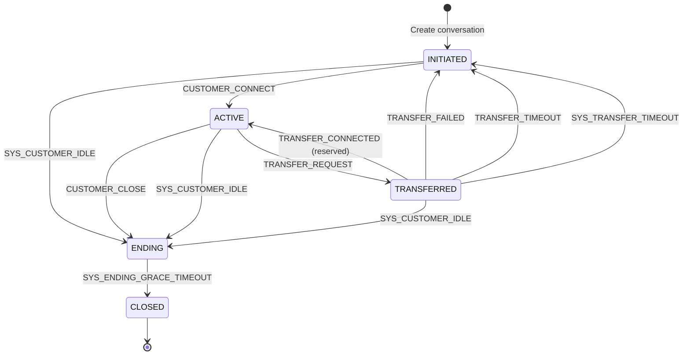
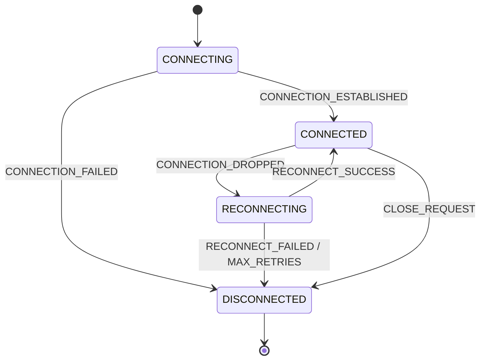
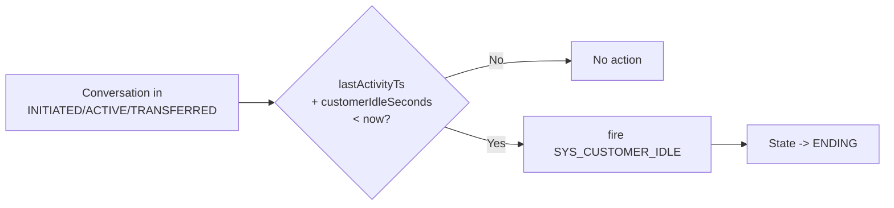
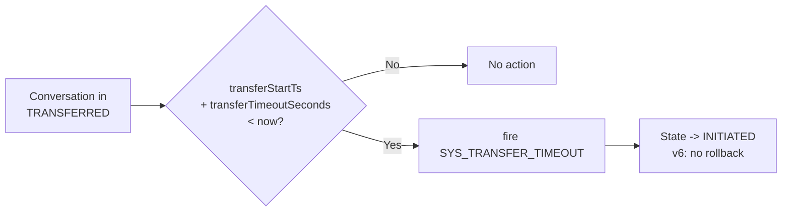
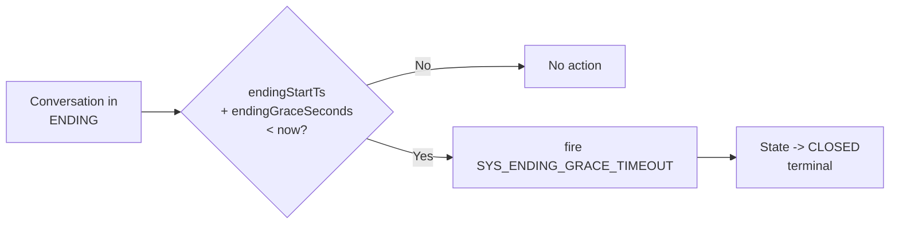

# State Transition Diagrams & Tables

> Version: 1.0 | Last Updated: 2026-09-01

## 1. Conversation State Machine

### 1.1 Full State Diagram



### 1.2 Transition Table

| ID | Source | Event | Target | Guard | Action | Monitor | v6 Note |
|----|--------|-------|--------|-------|--------|---------|---------|
| T01 | INITIATED | CUSTOMER_CONNECT | ACTIVE | - | - | - | Customer establishes connection |
| T02 | ACTIVE | TRANSFER_REQUEST | TRANSFERRED | transferEnabled | - | - | Request human agent |
| T03 | TRANSFERRED | TRANSFER_CONNECTED | ACTIVE | - | - | - | Reserved for future |
| T04 | TRANSFERRED | TRANSFER_FAILED | INITIATED | - | - | - | **v6: no rollback to ACTIVE** |
| T05 | TRANSFERRED | TRANSFER_TIMEOUT | INITIATED | - | - | - | **v6: no rollback to ACTIVE** |
| T06 | ACTIVE | CUSTOMER_CLOSE | ENDING | - | - | - | Customer explicitly closes |
| T07 | INITIATED | SYS_CUSTOMER_IDLE | ENDING | - | - | CustomerIdleMonitor | Idle before connect |
| T08 | ACTIVE | SYS_CUSTOMER_IDLE | ENDING | - | - | CustomerIdleMonitor | Customer idle timeout |
| T09 | TRANSFERRED | SYS_CUSTOMER_IDLE | ENDING | - | - | CustomerIdleMonitor | Idle during transfer |
| T10 | TRANSFERRED | SYS_TRANSFER_TIMEOUT | INITIATED | - | - | TransferMonitor | **v6: no rollback** |
| T11 | ENDING | SYS_ENDING_GRACE_TIMEOUT | CLOSED | - | - | EndingGraceMonitor | Terminal transition |

### 1.3 State Entry/Exit Actions

| State | Entry Action | Exit Action |
|-------|-------------|-------------|
| INITIATED | (none) | (none) |
| ACTIVE | Send welcome message (reserved) | Notify channel (reserved) |
| TRANSFERRED | Initiate transfer request | Cancel pending transfer (reserved) |
| ENDING | Start grace period timer | Send survey (if surveyEnabled) |
| CLOSED | Clean up resources, archive conversation | (none, terminal) |

## 2. Interaction State Machine (Reserved)

### 2.1 States

```java
public enum InteractionState {
    CONNECTING,     // Channel establishing connection
    CONNECTED,      // Channel active, messages flowing
    RECONNECTING,   // Channel dropped, attempting reconnect
    DISCONNECTED    // Channel terminated
}
```

### 2.2 State Diagram (Reserved)



## 3. Monitor Trigger Diagrams

### 3.1 CustomerIdleMonitor



### 3.2 TransferMonitor



### 3.3 EndingGraceMonitor



## 4. Event Classification

### 4.1 By Source

| Category | Events | Source |
|----------|--------|--------|
| Customer-driven | CUSTOMER_CONNECT, CUSTOMER_CLOSE | Customer action via channel |
| Agent-driven | AGENT_ATTACHED, AGENT_CLOSE | Human agent action (reserved) |
| System-driven | TRANSFER_REQUEST, TRANSFER_FAILED, TRANSFER_TIMEOUT | Business logic / integration |
| Monitor-driven | SYS_CUSTOMER_IDLE, SYS_TRANSFER_TIMEOUT, SYS_ENDING_GRACE_TIMEOUT | Scheduled monitors |
| Survey-driven | SURVEY_COMPLETE | Post-conversation survey (reserved) |

### 4.2 By Effect

| Effect | Events |
|--------|--------|
| State advances (normal) | CUSTOMER_CONNECT, TRANSFER_REQUEST, CUSTOMER_CLOSE |
| State resets (v6) | TRANSFER_FAILED, TRANSFER_TIMEOUT, SYS_TRANSFER_TIMEOUT |
| State enters ending | SYS_CUSTOMER_IDLE (from any non-terminal) |
| State terminates | SYS_ENDING_GRACE_TIMEOUT |
| No state change (internal) | (none currently defined) |

## 5. Default Market Configuration

| Parameter | Default | Description |
|-----------|---------|-------------|
| customerIdleSeconds | 300 (5 min) | Customer inactivity before auto-close |
| transferTimeoutSeconds | 180 (3 min) | Max wait for agent connection |
| endingGraceSeconds | 120 (2 min) | Grace period before final closure |
| surveyEnabled | false | Whether to send post-conversation survey |
| transferEnabled | true | Whether human agent transfer is allowed |
| genesysEnabled | false | Whether Genesys integration is active |
| fallbackRoutingStrategy | "DROP" | Strategy when transfer fails |

## 6. State Machine Lifecycle

```mermaid
flowchart TD
    A[Application Startup] --> B[ConversationStateMachineFactory.build()]
    B --> C[Create 10 Transition rules]
    C --> D[Register in CbolStateMachineRegistry]
    D --> E[State machine ready]

    E --> F[CbolStateMachineService.fire()]
    F --> G[fireEvent(sourceState, event, context)]
    G --> H{Transition exists?}
    H -->|No| I[throw StateMachineException]
    H -->|Yes| J{Guard satisfied?}
    J -->|No| K[Next candidate / throw]
    J -->|Yes| L[Execute exit action]
    L --> M[Execute transition action]
    M --> N[Execute entry action]
    N --> O[Notify listeners]
    O --> P[Return StateContext]

    P --> Q[Caller updates conversation state in DB]
```
