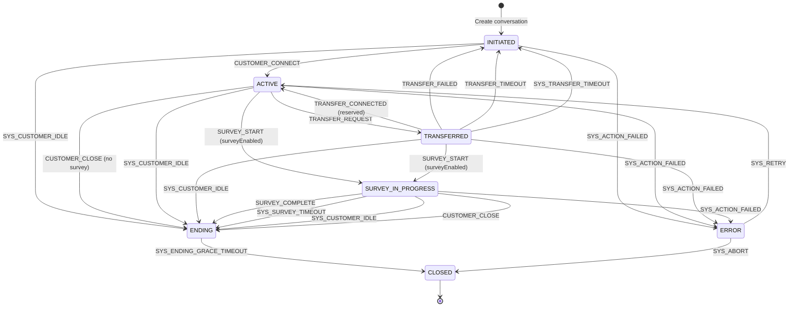
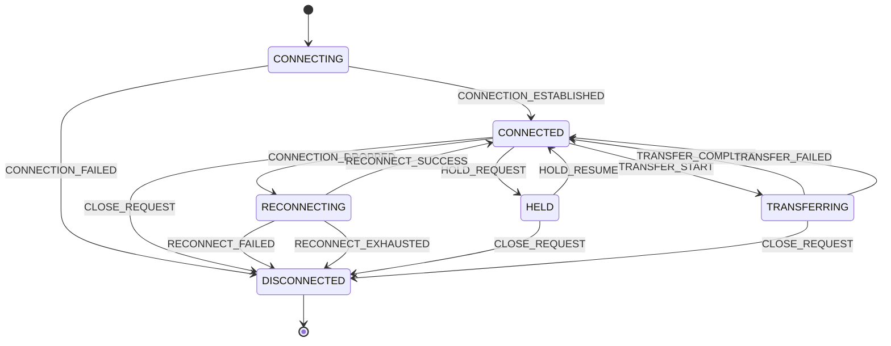
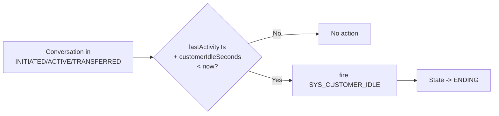
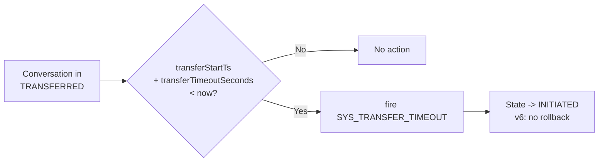
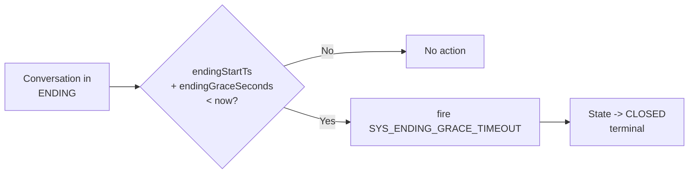
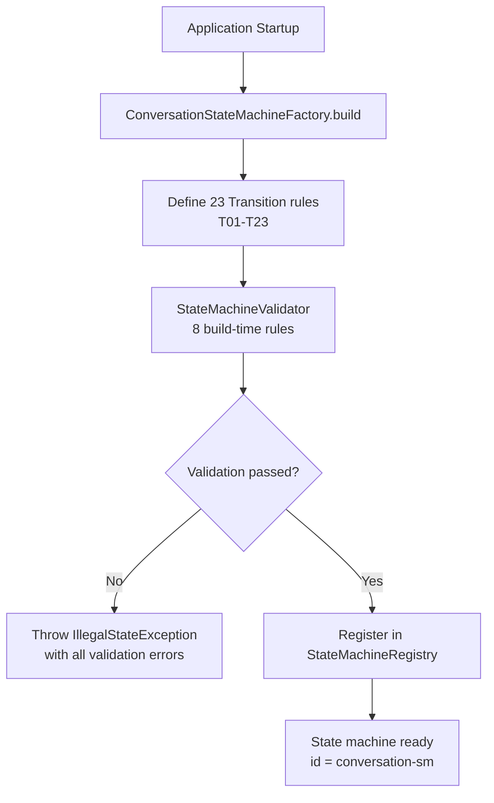
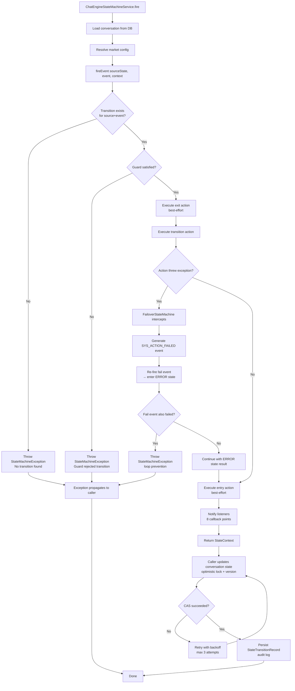

# State Transition Diagrams & Tables

> Version: 1.0 | Last Updated: 2026-09-01

## 1. Conversation State Machine

### 1.1 Full State Diagram



> **Survey as in-progress state**: When `surveyEnabled=true`, `closeConversation()` fires `SURVEY_START` to enter `SURVEY_IN_PROGRESS` instead of directly going to `ENDING`. The survey flow is fully controlled by the state machine.

> **Failover (action error → fail event)**: When an action throws an unhandled exception, `FailoverStateMachine` automatically fires `SYS_ACTION_FAILED` to enter `ERROR` state. From `ERROR`, the system can retry (`SYS_RETRY` → ACTIVE) or abort (`SYS_ABORT` → CLOSED). Fail events themselves do NOT trigger another failover (loop prevention).

### 1.2 Transition Table

| ID | Source | Event | Target | Guard | Action | Monitor | v6 Note |
|----|--------|-------|--------|-------|--------|---------|---------|
| T01 | INITIATED | CUSTOMER_CONNECT | ACTIVE | - | - | - | Customer establishes connection |
| T02 | ACTIVE | TRANSFER_REQUEST | TRANSFERRED | transferEnabled | - | - | Request human agent |
| T03 | TRANSFERRED | TRANSFER_CONNECTED | ACTIVE | - | - | - | Reserved for future |
| T04 | TRANSFERRED | TRANSFER_FAILED | INITIATED | - | - | - | **v6: no rollback to ACTIVE** |
| T05 | TRANSFERRED | TRANSFER_TIMEOUT | INITIATED | - | - | - | **v6: no rollback to ACTIVE** |
| T06 | ACTIVE | CUSTOMER_CLOSE | ENDING | !surveyEnabled | - | - | Customer closes, no survey |
| T07 | INITIATED | SYS_CUSTOMER_IDLE | ENDING | - | - | CustomerIdleMonitor | Idle before connect |
| T08 | ACTIVE | SYS_CUSTOMER_IDLE | ENDING | - | - | CustomerIdleMonitor | Customer idle timeout |
| T09 | TRANSFERRED | SYS_CUSTOMER_IDLE | ENDING | - | - | CustomerIdleMonitor | Idle during transfer |
| T10 | TRANSFERRED | SYS_TRANSFER_TIMEOUT | INITIATED | - | - | TransferMonitor | **v6: no rollback** |
| T11 | ENDING | SYS_ENDING_GRACE_TIMEOUT | CLOSED | - | - | EndingGraceMonitor | Terminal transition |
| T12 | ACTIVE | SURVEY_START | SURVEY_IN_PROGRESS | surveyEnabled | Show survey UI | - | **Survey as in-progress state** |
| T13 | TRANSFERRED | SURVEY_START | SURVEY_IN_PROGRESS | surveyEnabled | Show survey UI | - | **Survey as in-progress state** |
| T14 | SURVEY_IN_PROGRESS | SURVEY_COMPLETE | ENDING | - | Save survey results | - | Survey completed normally |
| T15 | SURVEY_IN_PROGRESS | SYS_SURVEY_TIMEOUT | ENDING | - | Save partial results | SurveyTimeoutMonitor | Survey timed out |
| T16 | SURVEY_IN_PROGRESS | SYS_CUSTOMER_IDLE | ENDING | - | - | CustomerIdleMonitor | Customer left during survey |
| T17 | SURVEY_IN_PROGRESS | CUSTOMER_CLOSE | ENDING | - | - | - | Customer explicitly closes survey |
| T18 | INITIATED | SYS_ACTION_FAILED | ERROR | - | Log error, alert | FailoverStateMachine | **Failover: action error** |
| T19 | ACTIVE | SYS_ACTION_FAILED | ERROR | - | Log error, alert | FailoverStateMachine | **Failover: action error** |
| T20 | TRANSFERRED | SYS_ACTION_FAILED | ERROR | - | Log error, alert | FailoverStateMachine | **Failover: action error** |
| T21 | SURVEY_IN_PROGRESS | SYS_ACTION_FAILED | ERROR | - | Log error, alert | FailoverStateMachine | **Failover: action error** |
| T22 | ERROR | SYS_RETRY | ACTIVE | - | Re-initialize resources | - | Manual or system retry |
| T23 | ERROR | SYS_ABORT | CLOSED | - | Clean up, notify | - | Unrecoverable error |

### 1.3 State Entry/Exit Actions

| State | Entry Action | Exit Action |
|-------|-------------|-------------|
| INITIATED | (none) | (none) |
| ACTIVE | Send welcome message (reserved) | Notify channel (reserved) |
| TRANSFERRED | Initiate transfer request | Cancel pending transfer (reserved) |
| SURVEY_IN_PROGRESS | Show survey UI, start survey timer | Save survey results, stop timer |
| ENDING | Start grace period timer | (none) |
| ERROR | Log error, alert on-call, capture diagnostics | Clear error state |
| CLOSED | Clean up resources, archive conversation | (none, terminal) |

## 2. Interaction State Machine

### 2.1 States

```java
public enum InteractionState {
    CONNECTING,     // Channel establishing connection
    CONNECTED,      // Channel active, communication flowing
    RECONNECTING,   // Channel dropped, attempting reconnection
    HELD,           // Customer on hold (agent-initiated)
    TRANSFERRING,   // Channel transfer in progress (e.g., WebSocket handoff)
    DISCONNECTED    // Channel terminated (terminal)
}
```

### 2.2 Events (InteractionFact)

```java
public enum InteractionFact {
    // Connection lifecycle
    CONNECTION_ESTABLISHED, CONNECTION_FAILED, CONNECTION_DROPPED,
    RECONNECT_SUCCESS, RECONNECT_FAILED, RECONNECT_EXHAUSTED, CLOSE_REQUEST,
    // Hold
    HOLD_REQUEST, HOLD_RESUME,
    // Transfer (channel-level)
    TRANSFER_START, TRANSFER_COMPLETE, TRANSFER_FAILED
}
```

### 2.3 State Diagram



### 2.4 Transition Table

| ID | Source | Event | Target | Notes |
|----|--------|-------|--------|-------|
| I01 | CONNECTING | CONNECTION_ESTABLISHED | CONNECTED | Channel connected successfully |
| I02 | CONNECTING | CONNECTION_FAILED | DISCONNECTED | Connection failed (network/auth) |
| I03 | CONNECTED | CONNECTION_DROPPED | RECONNECTING | Active connection dropped unexpectedly |
| I04 | CONNECTED | CLOSE_REQUEST | DISCONNECTED | Explicit close (customer/agent) |
| I05 | RECONNECTING | RECONNECT_SUCCESS | CONNECTED | Reconnection attempt succeeded |
| I06 | RECONNECTING | RECONNECT_FAILED | DISCONNECTED | Reconnection attempt failed |
| I07 | RECONNECTING | RECONNECT_EXHAUSTED | DISCONNECTED | Max reconnection retries reached |
| I08 | CONNECTED | HOLD_REQUEST | HELD | Agent puts customer on hold |
| I09 | HELD | HOLD_RESUME | CONNECTED | Customer retrieved from hold |
| I10 | HELD | CLOSE_REQUEST | DISCONNECTED | Close while on hold |
| I11 | CONNECTED | TRANSFER_START | TRANSFERRING | Channel transfer initiated |
| I12 | TRANSFERRING | TRANSFER_COMPLETE | CONNECTED | Transfer completed, on new channel |
| I13 | TRANSFERRING | TRANSFER_FAILED | CONNECTED | Transfer failed, stay on original channel |
| I14 | TRANSFERRING | CLOSE_REQUEST | DISCONNECTED | Close during transfer |

## 3. Monitor Trigger Diagrams

### 3.1 CustomerIdleMonitor



### 3.2 TransferMonitor



### 3.3 EndingGraceMonitor



## 4. Event Classification

### 4.1 By Source

| Category | Events | Source |
|----------|--------|--------|
| Customer-driven | CUSTOMER_CONNECT, CUSTOMER_CLOSE | Customer action via channel |
| Agent-driven | AGENT_ATTACHED, AGENT_CLOSE | Human agent action (reserved) |
| System-driven | TRANSFER_REQUEST, TRANSFER_FAILED, TRANSFER_TIMEOUT | Business logic / integration |
| Monitor-driven | SYS_CUSTOMER_IDLE, SYS_TRANSFER_TIMEOUT, SYS_ENDING_GRACE_TIMEOUT | Scheduled monitors |
| Survey-driven | SURVEY_COMPLETE | Post-conversation survey (reserved) |

### 4.2 By Effect

| Effect | Events |
|--------|--------|
| State advances (normal) | CUSTOMER_CONNECT, TRANSFER_REQUEST, CUSTOMER_CLOSE |
| State resets (v6) | TRANSFER_FAILED, TRANSFER_TIMEOUT, SYS_TRANSFER_TIMEOUT |
| State enters ending | SYS_CUSTOMER_IDLE (from any non-terminal) |
| State terminates | SYS_ENDING_GRACE_TIMEOUT |
| No state change (internal) | (none currently defined) |

## 5. Default Market Configuration

| Parameter | Default | Description |
|-----------|---------|-------------|
| customerIdleSeconds | 300 (5 min) | Customer inactivity before auto-close |
| transferTimeoutSeconds | 180 (3 min) | Max wait for agent connection |
| endingGraceSeconds | 120 (2 min) | Grace period before final closure |
| surveyEnabled | false | Whether to send post-conversation survey |
| transferEnabled | true | Whether human agent transfer is allowed |
| genesysEnabled | false | Whether Genesys integration is active |
| fallbackRoutingStrategy | "DROP" | Strategy when transfer fails |

## 6. State Machine Lifecycle

### 6.1 Startup Phase



### 6.2 Event Processing Phase



### 6.3 Lifecycle Callbacks

| Phase | Listener Callback | When |
|-------|-------------------|------|
| State machine start | `stateMachineStarted()` | After `start()` called |
| Event received | `eventReceived(event)` | Before transition lookup |
| Transition accepted | `transitionAccepted(transition)` | After guard passes, before actions |
| Transition rejected | `transitionRejected(event, source)` | No transition or guard failed |
| State entered | `stateEntered(state)` | After entry action executes |
| State exited | `stateExited(state)` | After exit action executes |
| Action executed | `actionExecuted(action, result)` | After transition action completes |
| State machine stop | `stateMachineStopped()` | After `stop()` called |
