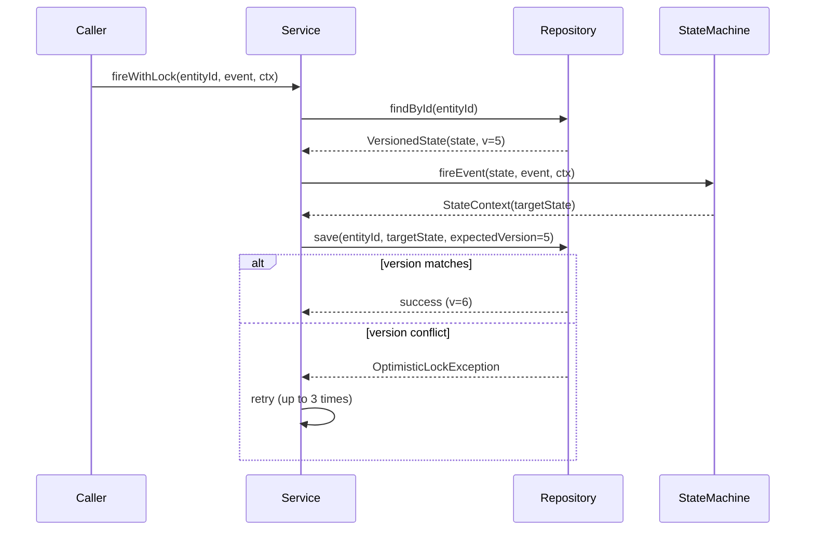

# 05 — Advanced Features

> Production-ready capabilities: persistence, validation, idempotency, observability, event sourcing, resilience, timeouts, and diagram generation.

---

## 1. State Persistence & Optimistic Locking

### Problem

In a concurrent environment, multiple threads or services may attempt to transition the same entity simultaneously. Without locking, the "last write wins" problem can corrupt state.

### Solution

A `StateRepository` interface with optimistic locking via version numbers.

```java
// Repository interface (dual generic: state type + ID type)
public interface StateRepository<S, ID> {
    VersionedState<S> load(ID id);
    long compareAndSet(ID id, long expectedVersion, S newState);
    long save(ID id, S state);
    boolean exists(ID id);
    boolean delete(ID id);
}

// Versioned state record
public record VersionedState<S>(S state, long version) {
    public static <S> VersionedState<S> initial(S state) { ... }
}

// Optimistic lock exception
public class OptimisticLockException extends RuntimeException {
    public OptimisticLockException(String entityId, long expected, long actual) { ... }
}
```

### Usage with Auto-Retry

```java
CbolStateMachineService service = new CbolStateMachineService(machine, repository);

// fireWithLock automatically retries on version conflict (default 3 retries)
StateContext<ConversationState, ConversationFact, CbolStateContext> result =
    service.fireWithLock("conv-123", ConversationFact.USER_MESSAGE, context);
```

### Flow



### Implementations

| Implementation | Use Case |
|---|---|
| `InMemoryStateRepository` | Testing, single-node, development |
| Custom JDBC/MongoDB | Production (implement the interface) |

---

## 2. Build-Time Validation

### Problem

Invalid state machine configurations (unreachable states, missing initial state, duplicate transitions) are often discovered at runtime, causing production incidents.

### Solution

A `StateMachineValidator` that checks 8 rules at build time.

### Validation Rules

| Rule | Level | Description |
|---|---|---|
| `NO_TRANSITIONS` | ERROR | Machine has zero transitions |
| `INITIAL_STATE_DEFINED` | ERROR | No initial state configured |
| `INITIAL_STATE_REACHABLE` | WARNING | Initial state has no incoming transitions |
| `END_STATE_NO_OUTGOING` | WARNING | End state has outgoing transitions |
| `UNREACHABLE_STATE` | WARNING | State has no incoming transitions and is not initial |
| `DEAD_END_STATE` | WARNING | State has no outgoing transitions and is not an end state |
| `INTERNAL_TRANSITION_MATCH` | ERROR | INTERNAL transition has different source and target |
| `DUPLICATE_TRANSITION_NO_GUARD` | WARNING | Multiple transitions for same (state, event) without guards |

### Usage

```java
// Validate during build
StateMachine<OrderState, OrderEvent, OrderContext> machine =
    StateMachineBuilder.<OrderState, OrderEvent, OrderContext>builder("order")
        .initialState(OrderState.CREATED)
        .transition()
            .from(OrderState.CREATED).on(OrderEvent.PAY).to(OrderState.PAID)
        .and()
        .build(true);  // validate=true, throws on ERROR

// Or validate separately
List<ValidationError> errors = StateMachineValidator.validate(machine);
errors.forEach(e -> System.out.println(e.level() + ": " + e.message()));
```

### ValidationError

```java
public record ValidationError(
    String rule,        // e.g., "UNREACHABLE_STATE"
    Level level,        // ERROR or WARNING
    String message,     // human-readable description
    String state,       // related state (may be null)
    String event        // related event (may be null)
) {}
```

---

## 3. Idempotency

### Problem

Events may be delivered multiple times (network retries, message queue at-least-once delivery). Without idempotency, the same event could trigger multiple state transitions.

### Solution

An `IdempotentStateMachineDecorator` that deduplicates events by a unique event ID.

```java
ProcessedEventStore store = new InMemoryProcessedEventStore();
IdempotentStateMachineDecorator<OrderState, OrderEvent, OrderContext> idempotent =
    new IdempotentStateMachineDecorator<>(machine, store);

// First call: processes the event
StateContext<...> result1 = idempotent.fireEventWithId("evt-001", OrderState.CREATED, OrderEvent.PAY, ctx);

// Second call with same ID: returns cached result, does NOT re-process
StateContext<...> result2 = idempotent.fireEventWithId("evt-001", OrderState.CREATED, OrderEvent.PAY, ctx);
// result1.equals(result2)
```

### ProcessedEventStore

```java
public interface ProcessedEventStore {
    boolean contains(String eventId);
    void store(String eventId, StateContext<?, ?, ?> result);
    Optional<StateContext<?, ?, ?>> get(String eventId);
    void clear();
}
```

---

## 4. Observability — Metrics (Micrometer)

### Problem

Without metrics, it's impossible to monitor state machine health: transition latency, error rates, denied events.

### Solution

`MonitoredStateMachine` decorator with Micrometer integration (optional dependency).

### Metrics

| Metric | Type | Tags | Description |
|---|---|---|---|
| `statemachine.transition.duration` | Timer | machine, from, to, event | Transition latency |
| `statemachine.transition.success` | Counter | machine, from, to, event | Successful transitions |
| `statemachine.transition.error` | Counter | machine, from, to, event, error | Action failures |
| `statemachine.transition.denied` | Counter | machine, from, event, reason | Denied (no rule/guard) |
| `statemachine.event.received` | Counter | machine, from, event | Total events received |

### Usage

```java
MeterRegistry registry = ...; // Spring's auto-configured or SimpleMeterRegistry
StateMachine<OrderState, OrderEvent, OrderContext> monitored =
    new MonitoredStateMachine<>(machine, registry);

// All fireEvent calls are automatically instrumented
monitored.fireEvent(OrderState.CREATED, OrderEvent.PAY, ctx);
```

### Spring Boot Integration

```yaml
# application.yml
management:
  endpoints:
    web:
      exposure:
        include: prometheus,metrics
  metrics:
    tags:
      application: cbol-messaging
```

---

## 5. Event Sourcing

### Problem

Need a full audit trail of all state changes for debugging, compliance, and state reconstruction.

### Solution

`EventSourcedStateMachine` decorator that records every transition as an immutable event.

### StateTransitionEvent

```java
public record StateTransitionEvent<S, E>(
    String entityId,          // conversation/order ID
    String machineId,         // state machine identifier
    S fromState,              // source state
    S toState,                // target state
    E event,                  // triggering event
    boolean accepted,         // whether the transition was accepted
    String denialReason,      // reason if denied
    long durationMs,          // transition duration
    String traceId,           // distributed trace ID
    Instant timestamp,        // when it happened
    Map<String, String> metadata  // extra context
) {}
```

### Store Interface

```java
public interface StateTransitionStore<S, E> {
    void append(StateTransitionEvent<S, E> event);
    List<StateTransitionEvent<S, E>> replay(String entityId);
    List<StateTransitionEvent<S, E>> replayUpTo(String entityId, Instant upTo);
    Optional<S> reconstructState(String entityId);  // replay accepted events
    int count(String entityId);
    Optional<StateTransitionEvent<S, E>> lastEvent(String entityId);
}
```

### Usage

```java
StateTransitionStore<ConversationState, ConversationFact> store =
    new InMemoryStateTransitionStore<>();

StateMachine<ConversationState, ConversationFact, CbolStateContext> eventSourced =
    new EventSourcedStateMachine<>(machine, store, "conv-123");

// All transitions are automatically recorded
eventSourced.fireEvent(ConversationState.INITIATED, ConversationFact.USER_MESSAGE, ctx);

// Replay and reconstruct
List<StateTransitionEvent<...>> history = store.replay("conv-123");
Optional<ConversationState> current = store.reconstructState("conv-123");
```

### Time-Travel Query

```java
// What was the state at 2026-01-01T10:00:00Z?
Instant pointInTime = Instant.parse("2026-01-01T10:00:00Z");
List<StateTransitionEvent<...>> eventsAtTime = store.replayUpTo("conv-123", pointInTime);
```

---

## 6. Resilience — Failure Handling

### Problem

State machine transitions can fail (no rule, guard failed, action exception). Need configurable strategies for different failure scenarios.

### Solution

`ResilientStateMachine` decorator with pluggable `FailureHandler` strategies.

### Failure Types

| Type | Description |
|---|---|
| `NO_TRANSITION` | No transition rule exists for (state, event) |
| `GUARD_FAILED` | All guard conditions evaluated to false |
| `ACTION_ERROR` | Transition action threw an exception |

### Built-in Strategies

| Strategy | Behavior | Use Case |
|---|---|---|
| `ThrowFailureHandler` | Throws `StateMachineException` | Default, fail fast |
| `ReturnSourceFailureHandler` | Returns source state, `accepted=false` | Silent ignore, check return value |
| `FallbackStateFailureHandler` | Transitions to configured fallback state | Dead letter, ERROR quarantine |
| `RetryFailureHandler` | Retries with backoff, then delegates | Transient failures, optimistic lock |

### Usage

```java
// 1. Throw on failure (default)
StateMachine<...> resilient = new ResilientStateMachine<>(machine, new ThrowFailureHandler<>());

// 2. Return source state (no exceptions)
StateMachine<...> resilient = new ResilientStateMachine<>(machine, new ReturnSourceFailureHandler<>());
StateContext<...> result = resilient.fireEvent(state, event, ctx);
if (!result.isTransitionAccepted()) {
    // handle denial
}

// 3. Fallback to ERROR state
StateMachine<...> resilient = new ResilientStateMachine<>(machine,
    new FallbackStateFailureHandler<>(OrderState.ERROR));

// 4. Retry with exponential backoff, then fallback
FailureHandler<...> fallback = new FallbackStateFailureHandler<>(OrderState.ERROR);
RetryFailureHandler<...> retry = RetryFailureHandler.exponentialBackoff(
    3,           // max retries
    fallback,    // handler after exhaustion
    100,         // initial delay ms
    5000         // max delay ms
);
StateMachine<...> resilient = new ResilientStateMachine<>(machine, retry);
```

---

## 7. Timeout Events / Scheduled Transitions

### Problem

Need to automatically trigger events when an entity stays in a state too long (idle timeout, transfer timeout, ending grace).

### Solution

`TimeoutAwareStateMachine` decorator that auto-schedules timeouts on state entry and auto-cancels on state exit.

### TimeoutConfig

```java
TimeoutConfig<ConversationState, ConversationFact> idleTimeout =
    TimeoutConfig.<ConversationState, ConversationFact>builder()
        .state(ConversationState.ACTIVE)
        .timeoutEvent(ConversationFact.IDLE_TIMEOUT)
        .duration(30)
        .timeUnit(TimeUnit.SECONDS)
        .build();  // one-shot by default

// Repeating timeout (e.g., send reminder every 60s)
TimeoutConfig<...> reminder = TimeoutConfig.<...>builder()
        .state(ConversationState.WAITING)
        .timeoutEvent(ConversationFact.SEND_REMINDER)
        .duration(60)
        .timeUnit(TimeUnit.SECONDS)
        .repeat(true)
        .build();
```

### Scheduler

```java
StateMachineTimeoutScheduler<ConversationState, ConversationFact> scheduler =
    new InMemoryTimeoutScheduler<>("conversation-timeout", 4);
```

### Usage

```java
Map<ConversationState, TimeoutConfig<ConversationState, ConversationFact>> timeouts = Map.of(
    ConversationState.ACTIVE, idleTimeout,
    ConversationState.TRANSFERRING, transferTimeout
);

StateMachine<ConversationState, ConversationFact, CbolStateContext> timeoutAware =
    new TimeoutAwareStateMachine<>(machine, scheduler, timeouts, "conv-123");

// Entering ACTIVE automatically starts 30s timer
timeoutAware.fireEvent(ConversationState.INITIATED, ConversationFact.USER_MESSAGE, ctx);

// Leaving ACTIVE automatically cancels the timer
timeoutAware.fireEvent(ConversationState.ACTIVE, ConversationFact.AGENT_JOIN, ctx);

// If 30s pass without leaving, IDLE_TIMEOUT fires automatically
```

### Querying Timeout Status

```java
boolean active = timeoutAware.isTimeoutActive();
long remainingMs = timeoutAware.getRemainingTimeoutMs();
timeoutAware.cancelTimeout();  // manual cancel
```

### CBOL Monitor Replacement

| Existing Monitor | Timeout Config |
|---|---|
| `CustomerIdleMonitor` | `ACTIVE` → 30s → `IDLE_TIMEOUT` |
| `TransferMonitor` | `TRANSFERRING` → 60s → `TRANSFER_TIMEOUT` |
| `EndingGraceMonitor` | `ENDING` → 10s → `END_GRACE_TIMEOUT` |

---

## 8. Diagram Generation

### Problem

Manually maintaining state diagrams in documentation is error-prone and quickly becomes outdated.

### Solution

`StateMachineDiagramGenerator` generates diagrams directly from the state machine configuration.

### Mermaid

```java
String mermaid = StateMachineDiagramGenerator.toMermaid(machine);
// Output:
// stateDiagram-v2
//     title order-machine
//     [*] --> CREATED
//     CREATED --> PAID : PAY
//     PAID --> SHIPPED : SHIP
//     SHIPPED --> DELIVERED : DELIVER
//     DELIVERED --> [*]
```

### PlantUML

```java
String plantUml = StateMachineDiagramGenerator.toPlantUml(machine);
// Output:
// @startuml
// title order-machine
// skinparam state { ... }
// [*] --> CREATED
// CREATED --> PAID : PAY
// ...
// @enduml
```

### Transition Table

```java
String table = StateMachineDiagramGenerator.toTransitionTable(machine);
// | # | From | Event | To | Kind | Guard | Action |
// |---|------|-------|----|------|-------|--------|
// | 1 | CREATED | PAY | PAID | EXTERNAL | - | Yes |
```

### Features

- Initial state marker (`[*] --> STATE`)
- End states (`STATE --> [*]`)
- Event labels with guard (`[guard]`) and action (`/ action`) indicators
- Internal transitions as self-loops
- Isolated state detection with notes

---

## 9. Decorator Composition

All advanced features are implemented as decorators, allowing flexible composition:

```java
// Compose: idempotent + monitored + event-sourced + resilient + timeout-aware
StateMachine<OrderState, OrderEvent, OrderContext> pipeline =
    new TimeoutAwareStateMachine<>(
        new ResilientStateMachine<>(
            new EventSourcedStateMachine<>(
                new MonitoredStateMachine<>(
                    new IdempotentStateMachineDecorator<>(
                        machine,
                        eventStore
                    ),
                    meterRegistry
                ),
                transitionStore,
                "order-123"
            ),
            new ThrowFailureHandler<>()
        ),
        timeoutScheduler,
        timeoutConfigs,
        "order-123"
    );
```

### Recommended Order (outermost to innermost)

1. **TimeoutAware** — outermost, manages timers around everything
2. **Failover** — catches action errors from all inner layers and generates fail events
3. **Resilient** — handles failures (retries) before failover
4. **EventSourced** — records all transitions (including retries and failovers)
5. **Monitored** — collects metrics for all transitions
6. **Idempotent** — innermost, deduplicates before processing
7. **SimpleStateMachine** — core engine

---

## 10. Failover (Action Error → Fail Event)

### 9.1 Overview

`FailoverStateMachine` is a decorator that automatically generates a **fail event** when an action throws an unhandled exception. The fail event is then re-fired through the state machine to follow a predefined **fail branch** (e.g., an ERROR state).

This is different from `ResilientStateMachine` (which retries or returns a fallback state): failover treats the exception as an event that drives the state machine through a dedicated error-handling flow.

### 9.2 Key Design Decisions

| Decision | Rationale |
|----------|-----------|
| Only handles **action errors** (StateMachineException with cause), not logical errors (no transition / guard failed) | Logical errors are caller bugs, not system failures |
| **Fail events do NOT trigger another failover** | Prevents infinite loops when the fail branch itself fails |
| **Composable with ResilientStateMachine** | Retry first (transient errors), then failover (permanent errors) |
| Fail event generated by configurable `failEventProvider` | Each domain can define its own fail event (e.g., `SYS_ACTION_FAILED`) |

### 9.3 Usage

```java
StateMachine<OrderState, OrderEvent, OrderContext> machine = ...;

// Failover: on action error, fire ORDER_FAILED event
StateMachine<OrderState, OrderEvent, OrderContext> failover = new FailoverStateMachine<>(
    machine,
    ctx -> OrderEvent.ORDER_FAILED,                              // fail event provider
    event -> event == OrderEvent.ORDER_FAILED                    // fail event predicate (loop prevention)
);

// When an action throws:
//   1. FailoverStateMachine catches the exception
//   2. Generates ORDER_FAILED event
//   3. Re-fires ORDER_FAILED → state machine follows fail branch → ERROR state
StateContext<...> result = failover.fireEvent(OrderState.PROCESSING, OrderEvent.PAY, ctx);
// result.getTargetState() == OrderState.ERROR
```

### 9.4 Combined with Retry (Recommended Pattern)

```java
// 1. Retry 3 times with exponential backoff
FailureHandler<...> fallback = new FallbackStateFailureHandler<>(OrderState.ERROR);
RetryFailureHandler<...> retry = RetryFailureHandler.exponentialBackoff(3, fallback, 100, 5000);
StateMachine<...> resilient = new ResilientStateMachine<>(machine, retry);

// 2. If retries are exhausted, failover to ERROR state via fail event
StateMachine<...> withFailover = new FailoverStateMachine<>(
    resilient,
    ctx -> OrderEvent.ORDER_FAILED,
    event -> event == OrderEvent.ORDER_FAILED
);
```

### 9.5 CBOL Integration

For the CBOL conversation state machine:

- **Fail event**: `SYS_ACTION_FAILED`
- **Fail branch**: All non-terminal states → `ERROR`
- **Recovery**: `ERROR` → `ACTIVE` (`SYS_RETRY`) or `CLOSED` (`SYS_ABORT`)

```java
StateMachine<ConversationState, ConversationFact, CbolStateContext> base =
    ConversationStateMachineFactory.build();

FailoverStateMachine<ConversationState, ConversationFact, CbolStateContext> failover =
    new FailoverStateMachine<>(
        base,
        ctx -> ConversationFact.SYS_ACTION_FAILED,
        event -> event == ConversationFact.SYS_ACTION_FAILED
    );
```

### 9.6 FailoverContext

The `failEventProvider` receives a `FailoverContext` containing:

- `sourceState` — the state before the failed event
- `originalEvent` — the event that triggered the failing action
- `context` — the business context
- `cause` — the original RuntimeException
- `causeMessage()` / `causeType()` — convenience methods for logging

This allows the fail event to carry diagnostic information (e.g., store in ExtendedState or context for later analysis).

---

## 11. Summary Table

| Feature | Package | Key Class | Dependency |
|---|---|---|---|
| Persistence | `statemachine.persistence` | `StateRepository`, `InMemoryStateRepository` | None |
| Validation | `statemachine.validation` | `StateMachineValidator` | None |
| Idempotency | `statemachine.idempotency` | `IdempotentStateMachineDecorator` | None |
| Metrics | `statemachine.metrics` | `MonitoredStateMachine` | Micrometer (optional) |
| Event Sourcing | `statemachine.eventsourcing` | `EventSourcedStateMachine` | None |
| Resilience | `statemachine.resilience` | `ResilientStateMachine` | None |
| Failover | `statemachine.resilience` | `FailoverStateMachine` | None |
| Timeout | `statemachine.timeout` | `TimeoutAwareStateMachine` | None |
| Diagram | `statemachine.diagram` | `StateMachineDiagramGenerator` | None |
| Event-Driven | `statemachine.event` | `StandardEvent`, `EventDispatcher` | None |
