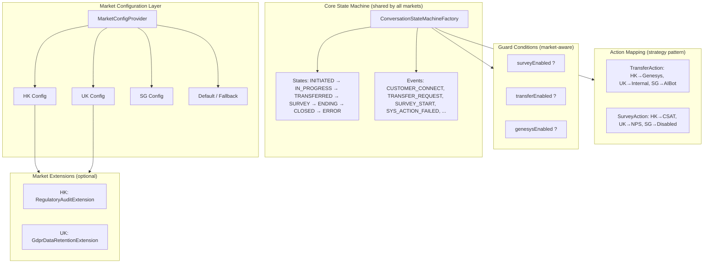

# Multi-Market State Machine Design

> Version: 1.0 | Last Updated: 2026-09-01
> Status: Design Proposal (for review)

## 1. Background & Requirements

### 1.1 Problem Statement

The CBOL messaging hub will be deployed to **multiple markets** (HK, UK, SG, etc.). Each market shares a **similar main flow** (connect → IN_PROGRESS → transfer → survey → ending → closed) but has **differences** in:

- Which features are enabled (survey, transfer, Genesys integration)
- Timeout thresholds (idle, transfer, ending grace, survey)
- Business rules (routing strategy, fallback behavior)
- Regulatory requirements (data retention, audit logging)
- Connector configurations (AIBot endpoint, Genesys org, WebSocket settings)

### 1.2 Key Question

> Should we use **configuration control** (one state machine + market-level config) or **design one per market** (separate state machine instances)?

### 1.3 Design Principles

1. **DRY (Don't Repeat Yourself)**: Main flow logic should be defined once
2. **Open/Closed**: New markets should be addable without modifying core code
3. **Explicit over Implicit**: Market differences should be visible and auditable
4. **Testability**: Each market's behavior should be independently verifiable
5. **Operational Simplicity**: Config changes should not require code deployment

---

## 2. Option Comparison

### 2.1 Option A: Configuration Control (Single State Machine + Market Config)

**Approach**: One state machine definition, all differences controlled by `StateMachineMarketConfig`.

| Pros | Cons |
|------|------|
| Code reuse, single source of truth for main flow | Config complexity grows with market differences |
| New market = add config, no code change | Extreme differences may require "config as code" (anti-pattern) |
| Consistent behavior across markets | Harder to debug (is it config or code?) |
| Easy to roll out global changes | Need flexible config model (guards, action mapping, state extensions) |
| Lower maintenance cost | Market-specific workarounds may pollute core code |

**Best for**: Markets with **80%+ similarity**, differences mainly in thresholds and feature toggles.

---

### 2.2 Option B: One Per Market (Separate State Machine Instances)

**Approach**: Each market has its own state machine factory with custom transitions, actions, and states.

| Pros | Cons |
|------|------|
| Maximum flexibility, each market fully independent | Massive code duplication |
| Simple to implement for highly divergent markets | Global changes require syncing N copies |
| Easy to debug (problem isolated to one market) | Easy to drift apart (one market gets a fix, others don't) |
| No config complexity | New market = copy-paste + modify, error-prone |
| Market-specific code is cleanly separated | High maintenance cost (linear with market count) |

**Best for**: Markets with **<50% similarity**, fundamentally different business logic.

---

### 2.3 Option C: Hybrid (Recommended)

**Approach**: Core state machine defines the **main flow** (shared by all markets). Market differences are handled through:

1. **Market-level config** — thresholds, feature toggles, connector settings
2. **Guard conditions** — transitions gated by market config (e.g., `surveyEnabled`)
3. **Action mapping** — same event triggers different actions per market (strategy pattern)
4. **Extension points** — market-specific states/events added via modular extensions
5. **Market profiles** — predefined config bundles (e.g., `HK-profile`, `UK-profile`)

| Pros | Cons |
|------|------|
| Main flow defined once, differences explicit | Requires upfront design of extension points |
| New market = choose profile + override configs | Moderate config complexity (but manageable) |
| Global changes propagate automatically | Market-specific code needs clear separation |
| Flexible enough for divergent markets | Slightly higher initial design effort |
| Config changes don't require code deployment | Need good tooling for config validation |

**Best for**: Our scenario — markets share main flow but have meaningful differences.

---

## 3. Recommended Design: Hybrid Approach

### 3.1 Architecture Overview



### 3.2 Configuration Model

#### 3.2.1 Extended StateMachineMarketConfig

```java
@Builder
public record StateMachineMarketConfig(
    // === Timeouts ===
    long customerIdleSeconds,
    long transferTimeoutSeconds,
    long endingGraceSeconds,
    long surveyTimeoutSeconds,

    // === Feature Toggles ===
    boolean surveyEnabled,
    boolean transferEnabled,
    boolean genesysEnabled,
    boolean aibotEnabled,
    boolean regulatoryAuditEnabled,

    // === Business Rules ===
    String fallbackRoutingStrategy,      // DROP / REQUEUE / FALLBACK_QUEUE
    String surveyType,                    // CSAT / NPS / CES
    String transferTarget,                // GENESYS / INTERNAL_QUEUE / AIBOT
    int maxTransferRetries,

    // === Connector Settings ===
    String aibotEndpoint,
    String genesysOrgId,
    String websocketEndpoint,

    // === Extensions ===
    List<String> enabledExtensions        // e.g., ["HKRegulatoryAudit", "UKGdprRetention"]
) {
    public static StateMachineMarketConfig defaultConfig() { ... }
}
```

#### 3.2.2 Market Profiles (YAML)

```yaml
# config/markets/hk.yaml
market: HK
profile: hk-standard
timeouts:
  customerIdleSeconds: 300
  transferTimeoutSeconds: 180
  endingGraceSeconds: 120
  surveyTimeoutSeconds: 300
features:
  surveyEnabled: true
  transferEnabled: true
  genesysEnabled: true
  aibotEnabled: true
  regulatoryAuditEnabled: true
businessRules:
  fallbackRoutingStrategy: REQUEUE
  surveyType: CSAT
  transferTarget: GENESYS
  maxTransferRetries: 3
connectors:
  aibotEndpoint: https://aibot.hk.example.com
  genesysOrgId: hk-org-001
extensions:
  - HKRegulatoryAudit
```

```yaml
# config/markets/uk.yaml
market: UK
profile: uk-standard
timeouts:
  customerIdleSeconds: 600      # UK: longer idle timeout
  transferTimeoutSeconds: 240
  endingGraceSeconds: 180
  surveyTimeoutSeconds: 600
features:
  surveyEnabled: true
  transferEnabled: true
  genesysEnabled: false          # UK: no Genesys
  aibotEnabled: true
  regulatoryAuditEnabled: false
businessRules:
  fallbackRoutingStrategy: FALLBACK_QUEUE
  surveyType: NPS                # UK: NPS instead of CSAT
  transferTarget: INTERNAL_QUEUE
  maxTransferRetries: 2
connectors:
  aibotEndpoint: https://aibot.uk.example.com
extensions:
  - UKGdprRetention
```

```yaml
# config/markets/sg.yaml
market: SG
profile: sg-lite
timeouts:
  customerIdleSeconds: 300
  transferTimeoutSeconds: 180
  endingGraceSeconds: 120
features:
  surveyEnabled: false           # SG: no survey
  transferEnabled: true
  genesysEnabled: false
  aibotEnabled: true
businessRules:
  fallbackRoutingStrategy: DROP
  transferTarget: AIBOT
  maxTransferRetries: 1
connectors:
  aibotEndpoint: https://aibot.sg.example.com
```

### 3.3 Market-Aware State Machine Building

#### 3.3.1 Guard Conditions

Transitions are gated by market config via guard conditions:

```java
// Example: SURVEY_START only allowed if surveyEnabled
builder.transition()
    .from(ConversationState.IN_PROGRESS)
    .on(ConversationFact.SURVEY_START)
    .to(ConversationState.IN_PROGRESS)
    .guard(ctx -> ctx.marketConfig().surveyEnabled())
    .and();

// Example: TRANSFER_REQUEST only allowed if transferEnabled
builder.transition()
    .from(ConversationState.IN_PROGRESS)
    .on(ConversationFact.TRANSFER_REQUEST)
    .to(ConversationState.TRANSFERRED)
    .guard(ctx -> ctx.marketConfig().transferEnabled())
    .and();
```

#### 3.3.2 Action Mapping (Strategy Pattern)

Same event triggers different actions per market:

```java
// Transfer action strategy
public interface TransferAction {
    void execute(CbolStateContext ctx);
}

public class GenesysTransferAction implements TransferAction { ... }
public class InternalQueueTransferAction implements TransferAction { ... }
public class AibotTransferAction implements TransferAction { ... }

// Factory: resolve action by market config
public class TransferActionFactory {
    public TransferAction getAction(StateMachineMarketConfig config) {
        return switch (config.transferTarget()) {
            case "GENESYS" -> new GenesysTransferAction();
            case "INTERNAL_QUEUE" -> new InternalQueueTransferAction();
            case "AIBOT" -> new AibotTransferAction();
            default -> throw new IllegalArgumentException("Unknown transferTarget: " + config.transferTarget());
        };
    }
}

// In state machine definition
builder.transition()
    .from(ConversationState.IN_PROGRESS)
    .on(ConversationFact.TRANSFER_REQUEST)
    .to(ConversationState.TRANSFERRED)
    .guard(ctx -> ctx.marketConfig().transferEnabled())
    .perform(ctx -> transferActionFactory.getAction(ctx.marketConfig()).execute(ctx))
    .and();
```

#### 3.3.3 Market Extensions (Optional)

For market-specific states/events that don't fit the core model:

```java
public interface MarketExtension {
    String getName();
    void registerTransitions(StateMachineBuilder<ConversationState, ConversationFact, CbolStateContext> builder);
    void registerActions(CbolStateContext ctx);
}

// HK: Regulatory audit on every state change
public class HKRegulatoryAuditExtension implements MarketExtension {
    public String getName() { return "HKRegulatoryAudit"; }

    public void registerTransitions(StateMachineBuilder<...> builder) {
        // Add HK-specific transitions if needed
    }

    public void registerActions(CbolStateContext ctx) {
        // Add audit logging listener
    }
}

// UK: GDPR data retention on conversation close
public class UKGdprRetentionExtension implements MarketExtension { ... }

// In state machine factory
List<MarketExtension> extensions = config.enabledExtensions().stream()
    .map(name -> extensionRegistry.get(name))
    .filter(Objects::nonNull)
    .toList();

extensions.forEach(ext -> ext.registerTransitions(builder));
```

### 3.4 Market-Aware Service Layer

```java
public class ChatEngineStateMachineService {
    private final StateMachine<ConversationState, ConversationFact, CbolStateContext> machine;
    private final MarketConfigProvider configProvider;

    public StateContext<...> fire(String conversationId, String market, ConversationFact fact) {
        StateMachineMarketConfig config = configProvider.getConfig(market);
        CbolStateContext ctx = buildContext(conversationId, config);
        return machine.fireEvent(ctx.conversation().state(), fact, ctx);
    }

    // closeConversation: survey path only if surveyEnabled
    public StateContext<...> closeConversation(String conversationId, String market) {
        StateMachineMarketConfig config = configProvider.getConfig(market);
        ConversationFact fact = config.surveyEnabled()
            ? ConversationFact.SURVEY_START
            : ConversationFact.CUSTOMER_CLOSE;
        return fire(conversationId, market, fact);
    }
}
```

---

## 4. Implementation Roadmap

### Phase 1: Config-Only Differences (Low Hanging Fruit)

- [ ] Extend `StateMachineMarketConfig` with all threshold/toggle fields
- [ ] Add guard conditions for `surveyEnabled`, `transferEnabled`, `genesysEnabled`
- [ ] Implement `YamlMarketConfigLoader` to load configs from YAML files
- [ ] Add `MarketConfigProvider` caching with refresh support
- [ ] Write tests for each market profile

**Estimated effort**: 2-3 days

### Phase 2: Action Mapping

- [ ] Define `TransferAction`, `SurveyAction`, `EndAction` strategy interfaces
- [ ] Implement market-specific action classes
- [ ] Create action factories resolvable by config
- [ ] Wire actions into state machine transitions
- [ ] Write tests for each action variant

**Estimated effort**: 3-4 days

### Phase 3: Market Extensions

- [ ] Define `MarketExtension` interface
- [ ] Implement `ExtensionRegistry`
- [ ] Implement HK regulatory audit extension
- [ ] Implement UK GDPR retention extension
- [ ] Wire extensions into state machine building
- [ ] Write tests for extension loading and execution

**Estimated effort**: 3-5 days

### Phase 4: Tooling & Operations

- [ ] Config validation tool (validate all market configs on startup)
- [ ] Config diff tool (compare two market configs)
- [ ] State machine diagram generator per market (show which transitions are IN_PROGRESS)
- [ ] Config hot-reload support (refresh config without restart)
- [ ] Monitoring dashboard (per-market state distribution, error rates)

**Estimated effort**: 2-3 days

---

## 5. Risk Assessment & Mitigation

| Risk | Likelihood | Impact | Mitigation |
|------|-----------|--------|------------|
| Config becomes too complex (spaghetti config) | Medium | High | Start with config-only, add action mapping/extensions only when needed. Set a "complexity budget" per market. |
| Market-specific code leaks into core | Medium | Medium | Strict package separation: `cbol.extension.hk.*`, `cbol.extension.uk.*`. Core code must not reference market names. |
| Config drift between markets (inconsistent behavior) | Medium | Medium | Config validation + diff tooling. Regular config audit. Default profile as baseline. |
| Hard to debug market-specific issues | Medium | Medium | All state transitions log market + config snapshot. Per-market trace IDs. Config version in audit logs. |
| Extension ordering conflicts | Low | Medium | Extensions declare dependencies. Registry validates DAG on startup. |
| Performance overhead from config lookups | Low | Low | Config cached in memory. Config object is immutable (record). No DB calls per transition. |
| New market requires code deployment (extensions) | Low | Medium | Extensions are optional. Most markets should work with config only. Extensions deployed as separate jars. |

---

## 6. Evaluation & Recommendation

### 6.1 Why Not Option A (Pure Config)?

Pure config control works when differences are **simple toggles and thresholds**. But our markets have differences in:
- **Transfer mechanism** (Genesys vs internal queue vs AIBot) — requires different code paths
- **Survey type** (CSAT vs NPS) — requires different survey UI and data model
- **Regulatory requirements** (HK audit, UK GDPR) — requires different event listeners and data handling

These differences cannot be cleanly expressed as config without creating a "config programming language" (anti-pattern).

### 6.2 Why Not Option B (One Per Market)?

Our markets share **80%+ of the main flow**:
- State definitions are identical
- Most transitions are identical
- Error handling (failover, retry) is identical
- Monitoring and audit infrastructure is identical

Creating separate state machines would duplicate this shared logic, leading to:
- Maintenance burden (fix a bug in 3+ places)
- Inconsistent behavior (one market gets a feature, others don't)
- Onboarding cost (new market = copy-paste + modify)

### 6.3 Recommendation: Option C (Hybrid)

**Adopt the hybrid approach with a phased rollout:**

1. **Start with Phase 1 (config-only)** — covers ~70% of differences
2. **Add Phase 2 (action mapping)** when transfer/survey differences need different code
3. **Add Phase 3 (extensions)** only for markets with truly unique requirements (HK regulatory, UK GDPR)
4. **Most markets should never need extensions** — config + action mapping should suffice

### 6.4 Success Criteria

- [ ] New market can be onboarded with config only (no code change) in < 1 day
- [ ] Global bug fix applies to all markets automatically
- [ ] Each market's IN_PROGRESS transitions can be visualized (config-aware diagram)
- [ ] Config changes can be validated before deployment
- [ ] Market-specific behavior is independently testable
- [ ] No market name appears in core state machine code

---

## 7. Appendix

### 7.1 Market Comparison Matrix (Example)

| Feature | HK | UK | SG |
|---------|----|----|----|
| Survey | CSAT, enabled | NPS, enabled | Disabled |
| Transfer | Genesys | Internal queue | AIBot |
| Idle timeout | 300s | 600s | 300s |
| Transfer timeout | 180s | 240s | 180s |
| Regulatory audit | Required | Not required | Not required |
| Data retention | 90 days | 30 days (GDPR) | 90 days |
| Fallback strategy | REQUEUE | FALLBACK_QUEUE | DROP |

### 7.2 References

- Existing `StateMachineMarketConfig` — current config model (needs extension)
- Existing `MarketConfigProvider` — config provider interface (needs YAML loader)
- `05-Advanced-Features.md` — decorator pattern (Failover, Resilient) that works seamlessly with multi-market
- `02-CBOL-Business-Layer-Design.md` — current CBOL business layer design
