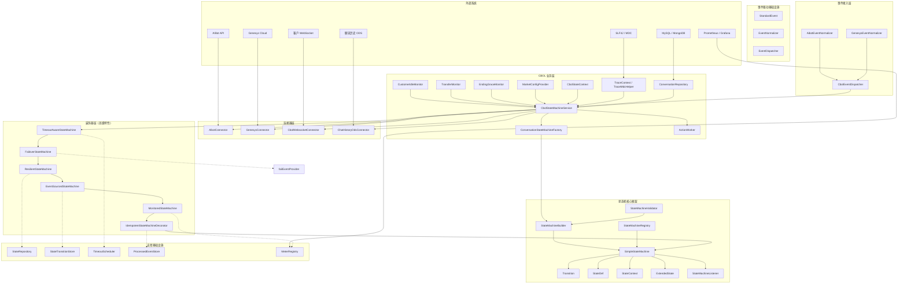

# 状态机架构设计

> 版本：1.0 | 最后更新：2026-09-01

## 1. 概述

本项目为 CBOL（AI 消息中心）系统实现了一个**轻量级、无状态、表驱动的状态机框架**。该框架受 Spring StateMachine 设计理念启发，但针对简洁性、零外部依赖和高性能进行了优化。

项目由两层组成：

| 层 | 包 | 职责 |
|----|----|------|
| **核心框架** | `com.selfdevelopment.ai.messaging.statemachine` | 通用、可复用的状态机引擎 |
| **CBOL 业务层** | `com.selfdevelopment.ai.messaging.cbol` | CBOL 特定的状态定义、迁移和服务 |

## 2. 设计原则

### 2.1 无状态引擎（强制）

状态机引擎本身**不**存储当前状态。调用方在每次 `fireEvent` 调用时注入当前状态。这种设计：

- 允许单个机器实例服务数千个并发会话
- 消除状态存储的线程安全问题
- 支持无需会话亲和性的水平扩展
- 简化状态持久化（调用方管理 DB/缓存）

```java
// 调用方管理状态；引擎只存储迁移规则
ConversationState newState = stateMachine.fireEvent(
    conversation.getCurrentState(),  // 由调用方注入
    ConversationFact.CUSTOMER_CONNECT,
    context
).getTargetState();
conversation.setCurrentState(newState);
repository.save(conversation);
```

### 2.2 表驱动迁移（O(1) 查找）

迁移存储在以 `(sourceState, event)` 为键的 `ConcurrentHashMap` 中，实现 O(1) 查找。具有相同键的多个迁移（不同 guard）存储为列表并按顺序评估。

### 2.3 零外部依赖

核心框架仅依赖 JDK 标准库。没有 Spring，没有 Apache Commons，没有 Guava。这使得它：

- 易于嵌入任何 Java 项目
- 轻量级核心（约 15 个核心类，含业务层和高级特性共 84 个）
- 无依赖冲突
- 启动快（无框架初始化）

### 2.4 Spring 风格配置

虽然核心零依赖，但配置 API 受 Spring StateMachine 的 `StateMachineConfigurerAdapter` 启发：

```java
public class ConversationConfig extends StateMachineConfigurerAdapter<ConversationState, ConversationFact, CbolStateContext> {
    @Override
    public void configure(StateConfigurer<...> states) {
        states.initial(INITIATED).state(ACTIVE).end(CLOSED);
    }

    @Override
    public void configure(TransitionConfigurer<...> transitions) {
        transitions.withExternal()
            .source(INITIATED).event(CUSTOMER_CONNECT).target(ACTIVE);
    }
}
```

## 3. 架构图



## 4. 包结构

```
com.selfdevelopment.ai.messaging/
├── statemachine/                          # 核心框架
│   ├── core/                              # 核心抽象
│   │   ├── StateMachine.java              # 接口（生命周期、fireEvent、监听器、getAllTransitions）
│   │   ├── SimpleStateMachine.java        # 默认实现（无状态、表驱动）
│   │   ├── Transition.java                # 迁移规则（source、event、target、guard、action、kind）
│   │   ├── StateDef.java                  # 状态定义（进入/退出动作、初始/结束标志）
│   │   ├── StateContext.java              # 迁移过程中传递的上下文对象
│   │   ├── ExtendedState.java             # 跨迁移共享的键值变量
│   │   ├── Guard.java                     # guard 条件的函数式接口
│   │   ├── Action.java                    # 迁移动作的函数式接口
│   │   └── TransitionKind.java            # EXTERNAL / INTERNAL 枚举
│   ├── builder/
│   │   └── StateMachineBuilder.java       # 流式 DSL 构建器 + fromConfigurer() 工厂 + build(validate)
│   ├── config/
│   │   ├── StateMachineConfigurerAdapter.java  # Spring 风格配置基类
│   │   ├── StateConfigurer.java           # 状态配置接口
│   │   ├── DefaultStateConfigurer.java    # 默认实现
│   │   ├── TransitionConfigurer.java      # 迁移配置接口
│   │   └── DefaultTransitionConfigurer.java
│   ├── listener/
│   │   └── StateMachineListener.java      # 8 个回调钩子（started、stopped、transition*、stateChanged、error）
│   ├── registry/
│   │   └── StateMachineRegistry.java      # 用于共享机器的命名注册表
│   ├── exception/
│   │   └── StateMachineException.java     # 所有状态机错误的运行时异常
│   ├── persistence/                       # 带乐观锁的状态持久化
│   │   ├── StateRepository.java           # 仓库接口（findById、带版本 save）
│   │   ├── InMemoryStateRepository.java   # 带原子版本的内存实现
│   │   ├── VersionedState.java            # Record（state、version）
│   │   └── OptimisticLockException.java   # 版本冲突异常
│   ├── validation/                        # 构建时校验
│   │   ├── StateMachineValidator.java     # 8 条校验规则（ERROR/WARNING 级别）
│   │   └── ValidationError.java           # Record（rule、level、message、state、event）
│   ├── idempotency/                       # 幂等事件处理
│   │   ├── ProcessedEventStore.java       # 已处理事件 ID 的存储接口
│   │   ├── InMemoryProcessedEventStore.java # 内存实现
│   │   └── IdempotentStateMachineDecorator.java # 事件 ID 去重装饰器
│   ├── metrics/                           # 可观测性（Micrometer 可选）
│   │   ├── StateMachineMetrics.java       # 指标收集器（Timer/Counter，5 个指标）
│   │   └── MonitoredStateMachine.java     # 自动埋点装饰器
│   ├── eventsourcing/                     # 事件溯源 / 审计追踪
│   │   ├── StateTransitionEvent.java      # 不可变迁移记录（timestamp、traceId、metadata）
│   │   ├── StateTransitionStore.java      # 存储接口（append、replay、reconstruct、time-travel）
│   │   ├── InMemoryStateTransitionStore.java # 线程安全内存实现
│   │   └── EventSourcedStateMachine.java  # 自动记录装饰器
│   ├── resilience/                        # 失败处理策略
│   │   ├── FailureHandler.java            # 策略接口（NO_TRANSITION/GUARD_FAILED/ACTION_ERROR）
│   │   ├── ThrowFailureHandler.java       # 抛出 StateMachineException（默认）
│   │   ├── ReturnSourceFailureHandler.java # 返回源状态，accepted=false
│   │   ├── FallbackStateFailureHandler.java # 迁移到配置的回退状态
│   │   ├── RetryFailureHandler.java       # 固定/指数退避重试
│   │   └── ResilientStateMachine.java     # 集成失败处理器的装饰器
│   ├── timeout/                           # 定时超时事件
│   │   ├── TimeoutConfig.java             # 状态超时配置（duration、event、repeat）
│   │   ├── StateMachineTimeoutScheduler.java # 调度器接口
│   │   ├── InMemoryTimeoutScheduler.java  # 基于 ScheduledExecutorService 的实现
│   │   └── TimeoutAwareStateMachine.java  # 自动调度/取消装饰器
│   ├── diagram/                           # 图生成
│   │   └── StateMachineDiagramGenerator.java # Mermaid / PlantUML / 迁移表
│   └── event/                             # 标准事件驱动基础设施
│       ├── StandardEvent.java             # 标准事件契约（eventId、type、source、entityId、payload、traceId）
│       ├── EventNormalizer.java           # 事件归一化器接口 <SRC, DST>
│       └── EventDispatcher.java           # 事件分发器（处理器路由、拦截器）
│
└── cbol/                                   # CBOL 业务层
    ├── enums/
    │   ├── ConversationState.java          # 7 个状态：INITIATED、ACTIVE、TRANSFERRED、SURVEY_IN_PROGRESS、ENDING、ERROR、CLOSED
    │   ├── ConversationFact.java           # 18 个事件（生命周期、转接、满意度调查、结束、系统、故障转移）
    │   ├── InteractionState.java           # 通道层面状态
    │   ├── EndReason.java                  # 会话结束原因
    │   └── TransferOutcome.java            # 转接结果码
    ├── model/
    │   ├── ConversationInstance.java       # 不可变 record（conversationId、state、market、...）
    │   ├── InteractionInstance.java        # 不可变 record（interactionId、channel、deviceType、...）
    │   └── StateTransitionRecord.java      # 审计记录（fromState、toState、fact、durationMs、traceId）
    ├── context/
    │   ├── CbolStateContext.java           # 聚合上下文（conversation + interaction + marketConfig + trace）
    │   ├── TraceContext.java               # 追踪标识符（traceId、spanId）
    │   └── TraceMdcHelper.java             # SLF4J MDC 传播工具
    ├── config/
    │   ├── StateMachineMarketConfig.java   # 市场层面配置（超时、阈值）
    │   └── MarketConfigProvider.java       # 配置提供者接口 + InMemoryProvider
    ├── ingress/                            # 事件接入层
    │   ├── AibotEvent.java                 # AIBot 外部事件 record
    │   ├── GenesysEvent.java               # Genesys 外部事件 record
    │   ├── AibotEventNormalizer.java       # AIBot → StandardEvent（4 种事件类型映射）
    │   ├── GenesysEventNormalizer.java     # Genesys → StandardEvent（6 种事件类型映射）
    │   └── CbolEventDispatcher.java         # 双状态机流水线分发器
    ├── action/
    │   ├── CbolAction.java                 # CBOL 动作的函数式接口
    │   ├── ActionWorker.java               # 有界线程池异步执行器 + MDC 传播
    │   └── CbolActionDefinition.java       # 动作元数据
    ├── statemachine/
    │   ├── ConversationStateMachineFactory.java  # 构建并注册会话状态机
    │   ├── InteractionStateMachineFactory.java   # 通道层面状态机
    │   ├── CbolStateMachineService.java    # 主服务入口（fire、审计日志、fireWithLock）
    │   └── CbolStateMachineRegistry.java   # 共享注册表的单例持有者
    ├── connector/                          # 业务连接器层
    │   ├── Connector.java                  # 连接器接口 + 请求/响应 record + 异常
    │   ├── AibotConnector.java             # AIBot API 连接器（sendMessage、triggerHandoff、endSession）
    │   ├── GenesysConnector.java           # Genesys Cloud 连接器（routeToQueue、sendAgentMessage、transfer）
    │   ├── CbolWebsocketConnector.java     # 客户 WebSocket 连接器（pushMessage、typingIndicator、会话管理）
    │   └── ChatHistoryOdsConnector.java    # 聊天历史 ODS 连接器（saveMessage、saveStateChange、queryHistory）
    ├── repository/                         # CBOL 持久化实现
    │   └── ConversationRepository.java     # 会话状态仓库（乐观锁、实例存储）
    └── monitor/
        ├── AbstractTimeoutMonitor.java     # 基于时间的监控器基类
        ├── CustomerIdleMonitor.java        # 空闲阈值超时时触发 SYS_CUSTOMER_IDLE
        ├── TransferMonitor.java            # 转接耗时过长时触发 SYS_TRANSFER_TIMEOUT
        └── EndingGraceMonitor.java         # 触发 SYS_ENDING_GRACE_TIMEOUT 关闭会话
```

## 5. 关键设计决策

| 决策 | 理由 | 权衡 |
|------|------|------|
| 无状态引擎 | 线程安全、可扩展、持久化简单 | 调用方必须管理状态存储 |
| 表驱动迁移 | O(1) 查找、无 if-else 链 | 迁移表的内存开销 |
| 零依赖 | 轻量级、无冲突 | 无内置持久化、AOP 等 |
| 进入/退出动作为尽力执行 | 副作用不应阻断状态迁移 | 动作失败仅通过监听器通知 |
| 迁移动作失败传播 | 业务逻辑失败应可见 | 调用方必须处理 StateMachineException |
| ActionWorker 使用有界线程池 | 防止高负载下 OOM | CallerRunsPolicy 提供背压 |
| 市场层面配置 | 多市场部署需要每市场调优 | InMemoryProvider 需要外部刷新机制 |
| 通过 SLF4J MDC 传播 TraceId | 零代码改动实现全链路可观测性 | 必须在 finally 块中清除 MDC |

## 6. 相关文档

- [01-State-Machine-Core-Design.md](./01-State-Machine-Core-Design.md) — 核心框架详细设计
- [02-CBOL-Business-Layer-Design.md](./02-CBOL-Business-Layer-Design.md) — CBOL 业务层详细设计
- [03-State-Transition-Diagrams.md](./03-State-Transition-Diagrams.md) — 状态图和迁移表
- [04-Usage-Guide.md](./04-Usage-Guide.md) — 快速开始和使用示例
