# 状态机架构设计

> 版本：2.0 | 最后更新：2026-09-02

## 1. 概述

本项目为 CBOL（AI 消息中心）系统实现了一个**轻量级、无状态、表驱动的状态机框架**。该框架受 Spring StateMachine 设计理念启发，但针对简洁性、零外部依赖和高性能进行了优化。

项目组织为**多模块 Maven 项目**，包含三个模块：

| 模块 | 包名 | 职责 |
|------|------|------|
| **statemachine-core** | `com.selfdevelopment.statemachine` | 通用、可复用的状态机引擎 + 高级特性（持久化、事件溯源、幂等性、弹性、指标、超时、校验、图生成） |
| **chat-engine** | `com.selfdevelopment.chatengine` | 会话状态机（业务层）：7 个状态、多市场配置、监控器、异步动作、Aibot/ChatHistory 连接器 |
| **agent-connector** | `com.selfdevelopment.agentconnector` | 交互状态机（通道层）：6 个状态、Genesys/WebSocket 连接器、事件归一化器 |

### 模块依赖

```
chat-engine ──► statemachine-core
agent-connector ──► statemachine-core
```

`chat-engine` 和 `agent-connector` 之间**没有直接依赖**。这种分离确保：
- 通道层关注点（连接、保持、转接）与业务层关注点（会话生命周期）隔离
- 每个模块可以独立开发、测试和部署
- 清晰的系统边界：chat-engine 连接 AIBot 和 ChatHistory；agent-connector 连接 Genesys 和 WebSocket

## 2. 设计原则

### 2.1 无状态引擎（强制）

状态机引擎本身**不**存储当前状态。调用方在每次 `fireEvent` 调用时注入当前状态。这种设计：

- 允许单个机器实例服务数千个并发会话
- 消除状态存储的线程安全问题
- 支持无需会话亲和性的水平扩展
- 简化状态持久化（调用方管理 DB/缓存）

```java
// 调用方管理状态；引擎只存储迁移规则
ConversationState newState = stateMachine.fireEvent(
    conversation.getCurrentState(),  // 由调用方注入
    ConversationFact.CUSTOMER_CONNECT,
    context
).getTargetState();
conversation.setCurrentState(newState);
repository.save(conversation);
```

### 2.2 表驱动迁移（O(1) 查找）

迁移存储在以 `(sourceState, event)` 为键的 `ConcurrentHashMap` 中，实现 O(1) 查找。具有相同键的多个迁移（不同 guard）存储为列表并按顺序评估。

### 2.3 零外部依赖

核心框架仅依赖 JDK 标准库。没有 Spring，没有 Apache Commons，没有 Guava。这使得它：

- 易于嵌入任何 Java 项目
- 轻量级核心（约 15 个核心类，含业务层和高级特性共 84 个）
- 无依赖冲突
- 启动快（无框架初始化）

### 2.4 Spring 风格配置

虽然核心零依赖，但配置 API 受 Spring StateMachine 的 `StateMachineConfigurerAdapter` 启发：

```java
public class ConversationConfig extends StateMachineConfigurerAdapter<ConversationState, ConversationFact, CbolStateContext> {
    @Override
    public void configure(StateConfigurer<...> states) {
        states.initial(INITIATED).state(IN_PROGRESS).end(CLOSED);
    }

    @Override
    public void configure(TransitionConfigurer<...> transitions) {
        transitions.withExternal()
            .source(INITIATED).event(CUSTOMER_CONNECT).target(IN_PROGRESS);
    }
}
```

## 3. 架构图

```mermaid
graph TB
    subgraph "chat-engine 模块 (com.selfdevelopment.chatengine)"
        subgraph "事件接入层"
            IN1[AibotEventNormalizer]
            IN3[ChatEngineEventDispatcher]
            IN1 --> IN3
        end

        subgraph "会话状态机"
            A[ChatEngineStateMachineService] --> B[ConversationStateMachineFactory]
            A --> C[ActionWorker]
            D[CustomerIdleMonitor] --> A
            E[TransferMonitor] --> A
            F[EndingGraceMonitor] --> A
            G[MarketConfigProvider] --> A
            H[CbolStateContext] --> A
            I[TraceContext / TraceMdcHelper] --> A
            REPO[ConversationRepository] --> A
        end

        subgraph "Chat Engine 连接器"
            CN1[AibotConnector]
            CN4[ChatHistoryOdsConnector]
        end
    end

    subgraph "agent-connector 模块 (com.selfdevelopment.agentconnector)"
        subgraph "交互状态机"
            AC1[AgentConnectorStateMachineService] --> AC2[InteractionStateMachineFactory]
            AC3[AgentConnectorStateContext] --> AC1
        end

        subgraph "Agent 连接器"
            CN2[GenesysConnector]
            CN3[CbolWebsocketConnector]
            IN2[GenesysEventNormalizer]
        end
    end

    subgraph "statemachine-core 模块 (com.selfdevelopment.statemachine)"
        subgraph "装饰器层（高级特性）"
            DA[TimeoutAwareStateMachine]
            DF[FailoverStateMachine]
            DB[ResilientStateMachine]
            DC[EventSourcedStateMachine]
            DD[MonitoredStateMachine]
            DE[IdempotentStateMachineDecorator]
            DA --> DF --> DB --> DC --> DD --> DE
        end

        subgraph "状态机核心框架"
            J[StateMachineBuilder] --> K[SimpleStateMachine]
            K --> L[Transition]
            K --> M[StateDef]
            K --> N[StateContext]
            K --> O[ExtendedState]
            K --> P[StateMachineListener]
            Q[StateMachineRegistry] --> K
            V[StateMachineValidator] --> J
        end

        subgraph "事件驱动基础设施"
            EV1[StandardEvent]
            EV2[EventNormalizer]
            EV3[EventDispatcher]
        end

        subgraph "支撑基础设施"
            R1[StateRepository]
            R2[StateTransitionStore]
            R3[TimeoutScheduler]
            R4[ProcessedEventStore]
            R5[MeterRegistry]
            R6[Connector 接口]
        end
    end

    subgraph "外部系统"
        S1[AIBot API] --> CN1
        S2[Genesys Cloud] --> CN2
        S3[客户 WebSocket] --> CN3
        S4[聊天历史 ODS] --> CN4
        S5[MySQL / MongoDB] --> REPO
        S6[SLF4J / MDC] --> I
        S7[Prometheus / Grafana] --> R5
    end

    IN3 --> A
    A --> DA
    DE --> K
    A --> CN1
    A --> CN4
    AC1 --> DA
    AC1 --> CN2
    AC1 --> CN3
    IN2 --> AC1
    DA -.-> R3
    DF -.-> failEventProvider
    DB -.-> R1
    DC -.-> R2
    DD -.-> R5
    DE -.-> R4
    CN1 -.-> R6
    CN2 -.-> R6
    CN3 -.-> R6
    CN4 -.-> R6
```



## 4. 包结构

### 4.1 statemachine-core 模块 (com.selfdevelopment.statemachine)

```
com.selfdevelopment.statemachine/
├── api/                              # 核心接口
│   ├── StateMachine.java             # 接口（生命周期、fireEvent、监听器、getAllTransitions）
│   ├── Action.java                   # 迁移动作的函数式接口
│   ├── Guard.java                    # guard 条件的函数式接口
│   ├── StateMachineListener.java     # 8 个回调钩子
│   └── StateMachineRegistry.java     # 用于共享机器的命名注册表
├── core/                             # 核心实现
│   ├── SimpleStateMachine.java       # 默认实现（无状态、表驱动）
│   ├── Transition.java               # 迁移规则（source、event、target、guard、action、kind）
│   ├── StateDef.java                 # 状态定义（进入/退出动作、初始/结束标志）
│   ├── StateContext.java             # 迁移过程中传递的上下文对象
│   ├── ExtendedState.java            # 跨迁移共享的键值变量
│   └── TransitionKind.java           # EXTERNAL / INTERNAL 枚举
├── builder/
│   └── StateMachineBuilder.java      # 流式 DSL 构建器 + fromConfigurer() 工厂 + build(validate)
├── config/                            # Spring 风格配置
│   ├── StateMachineConfigurerAdapter.java
│   ├── StateConfigurer.java
│   ├── DefaultStateConfigurer.java
│   ├── TransitionConfigurer.java
│   └── DefaultTransitionConfigurer.java
├── connector/                         # 通用 Connector 接口
│   └── Connector.java
├── event/                             # 标准事件驱动基础设施
│   ├── StandardEvent.java
│   ├── EventNormalizer.java
│   └── EventDispatcher.java
├── persistence/                       # 带乐观锁的状态持久化
│   ├── StateRepository.java
│   ├── InMemoryStateRepository.java
│   ├── VersionedState.java
│   └── OptimisticLockException.java
├── validation/                        # 构建时校验
│   ├── StateMachineValidator.java    # 8 条校验规则（ERROR/WARNING 级别）
│   └── ValidationError.java
├── idempotency/                       # 幂等事件处理
│   ├── ProcessedEventStore.java
│   ├── InMemoryProcessedEventStore.java
│   └── IdempotentStateMachineDecorator.java
├── metrics/                           # 可观测性（Micrometer 可选）
│   ├── StateMachineMetrics.java
│   └── MonitoredStateMachine.java
├── eventsourcing/                     # 事件溯源 / 审计追踪
│   ├── StateTransitionEvent.java
│   ├── StateTransitionStore.java
│   ├── InMemoryStateTransitionStore.java
│   └── EventSourcedStateMachine.java
├── resilience/                        # 失败处理策略
│   ├── FailureHandler.java
│   ├── ThrowFailureHandler.java
│   ├── ReturnSourceFailureHandler.java
│   ├── FallbackStateFailureHandler.java
│   ├── RetryFailureHandler.java
│   ├── ResilientStateMachine.java
│   ├── FailoverStateMachine.java
│   └── FailoverContext.java
├── timeout/                           # 定时超时事件
│   ├── TimeoutConfig.java
│   ├── StateMachineTimeoutScheduler.java
│   ├── InMemoryTimeoutScheduler.java
│   └── TimeoutAwareStateMachine.java
├── diagram/                           # 图生成
│   └── StateMachineDiagramGenerator.java
└── exception/
    └── StateMachineException.java
```

### 4.2 chat-engine 模块 (com.selfdevelopment.chatengine)

```
com.selfdevelopment.chatengine/
├── enums/
│   ├── ConversationState.java          # 7 个状态：INITIATED、IN_PROGRESS、TRANSFERRED、IN_PROGRESS、ENDING、ERROR、CLOSED
│   ├── ConversationFact.java           # 18 个事件（生命周期、转接、满意度调查、结束、系统、故障转移）
│   ├── EndReason.java
│   └── TransferOutcome.java
├── model/
│   ├── ConversationInstance.java       # 不可变 record（conversationId、state、market、...）
│   ├── InteractionInstance.java        # 简化的交互 record（用于上下文）
│   └── StateTransitionRecord.java      # 审计记录
├── context/
│   ├── CbolStateContext.java           # 聚合上下文（conversation + interaction + marketConfig + trace）
│   ├── TraceContext.java               # 追踪标识符（traceId、spanId）
│   └── TraceMdcHelper.java             # SLF4J MDC 传播工具
├── config/
│   ├── StateMachineMarketConfig.java   # 市场层面配置
│   └── MarketConfigProvider.java       # 配置提供者
├── ingress/                             # 事件接入层
│   ├── AibotEvent.java
│   ├── AibotEventNormalizer.java
│   └── ChatEngineEventDispatcher.java
├── action/
│   ├── CbolAction.java
│   ├── ActionWorker.java               # 有界线程池异步执行器 + MDC 传播
│   └── CbolActionDefinition.java
├── statemachine/
│   ├── factory/
│   │   └── ConversationStateMachineFactory.java
│   └── registry/
│       └── CbolStateMachineRegistry.java
├── service/
│   └── ChatEngineStateMachineService.java  # 主服务入口
├── connector/                           # Chat Engine 连接器
│   ├── AibotConnector.java             # AIBot API 连接器
│   └── ChatHistoryOdsConnector.java    # 聊天历史 ODS 连接器
├── repository/
│   └── ConversationRepository.java
├── monitor/
│   ├── AbstractTimeoutMonitor.java
│   ├── CustomerIdleMonitor.java
│   ├── TransferMonitor.java
│   └── EndingGraceMonitor.java
└── demo/
    └── ChatEngineDemo.java              # 4 个演示场景
```

### 4.3 agent-connector 模块 (com.selfdevelopment.agentconnector)

```
com.selfdevelopment.agentconnector/
├── enums/
│   ├── InteractionState.java           # 6 个状态：CONNECTING、CONNECTED、RECONNECTING、HELD、TRANSFERRING、DISCONNECTED
│   └── InteractionFact.java            # 14 个事件（连接生命周期、保持、转接）
├── model/
│   └── InteractionInstance.java        # 不可变 record（interactionId、channelType、state、...）
├── context/
│   └── AgentConnectorStateContext.java
├── ingress/
│   ├── GenesysEvent.java
│   ├── GenesysEventNormalizer.java
│   └── AgentConnectorEventDispatcher.java
├── statemachine/
│   ├── factory/
│   │   └── InteractionStateMachineFactory.java
│   └── registry/
│       └── AgentConnectorStateMachineRegistry.java
├── service/
│   └── AgentConnectorStateMachineService.java
├── connector/
│   ├── GenesysConnector.java           # Genesys Cloud 连接器
│   └── CbolWebsocketConnector.java     # 客户 WebSocket 连接器
└── demo/
    └── AgentConnectorDemo.java          # 6 个演示场景
```

## 5. 关键设计决策

| 决策 | 理由 | 权衡 |
|------|------|------|
| 无状态引擎 | 线程安全、可扩展、持久化简单 | 调用方必须管理状态存储 |
| 表驱动迁移 | O(1) 查找、无 if-else 链 | 迁移表的内存开销 |
| 零依赖 | 轻量级、无冲突 | 无内置持久化、AOP 等 |
| 进入/退出动作为尽力执行 | 副作用不应阻断状态迁移 | 动作失败仅通过监听器通知 |
| 迁移动作失败传播 | 业务逻辑失败应可见 | 调用方必须处理 StateMachineException |
| ActionWorker 使用有界线程池 | 防止高负载下 OOM | CallerRunsPolicy 提供背压 |
| 市场层面配置 | 多市场部署需要每市场调优 | InMemoryProvider 需要外部刷新机制 |
| 通过 SLF4J MDC 传播 TraceId | 零代码改动实现全链路可观测性 | 必须在 finally 块中清除 MDC |
| **多模块结构** | 清晰的关注点分离：核心 vs chat-engine vs agent-connector | 构建配置稍复杂 |
| **无循环依赖** | chat-engine 和 agent-connector 仅依赖 statemachine-core | 跨模块通信必须通过明确定义的接口 |
| **Survey 作为进行中状态** | 满意度调查流程由状态机控制，而非布尔标志 | 会话生命周期中增加了一个状态 |
| **故障转移机制** | 未处理的异常触发 FAIL 事件，路由到失败分支 | 增加了 ERROR 状态和重试/中止事件 |

## 6. 相关文档

- [01-State-Machine-Core-Design.md](./01-State-Machine-Core-Design.md) — 核心框架详细设计
- [02-CBOL-Business-Layer-Design.md](./02-CBOL-Business-Layer-Design.md) — Chat Engine 业务层详细设计
- [03-State-Transition-Diagrams.md](./03-State-Transition-Diagrams.md) — 状态图和迁移表
- [04-Usage-Guide.md](./04-Usage-Guide.md) — 快速开始和使用示例
