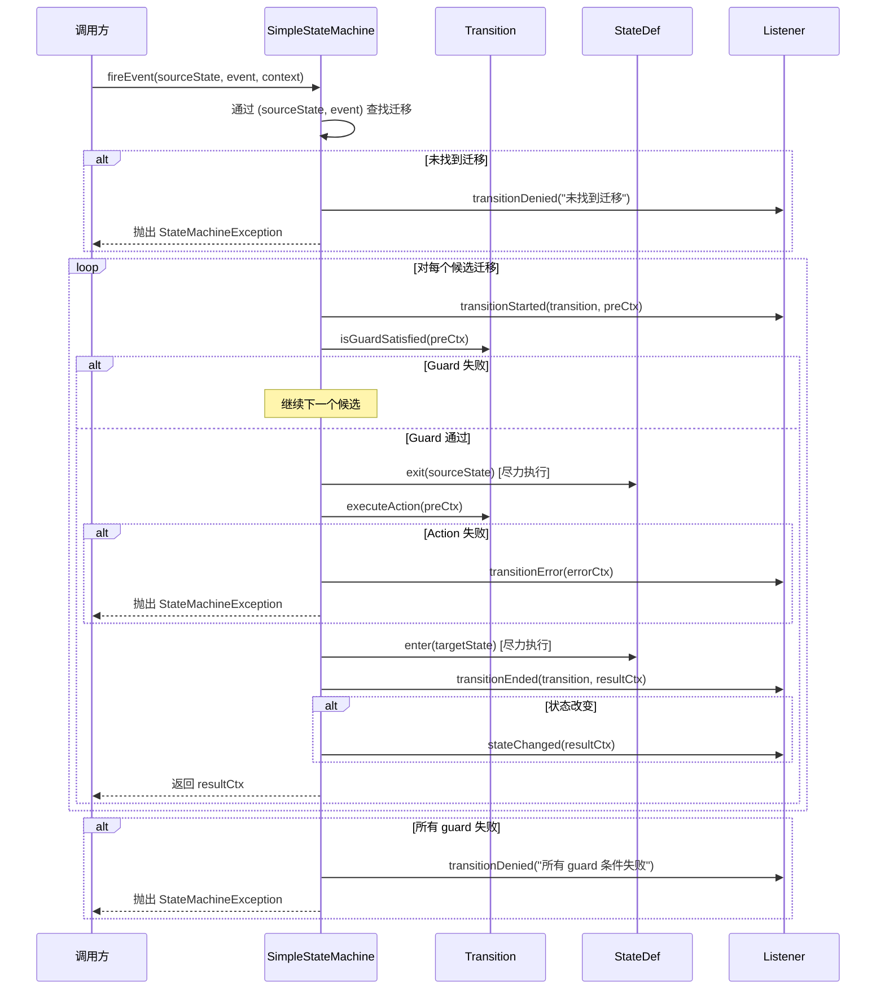

# 状态机核心框架设计

> 版本：1.0 | 最后更新：2026-09-01

## 1. 核心抽象

### 1.1 StateMachine 接口

定义状态机契约的中心接口。

```java
public interface StateMachine<S, E, C> {
    // 生命周期
    void start();
    void stop();
    boolean isStarted();

    // 事件处理
    StateContext<S, E, C> fireEvent(S sourceState, E event, C context);
    StateContext<S, E, C> fireEvent(S sourceState, E event, C context, ExtendedState extendedState);

    // 查询
    boolean hasTransition(S sourceState, E event);
    boolean canFire(S sourceState, E event, C context);
    int getTransitionCount();
    String getMachineId();
    S getInitialState();
    Collection<S> getEndStates();

    // 监听器
    void addListener(StateMachineListener<S, E, C> listener);
    void removeListener(StateMachineListener<S, E, C> listener);
}
```

**类型参数：**
- `S` — 状态类型（通常是枚举）
- `E` — 事件类型（通常是枚举）
- `C` — 业务上下文类型（携带领域数据）

### 1.2 SimpleStateMachine 实现

默认的线程安全实现。

**内部数据结构：**

```java
// 迁移查找：通过 (sourceState, event) 实现 O(1)
private final Map<TransitionKey<S, E>, List<Transition<S, E, C>>> transitions;

// 状态定义：进入/退出动作、初始/结束标志
private final Map<S, StateDef<S, E, C>> stateDefs;

// 监听器：CopyOnWriteArrayList 用于线程安全迭代
private final List<StateMachineListener<S, E, C>> listeners = new CopyOnWriteArrayList<>();

// 生命周期
private volatile boolean started = false;
```

**TransitionKey** 是用作 Map 键的私有 record：

```java
private record TransitionKey<S, E>(S sourceState, E event) {
    static <S, E> TransitionKey<S, E> of(S sourceState, E event) {
        return new TransitionKey<>(sourceState, event);
    }
}
```

### 1.3 Transition

表示单条迁移规则。

```java
public final class Transition<S, E, C> {
    private final S sourceState;      // 迁移前状态
    private final E event;            // 触发事件
    private final S targetState;      // 迁移后状态
    private final Guard<S, E, C> guard;    // 可选条件（null = 始终允许）
    private final Action<S, E, C> action;  // 可选副作用
    private final TransitionKind kind;      // EXTERNAL（默认）或 INTERNAL
}
```

**关键方法：**
- `matches(sourceState, event)` — 检查此迁移是否适用
- `isGuardSatisfied(context)` — 评估 guard（null guard = true）
- `executeAction(context)` — 执行动作（如果存在）
- `isInternal()` — 对于 INTERNAL 迁移返回 true

**TransitionKind：**
- `EXTERNAL` — 状态改变；exit(source) → action → entry(target)
- `INTERNAL` — 状态不改变；仅执行 action；无 entry/exit

### 1.4 StateDef

定义状态的元数据，包括进入/退出动作。

```java
public final class StateDef<S, E, C> {
    private final S id;
    private final Action<S, E, C> entryAction;
    private final Action<S, E, C> exitAction;
    private final boolean initial;
    private final boolean end;
}
```

**执行语义：**
- `exit(context)` — 执行退出动作（如果存在）（尽力执行，失败不阻断迁移）
- `enter(context)` — 执行进入动作（如果存在）（尽力执行）
- `hasEntryAction()` / `hasExitAction()` — Null 检查

### 1.5 StateContext

每次迁移过程中传递的上下文对象。

```java
public final class StateContext<S, E, C> {
    private final S sourceState;
    private final S targetState;
    private final E event;
    private final C businessContext;
    private final ExtendedState extendedState;
    private final Exception exception;        // 发生错误时非 null
    private final boolean transitionAccepted; // 迁移已应用时为 true
}
```

**构建器模式：**

```java
StateContext.<S, E, C>builder()
    .sourceState(source)
    .targetState(target)
    .event(event)
    .businessContext(ctx)
    .extendedState(ext)
    .transitionAccepted(true)
    .build();
```

### 1.6 ExtendedState

用于跨迁移共享变量的键值存储。

```java
public final class ExtendedState {
    private final Map<String, Object> variables = new ConcurrentHashMap<>();

    public ExtendedState set(String key, Object value) { ... }  // 返回 this 用于链式调用
    public <T> T get(String key) { ... }
    public <T> T getOrDefault(String key, T defaultValue) { ... }
    public boolean contains(String key) { ... }
    public ExtendedState remove(String key) { ... }  // 返回 this 用于链式调用
    public Map<String, Object> getVariables() { ... }  // 不可修改视图
    public void clear() { ... }
}
```

**使用场景：**
- 在 guard 条件和动作之间传递数据
- 存储中间计算结果
- 跟踪会话内的重试次数

### 1.7 Guard & Action（函数式接口）

```java
@FunctionalInterface
public interface Guard<S, E, C> {
    boolean evaluate(StateContext<S, E, C> context);
}

@FunctionalInterface
public interface Action<S, E, C> {
    void execute(StateContext<S, E, C> context);
}
```

## 2. 事件处理流程

### 2.1 fireEvent 时序图



### 2.2 动作执行顺序（EXTERNAL 迁移）

```
1. 源状态的 exit 动作     （尽力执行，失败 → 仅通知监听器）
2. 迁移动作                （失败 → StateMachineException）
3. 目标状态的 entry 动作    （尽力执行，失败 → 仅通知监听器）
```

**INTERNAL 迁移：** 仅执行步骤 2；无 entry/exit 动作。

### 2.3 错误处理策略

| 组件 | 失败行为 | 理由 |
|------|---------|------|
| Exit 动作 | 通过监听器记录，迁移继续 | 副作用不应阻断状态改变 |
| 迁移动作 | 抛出 StateMachineException | 业务逻辑失败必须可见 |
| Entry 动作 | 通过监听器记录，迁移继续 | 状态已改变，无法回滚 |
| Guard 条件 | 尝试下一个候选；全部失败 → 异常 | Guard 是条件，不是错误 |

## 3. Builder DSL

### 3.1 流式 API

```java
StateMachine<OrderState, OrderEvent, OrderContext> machine =
    StateMachineBuilder.<OrderState, OrderEvent, OrderContext>builder("order-machine")
        .initialState(OrderState.CREATED)
        .endStates(OrderState.COMPLETED, OrderState.CANCELLED)

        // 带 entry/exit 动作的状态
        .stateWithEntry(OrderState.PAID, ctx -> sendConfirmation(ctx))
        .stateWithExit(OrderState.PAID, ctx -> logExit(ctx))

        // 基本迁移
        .transition()
            .from(OrderState.CREATED)
            .on(OrderEvent.PAY)
            .to(OrderState.PAID)
            .guard(ctx -> ctx.getBusinessContext().isPaymentValid())
            .perform(ctx -> processPayment(ctx))
        .and()

        // 内部迁移（状态不改变）
        .transition()
            .from(OrderState.PAID)
            .on(OrderEvent.UPDATE_ADDRESS)
            .to(OrderState.PAID)
            .internal()
            .perform(ctx -> updateAddress(ctx))
        .and()

        .build();
```

### 3.2 Configurer 适配器（Spring 风格）

```java
public class OrderStateMachineConfig
        extends StateMachineConfigurerAdapter<OrderState, OrderEvent, OrderContext> {

    @Override
    public void configure(StateConfigurer<OrderState, OrderEvent, OrderContext> states) {
        states.initial(OrderState.CREATED)
              .state(OrderState.PAID)
              .end(OrderState.COMPLETED)
              .end(OrderState.CANCELLED);
    }

    @Override
    public void configure(TransitionConfigurer<OrderState, OrderEvent, OrderContext> transitions) {
        transitions.withExternal()
            .source(OrderState.CREATED)
            .event(OrderEvent.PAY)
            .target(OrderState.PAID)
            .guard(ctx -> ctx.getBusinessContext().isPaymentValid())
            .action(ctx -> processPayment(ctx))
        .and().withExternal()
            .source(OrderState.PAID)
            .event(OrderEvent.SHIP)
            .target(OrderState.SHIPPED);
    }
}

// 使用
StateMachine<OrderState, OrderEvent, OrderContext> machine =
    StateMachineBuilder.fromConfigurer("order-machine", new OrderStateMachineConfig());
```

## 4. 监听器机制

### 4.1 StateMachineListener 接口

```java
public interface StateMachineListener<S, E, C> {
    default void stateMachineStarted() {}
    default void stateMachineStopped() {}
    default void transitionStarted(Transition<S, E, C> transition, StateContext<S, E, C> ctx) {}
    default void transitionEnded(Transition<S, E, C> transition, StateContext<S, E, C> ctx) {}
    default void transitionDenied(StateContext<S, E, C> ctx, String reason) {}
    default void transitionError(StateContext<S, E, C> ctx) {}
    default void stateChanged(StateContext<S, E, C> ctx) {}
}
```

所有方法都有默认的空实现，因此监听器只需重写它们需要的方法。

### 4.2 常见监听器使用场景

```java
// 审计日志
machine.addListener(new StateMachineListener<>() {
    @Override
    public void stateChanged(StateContext<...> ctx) {
        auditLog.info("状态改变: {} -> {} (事件={})",
            ctx.getSourceState(), ctx.getTargetState(), ctx.getEvent());
    }
});

// 指标
machine.addListener(new StateMachineListener<>() {
    @Override
    public void transitionEnded(Transition<...> t, StateContext<...> ctx) {
        metrics.increment("statemachine.transition.success");
    }
    @Override
    public void transitionError(StateContext<...> ctx) {
        metrics.increment("statemachine.transition.error");
    }
});
```

## 5. 注册表

### 5.1 StateMachineRegistry

用于在应用程序中共享状态机实例的命名注册表。

```java
public class StateMachineRegistry {
    private final Map<String, StateMachine<?, ?, ?>> machines = new ConcurrentHashMap<>();

    public void register(StateMachine<?, ?, ?> machine) { ... }
    public <S, E, C> StateMachine<S, E, C> get(String machineId) { ... }
    public boolean contains(String machineId) { ... }
    public boolean unregister(String machineId) { ... }
    public int size() { ... }
    public void clear() { ... }
}
```

**线程安全：** 使用 `ConcurrentHashMap` 存储；`register` 在重复 ID 时抛出 `StateMachineException`。

## 6. 异常层次结构

```
RuntimeException
└── StateMachineException
    ├── "未找到迁移: state=X, event=Y"
    ├── "迁移 guard 条件失败: state=X, event=Y"
    ├── "迁移动作失败: <cause message>"
    ├── "状态机已注册: id=X"
    └── "状态机未找到: id=X"
```

所有异常都携带描述性消息，以及在适用时的原始 cause。

## 7. 性能特性

| 操作 | 复杂度 | 说明 |
|------|--------|------|
| 迁移查找 | O(1) | ConcurrentHashMap get |
| Guard 评估 | O(n) | n = 具有相同 (state, event) 的候选数 |
| 动作执行 | O(1) | 直接方法调用 |
| 监听器通知 | O(m) | m = 监听器数量（CopyOnWriteArrayList） |
| 每台机器内存 | O(t + s) | t = 迁移数，s = 状态数 |

**线程安全：** 构建完成后，`SimpleStateMachine` 是不可变的，可安全地由任意数量的线程并发使用。
