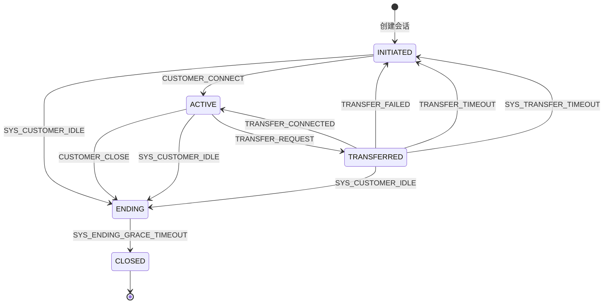
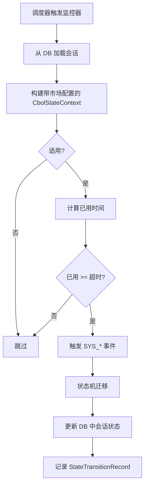
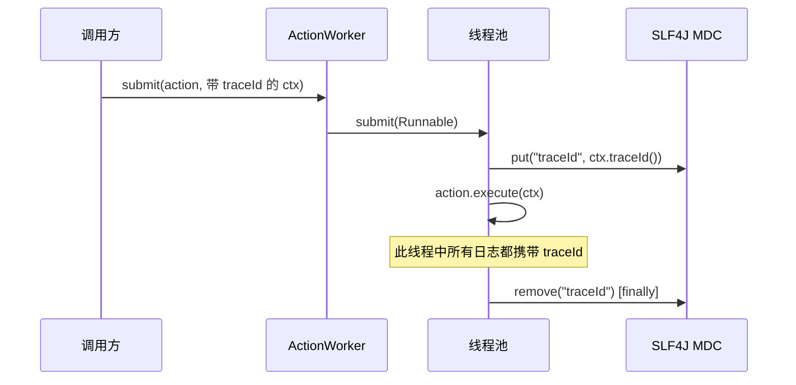
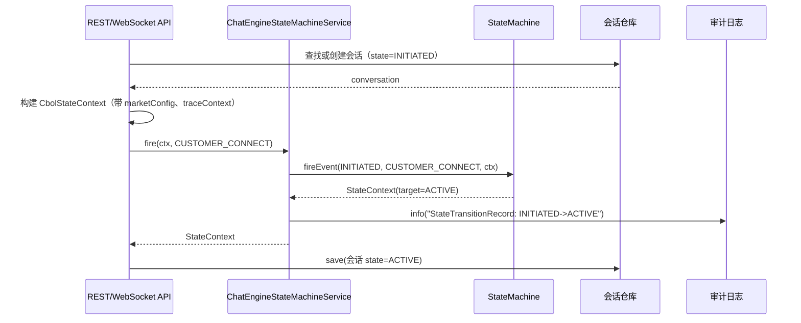
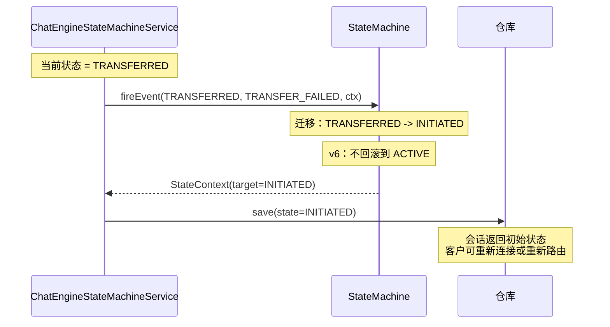

# Chat Engine 业务层设计

> 版本：1.0 | 最后更新：2026-09-01

## 1. 概述

CBOL（AI 消息中心）业务层使用核心状态机框架实现会话生命周期管理。它建模了客户会话从初始连接、AI 处理、人工转接，到最终关闭的完整流程。

**关键特性：**
- **双状态模型**：Conversation（业务层面）+ Interaction（通道层面）
- **多市场支持**：每市场配置超时和特性开关
- **全链路追踪**：通过 SLF4J MDC 跨异步边界传播 TraceId
- **v6 设计**：转接失败/超时返回 INITIATED（不回滚到 ACTIVE）
- **自动化监控器**：三个基于时间的监控器，用于空闲检测、转接超时和结束宽限

## 2. 会话状态模型

### 2.1 状态

```java
public enum ConversationState {
    INITIATED,          // 会话已创建，等待客户连接
    ACTIVE,             // 客户已连接，AI 或人工正在处理
    TRANSFERRED,        // 正在转接人工客服
    SURVEY_IN_PROGRESS, // 会话后满意度调查进行中（由流程控制）
    ENDING,             // 会话结束中，清理宽限期
    ERROR,              // 动作失败，故障转移状态（重试或中止）
    CLOSED              // 终态，会话完全关闭
}
```

### 2.2 状态描述

| 状态 | 描述 | 进入触发 | 退出触发 |
|------|------|---------|---------|
| INITIATED | 会话已创建但客户尚未连接 | 系统创建会话 | CUSTOMER_CONNECT / SYS_ACTION_FAILED |
| ACTIVE | 客户已连接，会话进行中 | CUSTOMER_CONNECT / SYS_RETRY | TRANSFER_REQUEST / SURVEY_START / CUSTOMER_CLOSE / SYS_CUSTOMER_IDLE / SYS_ACTION_FAILED |
| TRANSFERRED | 正在转接客服 | TRANSFER_REQUEST | TRANSFER_CONNECTED / TRANSFER_FAILED / TRANSFER_TIMEOUT / SURVEY_START / SYS_CUSTOMER_IDLE / SYS_ACTION_FAILED |
| SURVEY_IN_PROGRESS | 会话后满意度调查进行中 | SURVEY_START | SURVEY_COMPLETE / SYS_SURVEY_TIMEOUT / SYS_CUSTOMER_IDLE / CUSTOMER_CLOSE / SYS_ACTION_FAILED |
| ENDING | 关闭前的宽限期 | CUSTOMER_CLOSE / SYS_CUSTOMER_IDLE / SURVEY_COMPLETE / SYS_SURVEY_TIMEOUT | SYS_ENDING_GRACE_TIMEOUT |
| ERROR | 动作失败，故障转移状态 | SYS_ACTION_FAILED | SYS_RETRY / SYS_ABORT |
| CLOSED | 终态 | SYS_ENDING_GRACE_TIMEOUT / SYS_ABORT | （无） |

### 2.3 事件（ConversationFact）

```java
public enum ConversationFact {
    // 生命周期
    CUSTOMER_CONNECT,      // 客户建立连接
    AGENT_ATTACHED,        // 人工客服加入

    // 转接
    TRANSFER_REQUEST,      // 请求转接人工客服
    TRANSFER_CONNECTED,    // 客服成功连接
    TRANSFER_FAILED,       // 转接失败（客服不可用、被拒绝等）
    TRANSFER_TIMEOUT,      // 转接等待客服超时

    // 满意度调查
    SURVEY_START,          // 开始会话后满意度调查（surveyEnabled=true）
    SURVEY_COMPLETE,       // 客户完成满意度调查

    // 结束
    CUSTOMER_CLOSE,        // 客户主动关闭
    AGENT_CLOSE,           // 客服关闭

    // 系统（由监控器触发）
    SYS_CUSTOMER_IDLE,          // 客户空闲阈值超限
    SYS_TRANSFER_TIMEOUT,       // 转接时长超限
    SYS_ENDING_GRACE_TIMEOUT,   // 结束宽限期超限
    SYS_SURVEY_TIMEOUT,         // 满意度调查时长超限

    // 故障转移（动作错误 → 失败分支）
    SYS_ACTION_FAILED,    // 动作抛出未处理异常 → 进入 ERROR
    SYS_RETRY,            // 从 ERROR 重试 → ACTIVE
    SYS_ABORT             // 从 ERROR 中止 → CLOSED
}
```

## 3. 状态迁移图



### 3.1 迁移表

| # | 源状态 | 事件 | 目标状态 | Guard | Action | 说明 |
|---|--------|------|---------|-------|--------|------|
| 1 | INITIATED | CUSTOMER_CONNECT | ACTIVE | - | - | 客户连接 |
| 2 | ACTIVE | TRANSFER_REQUEST | TRANSFERRED | transferEnabled | - | 请求转接客服 |
| 3 | TRANSFERRED | TRANSFER_FAILED | INITIATED | - | - | v6：不回滚到 ACTIVE |
| 4 | TRANSFERRED | TRANSFER_TIMEOUT | INITIATED | - | - | v6：不回滚到 ACTIVE |
| 5 | TRANSFERRED | SYS_TRANSFER_TIMEOUT | INITIATED | - | - | 监控器驱动 |
| 6 | ACTIVE | CUSTOMER_CLOSE | ENDING | - | - | 客户关闭 |
| 7 | INITIATED | SYS_CUSTOMER_IDLE | ENDING | - | - | 监控器驱动 |
| 8 | ACTIVE | SYS_CUSTOMER_IDLE | ENDING | - | - | 监控器驱动 |
| 9 | TRANSFERRED | SYS_CUSTOMER_IDLE | ENDING | - | - | 监控器驱动 |
| 10 | ENDING | SYS_ENDING_GRACE_TIMEOUT | CLOSED | - | - | 监控器驱动，终态 |

## 4. 核心组件

### 4.1 CbolStateContext

每次状态迁移过程中传递的聚合上下文对象。

```java
@Builder
public record CbolStateContext(
    ConversationInstance conversation,      // 当前会话数据
    InteractionInstance interaction,         // 通道/设备数据
    StateMachineMarketConfig marketConfig,   // 市场层面配置
    TraceContext traceContext                // 追踪标识符
) {}
```

**设计理由：**
- 不可变 record 确保线程安全
- 将 guard、action 和监控器所需的所有数据聚合在一个对象中
- 市场配置基于快照（在事件发生时捕获），避免迁移过程中配置变化

### 4.2 ConversationInstance

```java
@Builder
public record ConversationInstance(
    String conversationId,          // 唯一会话标识符
    ConversationState state,        // 当前状态（由调用方管理）
    String market,                  // 市场代码（如 "HK"、"SG"、"UK"）
    String customerId,              // 客户标识符
    String agentId,                 // 分配的客服（纯 AI 时为 null）
    Long lastActivityTs,            // 最后客户活动时间戳
    Long transferStartTs,           // 转接开始时间戳（未转接时为 null）
    Long endingStartTs              // 结束期开始时间戳（未结束时为 null）
) {}
```

### 4.3 TraceContext

```java
@Builder
public record TraceContext(
    String traceId,                 // 全链路追踪标识符（UUID）
    String spanId,                  // 当前 span 标识符（UUID）
    String parentSpanId,            // 父 span（根 span 为 null）
    long startTimeMs,               // 追踪开始时间戳
    Map<String, String> tags        // 额外追踪元数据
) {
    public static TraceContext generate() { ... }
}
```

### 4.4 TraceMdcHelper

用于将追踪上下文传播到 SLF4J MDC（映射诊断上下文）的工具类。

```java
public final class TraceMdcHelper {
    public static final String MDC_TRACE_ID = "traceId";
    public static final String MDC_SPAN_ID = "spanId";

    public static void set(TraceContext ctx) {
        if (ctx == null) return;
        MDC.put(MDC_TRACE_ID, ctx.traceId());
        MDC.put(MDC_SPAN_ID, ctx.spanId());
    }

    public static void clear() {
        MDC.remove(MDC_TRACE_ID);
        MDC.remove(MDC_SPAN_ID);
    }
}
```

**使用模式（强制）：**
```java
try {
    TraceMdcHelper.set(ctx.traceContext());
    // ... 业务逻辑 ...
} finally {
    TraceMdcHelper.clear();  // 强制：防止线程池内存泄漏
}
```

## 5. 多市场配置

### 5.1 StateMachineMarketConfig

```java
@Builder
public record StateMachineMarketConfig(
    long customerIdleSeconds,       // 客户空闲阈值（默认：300秒 = 5分钟）
    long transferTimeoutSeconds,     // 转接超时（默认：180秒 = 3分钟）
    long endingGraceSeconds,         // 结束宽限期（默认：120秒 = 2分钟）
    boolean surveyEnabled,           // 是否启用会话后满意度调查
    boolean transferEnabled,         // 是否启用人工客服转接
    boolean genesysEnabled,          // 是否启用 Genesys 集成
    String fallbackRoutingStrategy   // 转接失败时的策略（"DROP"、"RETRY"、"QUEUE"）
) {
    public static StateMachineMarketConfig defaultConfig() { ... }
}
```

### 5.2 MarketConfigProvider

```java
public interface MarketConfigProvider {
    StateMachineMarketConfig getConfig(String market);
    void invalidate(String market);

    class InMemoryProvider implements MarketConfigProvider {
        private final ConcurrentHashMap<String, StateMachineMarketConfig> cache;
        private final StateMachineMarketConfig fallback;

        public StateMachineMarketConfig getConfig(String market) {
            return cache.getOrDefault(market, fallback);
        }
        // ...
    }
}
```

**设计说明：**
- `InMemoryProvider` 是参考实现；生产环境应使用 Redis 后端或配置中心提供者
- `invalidate(market)` 允许在配置变化时刷新缓存
- 回退到 `defaultConfig()` 确保未知市场不会 NPE

## 6. 监控器

### 6.1 AbstractTimeoutMonitor

所有基于时间的监控器的基类。

```java
public abstract class AbstractTimeoutMonitor {
    protected final ChatEngineStateMachineService ChatEngineStateMachineService;

    protected abstract boolean isApplicable(ConversationState state);
    protected abstract long timeoutSeconds(CbolStateContext ctx);
    protected abstract ConversationFact timeoutEvent();

    public void check(CbolStateContext ctx, long referenceTs) {
        if (!isApplicable(ctx.conversation().state())) return;
        long timeoutMs = TimeUnit.SECONDS.toMillis(timeoutSeconds(ctx));
        long elapsedMs = System.currentTimeMillis() - referenceTs;
        if (elapsedMs >= timeoutMs) {
            ChatEngineStateMachineService.fire(ctx, timeoutEvent());
        }
    }
}
```

### 6.2 监控器实现

| 监控器 | 适用状态 | 超时配置 | 触发事件 | 参考时间戳 |
|--------|---------|---------|---------|-----------|
| CustomerIdleMonitor | INITIATED, ACTIVE, TRANSFERRED | customerIdleSeconds | SYS_CUSTOMER_IDLE | lastActivityTs |
| TransferMonitor | TRANSFERRED | transferTimeoutSeconds | SYS_TRANSFER_TIMEOUT | transferStartTs |
| EndingGraceMonitor | ENDING | endingGraceSeconds | SYS_ENDING_GRACE_TIMEOUT | endingStartTs |

### 6.3 监控器执行流程



## 7. ActionWorker（异步执行）

### 7.1 设计

使用有界线程池异步执行状态机动作。

```java
public class ActionWorker {
    private final ExecutorService executor;

    public ActionWorker() {
        this(Runtime.getRuntime().availableProcessors(),  // core
             Runtime.getRuntime().availableProcessors() * 2,  // max
             60L,    // keepAlive 秒
             1000);  // 队列容量
    }

    public void submit(CbolAction action, CbolStateContext ctx) {
        executor.submit(() -> {
            try {
                TraceMdcHelper.set(ctx.traceContext());  // MDC 传播
                action.execute(ctx);
            } catch (RuntimeException e) {
                log.error("动作执行失败, conversationId={}", ..., e);
            } finally {
                TraceMdcHelper.clear();  // 强制清理
            }
        });
    }
}
```

### 7.2 线程池配置

| 参数 | 默认值 | 理由 |
|------|--------|------|
| corePoolSize | CPU 核心数 | 基线负载的最小线程数 |
| maximumPoolSize | CPU 核心数 * 2 | 处理突发的 IO 密集型动作负载 |
| keepAliveTime | 60秒 | 空闲线程回收 |
| queueCapacity | 1000 | 有界队列防止 OOM |
| rejectionPolicy | CallerRunsPolicy | 背压：调用方线程执行任务 |
| threadFactory | NamedThreadFactory | 用于调试的线程名（"cbol-action-worker-N"） |

### 7.3 MDC 传播



## 8. ChatEngineStateMachineService

### 8.1 主入口

```java
public class ChatEngineStateMachineService {
    private final StateMachine<ConversationState, ConversationFact, CbolStateContext> convSm;

    public ChatEngineStateMachineService() {
        this.convSm = CbolStateMachineRegistry.get(ConversationStateMachineFactory.MACHINE_ID);
    }

    public StateContext<ConversationState, ConversationFact, CbolStateContext> fire(
            CbolStateContext ctx, ConversationFact fact) {
        // Null 校验
        Objects.requireNonNull(ctx, "ctx must not be null");
        Objects.requireNonNull(fact, "fact must not be null");

        TraceMdcHelper.set(ctx.traceContext());
        long start = System.currentTimeMillis();
        try {
            ConversationState from = ctx.conversation().state();
            StateContext<...> result = convSm.fireEvent(from, fact, ctx);

            // 审计日志
            StateTransitionRecord record = StateTransitionRecord.builder()
                .businessId(ctx.conversation().conversationId())
                .fromState(from.name())
                .toState(result.getTargetState().name())
                .fact(fact.name())
                .guardResult(result.isTransitionAccepted())
                .timestampMs(System.currentTimeMillis())
                .traceId(ctx.traceContext().traceId())
                .durationMs(System.currentTimeMillis() - start)
                .build();
            log.info("StateTransitionRecord: {}", record);
            return result;
        } finally {
            TraceMdcHelper.clear();
        }
    }
}
```

### 8.2 StateTransitionRecord（审计）

```java
@Builder
public record StateTransitionRecord(
    String businessId,        // conversationId
    String fromState,         // 源状态名
    String toState,           // 目标状态名
    String fact,              // 事件名
    boolean guardResult,      // 迁移是否被接受
    long timestampMs,         // 事件时间戳
    String traceId,           // 追踪标识符
    long durationMs           // 处理耗时
) {}
```

## 9. 工厂与注册表

### 9.1 ConversationStateMachineFactory

构建并注册包含全部 23 条迁移规则（T01-T23）的会话状态机。

```java
public class ConversationStateMachineFactory {
    public static final String MACHINE_ID = "conversation";

    public static StateMachine<ConversationState, ConversationFact, CbolStateContext> build() {
        StateMachineBuilder<...> builder = StateMachineBuilder.builder(MACHINE_ID);

        // 1. INITIATED -> ACTIVE（客户连接）
        builder.transition().from(INITIATED).on(CUSTOMER_CONNECT).to(ACTIVE).and();

        // 2. ACTIVE -> TRANSFERRED（转接请求）
        builder.transition().from(ACTIVE).on(TRANSFER_REQUEST).to(TRANSFERRED).and();

        // 3. TRANSFERRED -> INITIATED（转接失败）[v6：不回滚]
        builder.transition().from(TRANSFERRED).on(TRANSFER_FAILED).to(INITIATED).and();

        // ...（全部 10 条迁移）

        StateMachine<...> sm = builder.build();
        CbolStateMachineRegistry.register(sm);
        return sm;
    }
}
```

### 9.2 CbolStateMachineRegistry

共享 `StateMachineRegistry` 的单例持有者。

```java
public final class CbolStateMachineRegistry {
    private static final StateMachineRegistry INSTANCE = new StateMachineRegistry();

    private CbolStateMachineRegistry() {}  // 单例

    public static StateMachineRegistry getInstance() { return INSTANCE; }
    public static <S, E, C> void register(StateMachine<S, E, C> machine) { INSTANCE.register(machine); }
    public static <S, E, C> StateMachine<S, E, C> get(String machineId) { return INSTANCE.get(machineId); }
    public static void clear() { INSTANCE.clear(); }  // 用于测试隔离
}
```

## 10. 典型使用流程

### 10.1 客户连接



### 10.2 转接失败（v6 行为）



## 11. 错误处理

| 场景 | 异常 | 处理 |
|------|------|------|
| (state, event) 无迁移 | StateMachineException | 调用方捕获，返回 400 或记录警告 |
| Guard 条件失败 | StateMachineException | 调用方捕获，返回 409 Conflict |
| 迁移动作失败 | StateMachineException | 调用方捕获，重试或升级 |
| Entry/exit 动作失败 | （无，尽力执行） | 监听器记录错误，迁移完成 |
| Null 上下文/事件 | NullPointerException | 服务边界快速失败 |
| 异步动作失败 | （仅记录） | ActionWorker 捕获并带 traceId 记录 |

## 12. 测试策略

| 级别 | 关注点 | 工具 |
|------|--------|------|
| 单元 | 单个迁移、guard、action | JUnit 5 |
| 单元 | 监控器超时逻辑 | JUnit 5 + Mock 时钟 |
| 单元 | ActionWorker 中的 MDC 传播 | JUnit 5 + CountDownLatch |
| 集成 | 完整会话生命周期 | JUnit 5 + InMemoryProvider |
| 集成 | 多市场配置 | JUnit 5 + 参数化测试 |

**当前覆盖率：** 83% 行 / 71% 分支（327 个测试用例）
