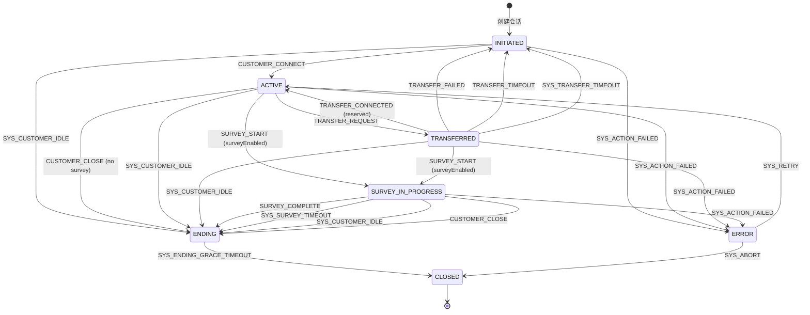
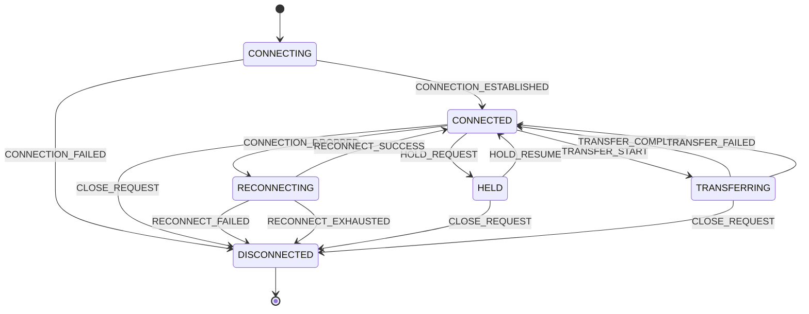
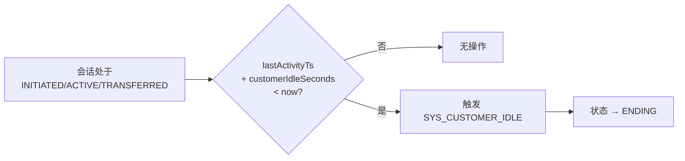
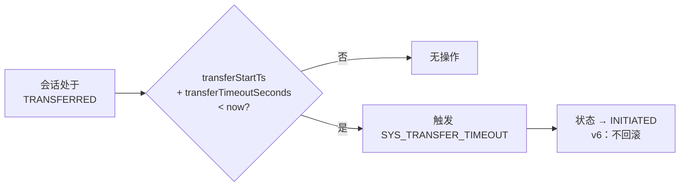
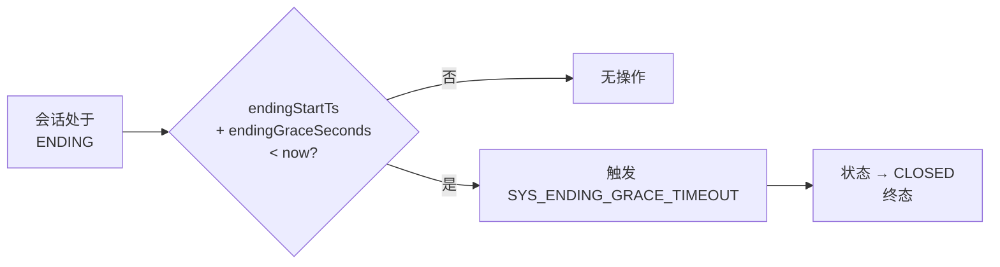
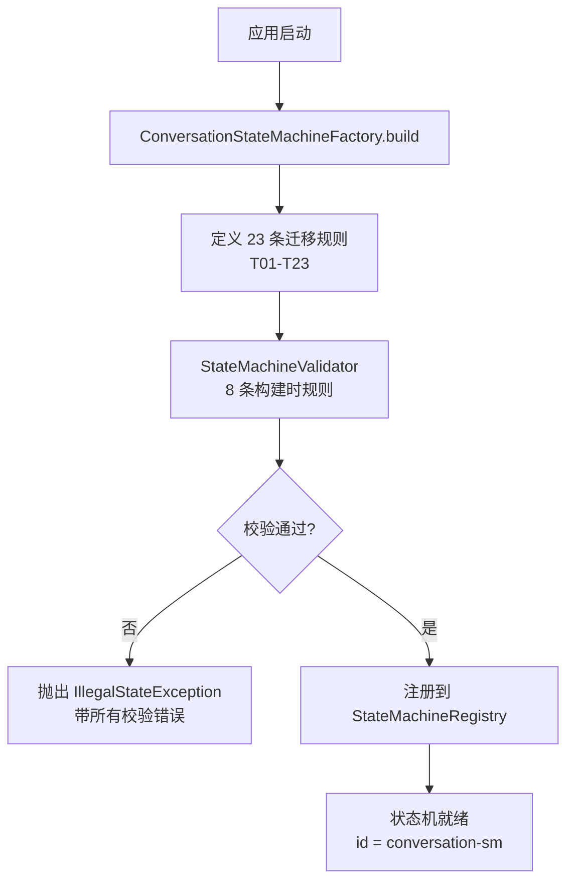
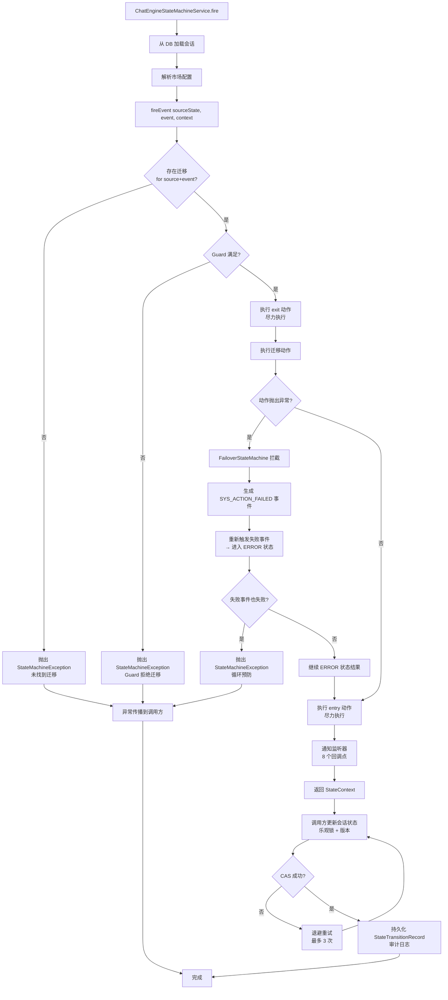

# 状态迁移图与迁移表

> 版本：1.0 | 最后更新：2026-09-01

## 1. 会话状态机

### 1.1 完整状态图



> **满意度调查作为进行中状态**：当 `surveyEnabled=true` 时，`closeConversation()` 触发 `SURVEY_START` 进入 `SURVEY_IN_PROGRESS`，而不是直接进入 `ENDING`。满意度调查流程完全由状态机控制。

> **故障转移（动作错误 → 失败事件）**：当动作抛出未处理异常时，`FailoverStateMachine` 自动触发 `SYS_ACTION_FAILED` 进入 `ERROR` 状态。从 `ERROR` 状态，系统可以重试（`SYS_RETRY` → ACTIVE）或中止（`SYS_ABORT` → CLOSED）。失败事件本身不会触发另一次故障转移（循环预防）。

### 1.2 迁移表

| ID | 源状态 | 事件 | 目标状态 | Guard | Action | 监控器 | v6 说明 |
|----|--------|------|---------|-------|--------|--------|---------|
| T01 | INITIATED | CUSTOMER_CONNECT | ACTIVE | - | - | - | 客户建立连接 |
| T02 | ACTIVE | TRANSFER_REQUEST | TRANSFERRED | transferEnabled | - | - | 请求人工客服 |
| T03 | TRANSFERRED | TRANSFER_CONNECTED | ACTIVE | - | - | - | 预留未来使用 |
| T04 | TRANSFERRED | TRANSFER_FAILED | INITIATED | - | - | - | **v6：不回滚到 ACTIVE** |
| T05 | TRANSFERRED | TRANSFER_TIMEOUT | INITIATED | - | - | - | **v6：不回滚到 ACTIVE** |
| T06 | ACTIVE | CUSTOMER_CLOSE | ENDING | !surveyEnabled | - | - | 客户关闭，无满意度调查 |
| T07 | INITIATED | SYS_CUSTOMER_IDLE | ENDING | - | - | CustomerIdleMonitor | 连接前空闲 |
| T08 | ACTIVE | SYS_CUSTOMER_IDLE | ENDING | - | - | CustomerIdleMonitor | 客户空闲超时 |
| T09 | TRANSFERRED | SYS_CUSTOMER_IDLE | ENDING | - | - | CustomerIdleMonitor | 转接期间空闲 |
| T10 | TRANSFERRED | SYS_TRANSFER_TIMEOUT | INITIATED | - | - | TransferMonitor | **v6：不回滚** |
| T11 | ENDING | SYS_ENDING_GRACE_TIMEOUT | CLOSED | - | - | EndingGraceMonitor | 终态迁移 |
| T12 | ACTIVE | SURVEY_START | SURVEY_IN_PROGRESS | surveyEnabled | 显示满意度调查 UI | - | **满意度调查作为进行中状态** |
| T13 | TRANSFERRED | SURVEY_START | SURVEY_IN_PROGRESS | surveyEnabled | 显示满意度调查 UI | - | **满意度调查作为进行中状态** |
| T14 | SURVEY_IN_PROGRESS | SURVEY_COMPLETE | ENDING | - | 保存满意度调查结果 | - | 满意度调查正常完成 |
| T15 | SURVEY_IN_PROGRESS | SYS_SURVEY_TIMEOUT | ENDING | - | 保存部分结果 | SurveyTimeoutMonitor | 满意度调查超时 |
| T16 | SURVEY_IN_PROGRESS | SYS_CUSTOMER_IDLE | ENDING | - | - | CustomerIdleMonitor | 满意度调查期间客户离开 |
| T17 | SURVEY_IN_PROGRESS | CUSTOMER_CLOSE | ENDING | - | - | - | 客户主动关闭满意度调查 |
| T18 | INITIATED | SYS_ACTION_FAILED | ERROR | - | 记录错误，告警 | FailoverStateMachine | **故障转移：动作错误** |
| T19 | ACTIVE | SYS_ACTION_FAILED | ERROR | - | 记录错误，告警 | FailoverStateMachine | **故障转移：动作错误** |
| T20 | TRANSFERRED | SYS_ACTION_FAILED | ERROR | - | 记录错误，告警 | FailoverStateMachine | **故障转移：动作错误** |
| T21 | SURVEY_IN_PROGRESS | SYS_ACTION_FAILED | ERROR | - | 记录错误，告警 | FailoverStateMachine | **故障转移：动作错误** |
| T22 | ERROR | SYS_RETRY | ACTIVE | - | 重新初始化资源 | - | 手动或系统重试 |
| T23 | ERROR | SYS_ABORT | CLOSED | - | 清理，通知 | - | 不可恢复错误 |

### 1.3 状态进入/退出动作

| 状态 | 进入动作 | 退出动作 |
|------|---------|---------|
| INITIATED | （无） | （无） |
| ACTIVE | 发送欢迎消息（预留） | 通知通道（预留） |
| TRANSFERRED | 发起转接请求 | 取消待处理转接（预留） |
| SURVEY_IN_PROGRESS | 显示满意度调查 UI，启动调查计时器 | 保存满意度调查结果，停止计时器 |
| ENDING | 启动宽限期计时器 | （无） |
| ERROR | 记录错误，告警值班人员，捕获诊断信息 | 清除错误状态 |
| CLOSED | 清理资源，归档会话 | （无，终态） |

## 2. Interaction 状态机

### 2.1 状态

```java
public enum InteractionState {
    CONNECTING,     // 通道正在建立连接
    CONNECTED,      // 通道活跃，通信进行中
    RECONNECTING,   // 通道断开，正在尝试重连
    HELD,           // 客户被保持（客服发起）
    TRANSFERRING,   // 通道转接进行中（如 WebSocket 切换）
    DISCONNECTED    // 通道已终止（终态）
}
```

### 2.2 事件（InteractionFact）

```java
public enum InteractionFact {
    // 连接生命周期
    CONNECTION_ESTABLISHED, CONNECTION_FAILED, CONNECTION_DROPPED,
    RECONNECT_SUCCESS, RECONNECT_FAILED, RECONNECT_EXHAUSTED, CLOSE_REQUEST,
    // 保持
    HOLD_REQUEST, HOLD_RESUME,
    // 转接（通道层面）
    TRANSFER_START, TRANSFER_COMPLETE, TRANSFER_FAILED
}
```

### 2.3 状态图



### 2.4 迁移表

| ID | 源状态 | 事件 | 目标状态 | 说明 |
|----|--------|------|---------|------|
| I01 | CONNECTING | CONNECTION_ESTABLISHED | CONNECTED | 通道连接成功 |
| I02 | CONNECTING | CONNECTION_FAILED | DISCONNECTED | 连接失败（网络/认证） |
| I03 | CONNECTED | CONNECTION_DROPPED | RECONNECTING | 活跃连接意外断开 |
| I04 | CONNECTED | CLOSE_REQUEST | DISCONNECTED | 主动关闭（客户/客服） |
| I05 | RECONNECTING | RECONNECT_SUCCESS | CONNECTED | 重连尝试成功 |
| I06 | RECONNECTING | RECONNECT_FAILED | DISCONNECTED | 重连尝试失败 |
| I07 | RECONNECTING | RECONNECT_EXHAUSTED | DISCONNECTED | 达到最大重连次数 |
| I08 | CONNECTED | HOLD_REQUEST | HELD | 客服保持客户 |
| I09 | HELD | HOLD_RESUME | CONNECTED | 客户从保持中恢复 |
| I10 | HELD | CLOSE_REQUEST | DISCONNECTED | 保持期间关闭 |
| I11 | CONNECTED | TRANSFER_START | TRANSFERRING | 通道转接发起 |
| I12 | TRANSFERRING | TRANSFER_COMPLETE | CONNECTED | 转接完成，在新通道上 |
| I13 | TRANSFERRING | TRANSFER_FAILED | CONNECTED | 转接失败，留在原通道 |
| I14 | TRANSFERRING | CLOSE_REQUEST | DISCONNECTED | 转接期间关闭 |

## 3. 监控器触发图

### 3.1 CustomerIdleMonitor



### 3.2 TransferMonitor



### 3.3 EndingGraceMonitor



## 4. 事件分类

### 4.1 按来源

| 类别 | 事件 | 来源 |
|------|------|------|
| 客户驱动 | CUSTOMER_CONNECT, CUSTOMER_CLOSE | 客户通过通道操作 |
| 客服驱动 | AGENT_ATTACHED, AGENT_CLOSE | 人工客服操作（预留） |
| 系统驱动 | TRANSFER_REQUEST, TRANSFER_FAILED, TRANSFER_TIMEOUT | 业务逻辑 / 集成 |
| 监控器驱动 | SYS_CUSTOMER_IDLE, SYS_TRANSFER_TIMEOUT, SYS_ENDING_GRACE_TIMEOUT | 定时监控器 |
| 满意度调查驱动 | SURVEY_COMPLETE | 会话后满意度调查（预留） |

### 4.2 按效果

| 效果 | 事件 |
|------|------|
| 状态推进（正常） | CUSTOMER_CONNECT, TRANSFER_REQUEST, CUSTOMER_CLOSE |
| 状态重置（v6） | TRANSFER_FAILED, TRANSFER_TIMEOUT, SYS_TRANSFER_TIMEOUT |
| 状态进入结束 | SYS_CUSTOMER_IDLE（从任何非终态） |
| 状态终止 | SYS_ENDING_GRACE_TIMEOUT |
| 无状态改变（内部） | （当前未定义） |

## 5. 默认市场配置

| 参数 | 默认值 | 描述 |
|------|--------|------|
| customerIdleSeconds | 300（5分钟） | 客户不活跃后自动关闭 |
| transferTimeoutSeconds | 180（3分钟） | 等待客服连接的最大时间 |
| endingGraceSeconds | 120（2分钟） | 最终关闭前的宽限期 |
| surveyEnabled | false | 是否发送会话后满意度调查 |
| transferEnabled | true | 是否允许人工客服转接 |
| genesysEnabled | false | Genesys 集成是否激活 |
| fallbackRoutingStrategy | "DROP" | 转接失败时的策略 |

## 6. 状态机生命周期

### 6.1 启动阶段



### 6.2 事件处理阶段



### 6.3 生命周期回调

| 阶段 | 监听器回调 | 时机 |
|------|------------|------|
| 状态机启动 | `stateMachineStarted()` | `start()` 调用后 |
| 事件接收 | `eventReceived(event)` | 迁移查找前 |
| 迁移接受 | `transitionAccepted(transition)` | Guard 通过后，动作执行前 |
| 迁移拒绝 | `transitionRejected(event, source)` | 无迁移或 Guard 失败 |
| 状态进入 | `stateEntered(state)` | entry 动作执行后 |
| 状态退出 | `stateExited(state)` | exit 动作执行后 |
| 动作执行 | `actionExecuted(action, result)` | 迁移动作完成后 |
| 状态机停止 | `stateMachineStopped()` | `stop()` 调用后 |
