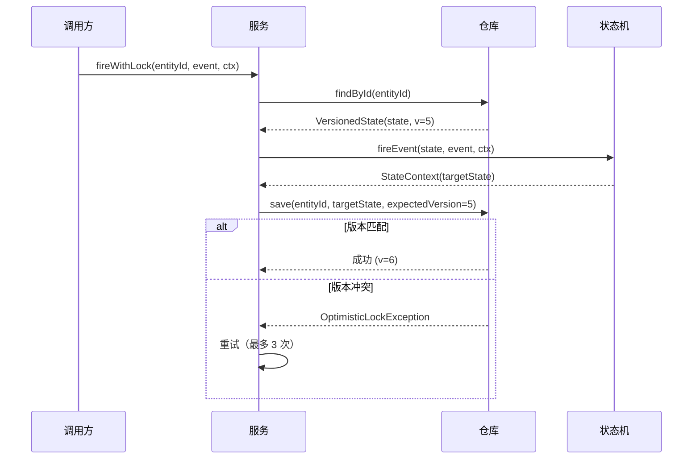

# 05 — 高级特性

> 生产级能力：持久化、校验、幂等性、可观测性、事件溯源、弹性、超时和图表生成。

---

## 1. 状态持久化与乐观锁

### 问题

在并发环境中，多个线程或服务可能同时尝试迁移同一个实体。没有锁的话，"最后写入获胜"问题可能会损坏状态。

### 解决方案

通过版本号实现乐观锁的 `StateRepository` 接口。

```java
// 仓库接口（双泛型：状态类型 + ID 类型）
public interface StateRepository<S, ID> {
    VersionedState<S> load(ID id);
    long compareAndSet(ID id, long expectedVersion, S newState);
    long save(ID id, S state);
    boolean exists(ID id);
    boolean delete(ID id);
}

// 带版本的状态 record
public record VersionedState<S>(S state, long version) {
    public static <S> VersionedState<S> initial(S state) { ... }
}

// 乐观锁异常
public class OptimisticLockException extends RuntimeException {
    public OptimisticLockException(String entityId, long expected, long actual) { ... }
}
```

### 自动重试使用

```java
ChatEngineStateMachineService service = new ChatEngineStateMachineService(machine, repository);

// fireWithLock 在版本冲突时自动重试（默认 3 次）
StateContext<ConversationState, ConversationFact, CbolStateContext> result =
    service.fireWithLock("conv-123", ConversationFact.USER_MESSAGE, context);
```

### 流程



### 实现

| 实现 | 用例 |
|---|---|
| `InMemoryStateRepository` | 测试、单节点、开发 |
| 自定义 JDBC/MongoDB | 生产（实现接口） |

---

## 2. 构建时校验

### 问题

无效的状态机配置（不可达状态、缺少初始状态、重复迁移）通常在运行时才被发现，导致生产事故。

### 解决方案

在构建时检查 8 条规则的 `StateMachineValidator`。

### 校验规则

| 规则 | 级别 | 描述 |
|---|---|---|
| `NO_TRANSITIONS` | ERROR | 状态机有零条迁移 |
| `INITIAL_STATE_DEFINED` | ERROR | 未配置初始状态 |
| `INITIAL_STATE_REACHABLE` | WARNING | 初始状态没有入向迁移 |
| `END_STATE_NO_OUTGOING` | WARNING | 终态有出向迁移 |
| `UNREACHABLE_STATE` | WARNING | 状态没有入向迁移且不是初始状态 |
| `DEAD_END_STATE` | WARNING | 状态没有出向迁移且不是终态 |
| `INTERNAL_TRANSITION_MATCH` | ERROR | INTERNAL 迁移的源和目标不同 |
| `DUPLICATE_TRANSITION_NO_GUARD` | WARNING | 同一 (state, event) 有多条迁移但没有 guard |

### 使用

```java
// 构建期间校验
StateMachine<OrderState, OrderEvent, OrderContext> machine =
    StateMachineBuilder.<OrderState, OrderEvent, OrderContext>builder("order")
        .initialState(OrderState.CREATED)
        .transition()
            .from(OrderState.CREATED).on(OrderEvent.PAY).to(OrderState.PAID)
        .and()
        .build(true);  // validate=true，ERROR 时抛出

// 或单独校验
List<ValidationError> errors = StateMachineValidator.validate(machine);
errors.forEach(e -> System.out.println(e.level() + ": " + e.message()));
```

### ValidationError

```java
public record ValidationError(
    String rule,        // 例如 "UNREACHABLE_STATE"
    Level level,        // ERROR 或 WARNING
    String message,     // 人类可读的描述
    String state,       // 相关状态（可能为 null）
    String event        // 相关事件（可能为 null）
) {}
```

---

## 3. 幂等性

### 问题

事件可能被多次投递（网络重试、消息队列至少一次投递）。没有幂等性的话，同一个事件可能触发多次状态迁移。

### 解决方案

通过唯一事件 ID 去重事件的 `IdempotentStateMachineDecorator`。

```java
ProcessedEventStore store = new InMemoryProcessedEventStore();
IdempotentStateMachineDecorator<OrderState, OrderEvent, OrderContext> idempotent =
    new IdempotentStateMachineDecorator<>(machine, store);

// 第一次调用：处理事件
StateContext<...> result1 = idempotent.fireEventWithId("evt-001", OrderState.CREATED, OrderEvent.PAY, ctx);

// 相同 ID 的第二次调用：返回缓存结果，不重新处理
StateContext<...> result2 = idempotent.fireEventWithId("evt-001", OrderState.CREATED, OrderEvent.PAY, ctx);
// result1.equals(result2)
```

### ProcessedEventStore

```java
public interface ProcessedEventStore {
    boolean contains(String eventId);
    void store(String eventId, StateContext<?, ?, ?> result);
    Optional<StateContext<?, ?, ?>> get(String eventId);
    void clear();
}
```

---

## 4. 可观测性 — 指标（Micrometer）

### 问题

没有指标的话，无法监控状态机健康状况：迁移延迟、错误率、被拒绝的事件。

### 解决方案

集成 Micrometer 的 `MonitoredStateMachine` 装饰器（可选依赖）。

### 指标

| 指标 | 类型 | 标签 | 描述 |
|---|---|---|---|
| `statemachine.transition.duration` | Timer | machine, from, to, event | 迁移延迟 |
| `statemachine.transition.success` | Counter | machine, from, to, event | 成功迁移 |
| `statemachine.transition.error` | Counter | machine, from, to, event, error | 动作失败 |
| `statemachine.transition.denied` | Counter | machine, from, event, reason | 被拒绝（无规则/guard） |
| `statemachine.event.received` | Counter | machine, from, event | 接收的总事件数 |

### 使用

```java
MeterRegistry registry = ...; // Spring 自动配置的或 SimpleMeterRegistry
StateMachine<OrderState, OrderEvent, OrderContext> monitored =
    new MonitoredStateMachine<>(machine, registry);

// 所有 fireEvent 调用自动被检测
monitored.fireEvent(OrderState.CREATED, OrderEvent.PAY, ctx);
```

### Spring Boot 集成

```yaml
# application.yml
management:
  endpoints:
    web:
      exposure:
        include: prometheus,metrics
  metrics:
    tags:
      application: cbol-messaging
```

---

## 5. 事件溯源

### 问题

需要所有状态变更的完整审计追踪，用于调试、合规和状态重建。

### 解决方案

将每次迁移记录为不可变事件的 `EventSourcedStateMachine` 装饰器。

### StateTransitionEvent

```java
public record StateTransitionEvent<S, E>(
    String entityId,          // conversation/order ID
    String machineId,         // 状态机标识符
    S fromState,              // 源状态
    S toState,                // 目标状态
    E event,                  // 触发事件
    boolean accepted,         // 迁移是否被接受
    String denialReason,      // 被拒绝时的原因
    long durationMs,          // 迁移耗时
    String traceId,           // 分布式追踪 ID
    Instant timestamp,        // 发生时间
    Map<String, String> metadata  // 额外上下文
) {}
```

### Store 接口

```java
public interface StateTransitionStore<S, E> {
    void append(StateTransitionEvent<S, E> event);
    List<StateTransitionEvent<S, E>> replay(String entityId);
    List<StateTransitionEvent<S, E>> replayUpTo(String entityId, Instant upTo);
    Optional<S> reconstructState(String entityId);  // 重放被接受的事件
    int count(String entityId);
    Optional<StateTransitionEvent<S, E>> lastEvent(String entityId);
}
```

### 使用

```java
StateTransitionStore<ConversationState, ConversationFact> store =
    new InMemoryStateTransitionStore<>();

StateMachine<ConversationState, ConversationFact, CbolStateContext> eventSourced =
    new EventSourcedStateMachine<>(machine, store, "conv-123");

// 所有迁移自动被记录
eventSourced.fireEvent(ConversationState.INITIATED, ConversationFact.USER_MESSAGE, ctx);

// 重放和重建
List<StateTransitionEvent<...>> history = store.replay("conv-123");
Optional<ConversationState> current = store.reconstructState("conv-123");
```

### 时间旅行查询

```java
// 2026-01-01T10:00:00Z 时的状态是什么？
Instant pointInTime = Instant.parse("2026-01-01T10:00:00Z");
List<StateTransitionEvent<...>> eventsAtTime = store.replayUpTo("conv-123", pointInTime);
```

---

## 6. 弹性 — 失败处理

### 问题

状态机迁移可能失败（无规则、guard 失败、动作异常）。需要针对不同失败场景的可配置策略。

### 解决方案

带可插拔 `FailureHandler` 策略的 `ResilientStateMachine` 装饰器。

### 失败类型

| 类型 | 描述 |
|---|---|
| `NO_TRANSITION` | (state, event) 不存在迁移规则 |
| `GUARD_FAILED` | 所有 guard 条件评估为 false |
| `ACTION_ERROR` | 迁移动作抛出异常 |

### 内置策略

| 策略 | 行为 | 用例 |
|---|---|---|
| `ThrowFailureHandler` | 抛出 `StateMachineException` | 默认，快速失败 |
| `ReturnSourceFailureHandler` | 返回源状态，`accepted=false` | 静默忽略，检查返回值 |
| `FallbackStateFailureHandler` | 迁移到配置的回退状态 | 死信、ERROR 隔离 |
| `RetryFailureHandler` | 退避重试，然后委托 | 瞬时失败、乐观锁 |

### 使用

```java
// 1. 失败时抛出（默认）
StateMachine<...> resilient = new ResilientStateMachine<>(machine, new ThrowFailureHandler<>());

// 2. 返回源状态（无异常）
StateMachine<...> resilient = new ResilientStateMachine<>(machine, new ReturnSourceFailureHandler<>());
StateContext<...> result = resilient.fireEvent(state, event, ctx);
if (!result.isTransitionAccepted()) {
    // 处理拒绝
}

// 3. 回退到 ERROR 状态
StateMachine<...> resilient = new ResilientStateMachine<>(machine,
    new FallbackStateFailureHandler<>(OrderState.ERROR));

// 4. 指数退避重试，然后回退
FailureHandler<...> fallback = new FallbackStateFailureHandler<>(OrderState.ERROR);
RetryFailureHandler<...> retry = RetryFailureHandler.exponentialBackoff(
    3,           // 最大重试次数
    fallback,    // 耗尽后的处理器
    100,         // 初始延迟 ms
    5000         // 最大延迟 ms
);
StateMachine<...> resilient = new ResilientStateMachine<>(machine, retry);
```

---

## 7. 超时事件 / 定时迁移

### 问题

当实体在某个状态停留过久时需要自动触发事件（空闲超时、转接超时、结束宽限）。

### 解决方案

在状态进入时自动调度超时、在状态退出时自动取消的 `TimeoutAwareStateMachine` 装饰器。

### TimeoutConfig

```java
TimeoutConfig<ConversationState, ConversationFact> idleTimeout =
    TimeoutConfig.<ConversationState, ConversationFact>builder()
        .state(ConversationState.IN_PROGRESS)
        .timeoutEvent(ConversationFact.IDLE_TIMEOUT)
        .duration(30)
        .timeUnit(TimeUnit.SECONDS)
        .build();  // 默认一次性

// 重复超时（例如每 60 秒发送提醒）
TimeoutConfig<...> reminder = TimeoutConfig.<...>builder()
    .state(ConversationState.WAITING)
    .timeoutEvent(ConversationFact.SEND_REMINDER)
    .duration(60)
    .timeUnit(TimeUnit.SECONDS)
    .repeat(true)
    .build();
```

### 调度器

```java
StateMachineTimeoutScheduler<ConversationState, ConversationFact> scheduler =
    new InMemoryTimeoutScheduler<>("conversation-timeout", 4);
```

### 使用

```java
Map<ConversationState, TimeoutConfig<ConversationState, ConversationFact>> timeouts = Map.of(
    ConversationState.IN_PROGRESS, idleTimeout,
    ConversationState.TRANSFERRING, transferTimeout
);

StateMachine<ConversationState, ConversationFact, CbolStateContext> timeoutAware =
    new TimeoutAwareStateMachine<>(machine, scheduler, timeouts, "conv-123");

// 进入 IN_PROGRESS 自动启动 30 秒计时器
timeoutAware.fireEvent(ConversationState.INITIATED, ConversationFact.USER_MESSAGE, ctx);

// 离开 IN_PROGRESS 自动取消计时器
timeoutAware.fireEvent(ConversationState.IN_PROGRESS, ConversationFact.AGENT_JOIN, ctx);

// 如果 30 秒内没有离开，IDLE_TIMEOUT 自动触发
```

### 查询超时状态

```java
boolean IN_PROGRESS = timeoutAware.isTimeoutActive();
long remainingMs = timeoutAware.getRemainingTimeoutMs();
timeoutAware.cancelTimeout();  // 手动取消
```

### CBOL 监控器替换

| 现有监控器 | 超时配置 |
|---|---|
| `CustomerIdleMonitor` | `IN_PROGRESS` → 30s → `IDLE_TIMEOUT` |
| `TransferMonitor` | `TRANSFERRING` → 60s → `TRANSFER_TIMEOUT` |
| `EndingGraceMonitor` | `ENDING` → 10s → `END_GRACE_TIMEOUT` |

---

## 8. 图表生成

### 问题

在文档中手动维护状态图容易出错且很快过时。

### 解决方案

直接从状态机配置生成图表的 `StateMachineDiagramGenerator`。

### Mermaid

```java
String mermaid = StateMachineDiagramGenerator.toMermaid(machine);
// 输出：
// stateDiagram-v2
//     title order-machine
//     [*] --> CREATED
//     CREATED --> PAID : PAY
//     PAID --> SHIPPED : SHIP
//     SHIPPED --> DELIVERED : DELIVER
//     DELIVERED --> [*]
```

### PlantUML

```java
String plantUml = StateMachineDiagramGenerator.toPlantUml(machine);
// 输出：
// @startuml
// title order-machine
// skinparam state { ... }
// [*] --> CREATED
// CREATED --> PAID : PAY
// ...
// @enduml
```

### 迁移表

```java
String table = StateMachineDiagramGenerator.toTransitionTable(machine);
// | # | From | Event | To | Kind | Guard | Action |
// |---|------|-------|----|------|-------|--------|
// | 1 | CREATED | PAY | PAID | EXTERNAL | - | Yes |
```

### 特性

- 初始状态标记（`[*] --> STATE`）
- 终态（`STATE --> [*]`）
- 带 guard（`[guard]`）和 action（`/ action`）指示符的事件标签
- 内部迁移作为自环
- 带注释的隔离状态检测

---

## 9. 装饰器组合

所有高级特性都实现为装饰器，允许灵活组合：

```java
// 组合：幂等 + 指标 + 事件溯源 + 弹性 + 超时感知
StateMachine<OrderState, OrderEvent, OrderContext> pipeline =
    new TimeoutAwareStateMachine<>(
        new ResilientStateMachine<>(
            new EventSourcedStateMachine<>(
                new MonitoredStateMachine<>(
                    new IdempotentStateMachineDecorator<>(
                        machine,
                        eventStore
                    ),
                    meterRegistry
                ),
                transitionStore,
                "order-123"
            ),
            new ThrowFailureHandler<>()
        ),
        timeoutScheduler,
        timeoutConfigs,
        "order-123"
    );
```

### 推荐顺序（从最外层到最内层）

1. **TimeoutAware** — 最外层，管理所有内容周围的计时器
2. **Failover** — 捕获所有内层的动作错误并生成失败事件
3. **Resilient** — 在故障转移前处理失败（重试）
4. **EventSourced** — 记录所有迁移（包括重试和故障转移）
5. **Monitored** — 收集所有迁移的指标
6. **Idempotent** — 最内层，处理前去重
7. **SimpleStateMachine** — 核心引擎

---

## 10. 故障转移（动作错误 → 失败事件）

### 10.1 概述

`FailoverStateMachine` 是一个装饰器，当动作抛出未处理异常时自动生成**失败事件**。失败事件然后通过状态机重新触发，以遵循预定义的**失败分支**（例如 ERROR 状态）。

这与 `ResilientStateMachine`（重试或返回回退状态）不同：故障转移将异常视为驱动状态机通过专用错误处理流程的事件。

### 10.2 关键设计决策

| 决策 | 理由 |
|----------|-----------|
| 仅处理**动作错误**（带 cause 的 StateMachineException），不处理逻辑错误（无迁移 / guard 失败） | 逻辑错误是调用方 bug，不是系统失败 |
| **失败事件不会触发另一次故障转移** | 防止失败分支本身失败时的无限循环 |
| **可与 ResilientStateMachine 组合** | 先重试（瞬时错误），再故障转移（永久错误） |
| 失败事件由可配置的 `failEventProvider` 生成 | 每个领域可以定义自己的失败事件（例如 `SYS_ACTION_FAILED`） |

### 10.3 使用

```java
StateMachine<OrderState, OrderEvent, OrderContext> machine = ...;

// 故障转移：动作错误时，触发 ORDER_FAILED 事件
StateMachine<OrderState, OrderEvent, OrderContext> failover = new FailoverStateMachine<>(
    machine,
    ctx -> OrderEvent.ORDER_FAILED,                              // 失败事件提供者
    event -> event == OrderEvent.ORDER_FAILED                    // 失败事件谓词（循环预防）
);

// 当动作抛出时：
//   1. COLA StateMachine 抛出 StateMachineException
//   2. 状态保持不变（action-first 原则）
//   3. 业务层应捕获异常并处理故障转移逻辑
// 注意：FailoverStateMachine/ResilientStateMachine 是 v3.0 中移除的自定义功能
// COLA StateMachine 使用 action-first 原则：动作失败抛出异常，状态不变
ConversationState result = machine.fireEvent(ConversationState.IN_PROGRESS, ConversationFact.CUSTOMER_CLOSE, ctx);
// result == ConversationState.ENDING（如果动作成功）
// 抛出 StateMachineException（如果动作失败，状态保持 IN_PROGRESS）
```

### 10.4 与重试组合（推荐模式）

```java
// 1. 指数退避重试 3 次
FailureHandler<...> fallback = new FallbackStateFailureHandler<>(OrderState.ERROR);
RetryFailureHandler<...> retry = RetryFailureHandler.exponentialBackoff(3, fallback, 100, 5000);
StateMachine<...> resilient = new ResilientStateMachine<>(machine, retry);

// 2. 如果重试耗尽，通过失败事件故障转移到 ERROR 状态
StateMachine<...> withFailover = new FailoverStateMachine<>(
    resilient,
    ctx -> OrderEvent.ORDER_FAILED,
    event -> event == OrderEvent.ORDER_FAILED
);
```

### 10.5 CBOL 集成

对于 CBOL 会话状态机：

- **失败事件**：`SYS_ACTION_FAILED`
- **失败分支**：所有非终态 → `ERROR`
- **恢复**：`ERROR` → `IN_PROGRESS`（`SYS_RETRY`）或 `CLOSED`（`SYS_ABORT`）

```java
StateMachine<ConversationState, ConversationFact, CbolStateContext> base =
    ConversationStateMachineFactory.build();

FailoverStateMachine<ConversationState, ConversationFact, CbolStateContext> failover =
    new FailoverStateMachine<>(
        base,
        ctx -> ConversationFact.SYS_ACTION_FAILED,
        event -> event == ConversationFact.SYS_ACTION_FAILED
    );
```

### 10.6 FailoverContext

`failEventProvider` 接收包含以下内容的 `FailoverContext`：

- `sourceState` — 失败事件前的状态
- `originalEvent` — 触发失败动作的事件
- `context` — 业务上下文
- `cause` — 原始 RuntimeException
- `causeMessage()` / `causeType()` — 用于日志记录的便捷方法

这允许失败事件携带诊断信息（例如存储在 ExtendedState 或上下文中供以后分析）。

---

## 11. 汇总表

| 特性 | 包 | 关键类 | 依赖 |
|---|---|---|---|
| 持久化 | `statemachine.persistence` | `StateRepository`, `InMemoryStateRepository` | 无 |
| 校验 | `statemachine.validation` | `StateMachineValidator` | 无 |
| 幂等性 | `statemachine.idempotency` | `IdempotentStateMachineDecorator` | 无 |
| 指标 | `statemachine.metrics` | `MonitoredStateMachine` | Micrometer（可选） |
| 事件溯源 | `statemachine.eventsourcing` | `EventSourcedStateMachine` | 无 |
| 弹性 | `statemachine.resilience` | `ResilientStateMachine` | 无 |
| 故障转移 | `statemachine.resilience` | `FailoverStateMachine` | 无 |
| 超时 | `statemachine.timeout` | `TimeoutAwareStateMachine` | 无 |
| 图表 | `statemachine.diagram` | `StateMachineDiagramGenerator` | 无 |
| 事件驱动 | `statemachine.event` | `StandardEvent`, `EventDispatcher` | 无 |
