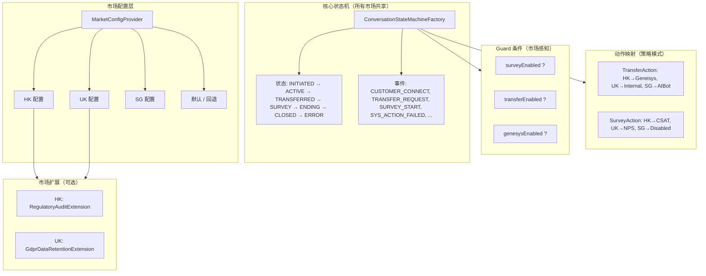

# 多市场状态机设计

> 版本：1.0 | 最后更新：2026-09-01
> 状态：设计提案（待评审）

## 1. 背景与需求

### 1.1 问题陈述

CBOL 消息中心将部署到**多个市场**（HK、UK、SG 等）。每个市场共享**相似的主流程**（连接 → 活跃 → 转接 → 满意度调查 → 结束 → 关闭），但在以下方面存在**差异**：

- 启用哪些功能（满意度调查、转接、Genesys 集成）
- 超时阈值（空闲、转接、结束宽限、满意度调查）
- 业务规则（路由策略、回退行为）
- 监管要求（数据保留、审计日志）
- 连接器配置（AIBot 端点、Genesys 组织、WebSocket 设置）

### 1.2 关键问题

> 我们应该使用**配置控制**（一个状态机 + 市场级配置）还是**每个市场设计一份**（独立的状态机实例）？

### 1.3 设计原则

1. **DRY（不要重复自己）**：主流程逻辑应定义一次
2. **开闭原则**：新市场应可在不修改核心代码的情况下添加
3. **显式优于隐式**：市场差异应可见且可审计
4. **可测试性**：每个市场的行为应可独立验证
5. **运维简洁性**：配置更改不应需要代码部署

---

## 2. 方案比较

### 2.1 方案 A：配置控制（单状态机 + 市场配置）

**方法**：一个状态机定义，所有差异由 `StateMachineMarketConfig` 控制。

| 优点 | 缺点 |
|------|------|
| 代码复用，主流程单一真相源 | 配置复杂度随市场差异增长 |
| 新市场 = 添加配置，无需改代码 | 极端差异可能需要"配置即代码"（反模式） |
| 跨市场行为一致 | 更难调试（是配置还是代码？） |
| 易于推出全局变更 | 需要灵活的配置模型（guard、动作映射、状态扩展） |
| 维护成本较低 | 市场特定的变通方案可能污染核心代码 |

**最适合**：市场**80%+ 相似**，差异主要在阈值和功能开关。

---

### 2.2 方案 B：每个市场一份（独立状态机实例）

**方法**：每个市场有自己的状态机工厂，带自定义迁移、动作和状态。

| 优点 | 缺点 |
|------|------|
| 最大灵活性，每个市场完全独立 | 大量代码重复 |
| 高度差异化市场实现简单 | 全局变更需要同步 N 份 |
| 易于调试（问题隔离到一个市场） | 容易漂移（一个市场得到修复，其他没有） |
| 无配置复杂度 | 新市场 = 复制粘贴 + 修改，容易出错 |
| 市场特定代码清晰分离 | 维护成本高（与市场数量线性相关） |

**最适合**：市场**<50% 相似**，业务逻辑根本不同。

---

### 2.3 方案 C：混合（推荐）

**方法**：核心状态机定义**主流程**（所有市场共享）。市场差异通过以下方式处理：

1. **市场级配置** — 阈值、功能开关、连接器设置
2. **Guard 条件** — 由市场配置门控的迁移（例如 `surveyEnabled`）
3. **动作映射** — 同一事件按市场触发不同动作（策略模式）
4. **扩展点** — 通过模块化扩展添加市场特定状态/事件
5. **市场配置文件** — 预定义的配置包（例如 `HK-profile`、`UK-profile`）

| 优点 | 缺点 |
|------|------|
| 主流程定义一次，差异显式 | 需要提前设计扩展点 |
| 新市场 = 选择配置文件 + 覆盖配置 | 中等配置复杂度（但可管理） |
| 全局变更自动传播 | 市场特定代码需要清晰分离 |
| 足够灵活以应对差异化市场 | 初始设计工作量略高 |
| 配置更改不需要代码部署 | 需要良好的配置校验工具 |

**最适合**：我们的场景 — 市场共享主流程但有有意义的差异。

---

## 3. 推荐设计：混合方法

### 3.1 架构概述



### 3.2 配置模型

#### 3.2.1 扩展的 StateMachineMarketConfig

```java
@Builder
public record StateMachineMarketConfig(
    // === 超时 ===
    long customerIdleSeconds,
    long transferTimeoutSeconds,
    long endingGraceSeconds,
    long surveyTimeoutSeconds,

    // === 功能开关 ===
    boolean surveyEnabled,
    boolean transferEnabled,
    boolean genesysEnabled,
    boolean aibotEnabled,
    boolean regulatoryAuditEnabled,

    // === 业务规则 ===
    String fallbackRoutingStrategy,      // DROP / REQUEUE / FALLBACK_QUEUE
    String surveyType,                    // CSAT / NPS / CES
    String transferTarget,                // GENESYS / INTERNAL_QUEUE / AIBOT
    int maxTransferRetries,

    // === 连接器设置 ===
    String aibotEndpoint,
    String genesysOrgId,
    String websocketEndpoint,

    // === 扩展 ===
    List<String> enabledExtensions        // 例如 ["HKRegulatoryAudit", "UKGdprRetention"]
) {
    public static StateMachineMarketConfig defaultConfig() { ... }
}
```

#### 3.2.2 市场配置文件（YAML）

```yaml
# config/markets/hk.yaml
market: HK
profile: hk-standard
timeouts:
  customerIdleSeconds: 300
  transferTimeoutSeconds: 180
  endingGraceSeconds: 120
  surveyTimeoutSeconds: 300
features:
  surveyEnabled: true
  transferEnabled: true
  genesysEnabled: true
  aibotEnabled: true
  regulatoryAuditEnabled: true
businessRules:
  fallbackRoutingStrategy: REQUEUE
  surveyType: CSAT
  transferTarget: GENESYS
  maxTransferRetries: 3
connectors:
  aibotEndpoint: https://aibot.hk.example.com
  genesysOrgId: hk-org-001
extensions:
  - HKRegulatoryAudit
```

```yaml
# config/markets/uk.yaml
market: UK
profile: uk-standard
timeouts:
  customerIdleSeconds: 600      # UK: 更长的空闲超时
  transferTimeoutSeconds: 240
  endingGraceSeconds: 180
  surveyTimeoutSeconds: 600
features:
  surveyEnabled: true
  transferEnabled: true
  genesysEnabled: false          # UK: 无 Genesys
  aibotEnabled: true
  regulatoryAuditEnabled: false
businessRules:
  fallbackRoutingStrategy: FALLBACK_QUEUE
  surveyType: NPS                # UK: NPS 而非 CSAT
  transferTarget: INTERNAL_QUEUE
  maxTransferRetries: 2
connectors:
  aibotEndpoint: https://aibot.uk.example.com
extensions:
  - UKGdprRetention
```

```yaml
# config/markets/sg.yaml
market: SG
profile: sg-lite
timeouts:
  customerIdleSeconds: 300
  transferTimeoutSeconds: 180
  endingGraceSeconds: 120
features:
  surveyEnabled: false           # SG: 无满意度调查
  transferEnabled: true
  genesysEnabled: false
  aibotEnabled: true
businessRules:
  fallbackRoutingStrategy: DROP
  transferTarget: AIBOT
  maxTransferRetries: 1
connectors:
  aibotEndpoint: https://aibot.sg.example.com
```

### 3.3 市场感知状态机构建

#### 3.3.1 Guard 条件

迁移通过 guard 条件由市场配置门控：

```java
// 示例：SURVEY_START 仅在 surveyEnabled 时允许
builder.transition()
    .from(ConversationState.ACTIVE)
    .on(ConversationFact.SURVEY_START)
    .to(ConversationState.SURVEY_IN_PROGRESS)
    .guard(ctx -> ctx.marketConfig().surveyEnabled())
    .and();

// 示例：TRANSFER_REQUEST 仅在 transferEnabled 时允许
builder.transition()
    .from(ConversationState.ACTIVE)
    .on(ConversationFact.TRANSFER_REQUEST)
    .to(ConversationState.TRANSFERRED)
    .guard(ctx -> ctx.marketConfig().transferEnabled())
    .and();
```

#### 3.3.2 动作映射（策略模式）

同一事件按市场触发不同动作：

```java
// 转接动作策略
public interface TransferAction {
    void execute(CbolStateContext ctx);
}

public class GenesysTransferAction implements TransferAction { ... }
public class InternalQueueTransferAction implements TransferAction { ... }
public class AibotTransferAction implements TransferAction { ... }

// 工厂：按市场配置解析动作
public class TransferActionFactory {
    public TransferAction getAction(StateMachineMarketConfig config) {
        return switch (config.transferTarget()) {
            case "GENESYS" -> new GenesysTransferAction();
            case "INTERNAL_QUEUE" -> new InternalQueueTransferAction();
            case "AIBOT" -> new AibotTransferAction();
            default -> throw new IllegalArgumentException("Unknown transferTarget: " + config.transferTarget());
        };
    }
}

// 在状态机定义中
builder.transition()
    .from(ConversationState.ACTIVE)
    .on(ConversationFact.TRANSFER_REQUEST)
    .to(ConversationState.TRANSFERRED)
    .guard(ctx -> ctx.marketConfig().transferEnabled())
    .perform(ctx -> transferActionFactory.getAction(ctx.marketConfig()).execute(ctx))
    .and();
```

#### 3.3.3 市场扩展（可选）

对于不适合核心模型的市场特定状态/事件：

```java
public interface MarketExtension {
    String getName();
    void registerTransitions(StateMachineBuilder<ConversationState, ConversationFact, CbolStateContext> builder);
    void registerActions(CbolStateContext ctx);
}

// HK: 每次状态变更的监管审计
public class HKRegulatoryAuditExtension implements MarketExtension {
    public String getName() { return "HKRegulatoryAudit"; }

    public void registerTransitions(StateMachineBuilder<...> builder) {
        // 如有需要添加 HK 特定迁移
    }

    public void registerActions(CbolStateContext ctx) {
        // 添加审计日志监听器
    }
}

// UK: 会话关闭时的 GDPR 数据保留
public class UKGdprRetentionExtension implements MarketExtension { ... }

// 在状态机工厂中
List<MarketExtension> extensions = config.enabledExtensions().stream()
    .map(name -> extensionRegistry.get(name))
    .filter(Objects::nonNull)
    .toList();

extensions.forEach(ext -> ext.registerTransitions(builder));
```

### 3.4 市场感知服务层

```java
public class CbolStateMachineService {
    private final StateMachine<ConversationState, ConversationFact, CbolStateContext> machine;
    private final MarketConfigProvider configProvider;

    public StateContext<...> fire(String conversationId, String market, ConversationFact fact) {
        StateMachineMarketConfig config = configProvider.getConfig(market);
        CbolStateContext ctx = buildContext(conversationId, config);
        return machine.fireEvent(ctx.conversation().state(), fact, ctx);
    }

    // closeConversation: 仅在 surveyEnabled 时走满意度调查路径
    public StateContext<...> closeConversation(String conversationId, String market) {
        StateMachineMarketConfig config = configProvider.getConfig(market);
        ConversationFact fact = config.surveyEnabled()
            ? ConversationFact.SURVEY_START
            : ConversationFact.CUSTOMER_CLOSE;
        return fire(conversationId, market, fact);
    }
}
```

---

## 4. 实施路线图

### 阶段 1：仅配置差异（低成本）

- [ ] 用所有阈值/开关字段扩展 `StateMachineMarketConfig`
- [ ] 为 `surveyEnabled`、`transferEnabled`、`genesysEnabled` 添加 guard 条件
- [ ] 实现 `YamlMarketConfigLoader` 从 YAML 文件加载配置
- [ ] 添加带刷新支持的 `MarketConfigProvider` 缓存
- [ ] 为每个市场配置文件编写测试

**预估工作量**：2-3 天

### 阶段 2：动作映射

- [ ] 定义 `TransferAction`、`SurveyAction`、`EndAction` 策略接口
- [ ] 实现市场特定动作类
- [ ] 创建可按配置解析的动作工厂
- [ ] 将动作接入状态机迁移
- [ ] 为每个动作变体编写测试

**预估工作量**：3-4 天

### 阶段 3：市场扩展

- [ ] 定义 `MarketExtension` 接口
- [ ] 实现 `ExtensionRegistry`
- [ ] 实现 HK 监管审计扩展
- [ ] 实现 UK GDPR 保留扩展
- [ ] 将扩展接入状态机构建
- [ ] 为扩展加载和执行编写测试

**预估工作量**：3-5 天

### 阶段 4：工具与运维

- [ ] 配置校验工具（启动时校验所有市场配置）
- [ ] 配置差异工具（比较两个市场配置）
- [ ] 每市场状态机图表生成器（显示哪些迁移处于活动状态）
- [ ] 配置热重载支持（无需重启刷新配置）
- [ ] 监控仪表板（每市场状态分布、错误率）

**预估工作量**：2-3 天

---

## 5. 风险评估与缓解

| 风险 | 可能性 | 影响 | 缓解措施 |
|------|-----------|--------|------------|
| 配置变得过于复杂（意大利面配置） | 中 | 高 | 从仅配置开始，仅在需要时添加动作映射/扩展。为每个市场设置"复杂度预算"。 |
| 市场特定代码泄漏到核心 | 中 | 中 | 严格的包分离：`cbol.extension.hk.*`、`cbol.extension.uk.*`。核心代码不得引用市场名称。 |
| 市场间配置漂移（行为不一致） | 中 | 中 | 配置校验 + 差异工具。定期配置审计。默认配置文件作为基线。 |
| 难以调试市场特定问题 | 中 | 中 | 所有状态迁移记录市场 + 配置快照。每市场追踪 ID。审计日志中的配置版本。 |
| 扩展排序冲突 | 低 | 中 | 扩展声明依赖项。注册表在启动时校验 DAG。 |
| 配置查找的性能开销 | 低 | 低 | 配置缓存在内存中。配置对象是不可变的（record）。每次迁移无 DB 调用。 |
| 新市场需要代码部署（扩展） | 低 | 中 | 扩展是可选的。大多数市场应仅用配置即可工作。扩展作为独立 jar 部署。 |

---

## 6. 评估与建议

### 6.1 为什么不选方案 A（纯配置）？

纯配置控制在差异是**简单开关和阈值**时有效。但我们的市场在以下方面存在差异：
- **转接机制**（Genesys vs 内部队列 vs AIBot）— 需要不同代码路径
- **满意度调查类型**（CSAT vs NPS）— 需要不同的调查 UI 和数据模型
- **监管要求**（HK 审计、UK GDPR）— 需要不同的事件监听器和数据处理

这些差异无法在不创建"配置编程语言"（反模式）的情况下干净地表达为配置。

### 6.2 为什么不选方案 B（每市场一份）？

我们的市场共享**80%+ 的主流程**：
- 状态定义相同
- 大多数迁移相同
- 错误处理（故障转移、重试）相同
- 监控和审计基础设施相同

创建独立状态机会重复这些共享逻辑，导致：
- 维护负担（在 3+ 个地方修复 bug）
- 行为不一致（一个市场得到功能，其他没有）
- 上手成本（新市场 = 复制粘贴 + 修改）

### 6.3 建议：方案 C（混合）

**采用分阶段推出的混合方法：**

1. **从阶段 1（仅配置）开始** — 覆盖约 70% 的差异
2. **在转接/满意度调查差异需要不同代码时添加阶段 2（动作映射）**
3. **仅为有真正独特需求的市场（HK 监管、UK GDPR）添加阶段 3（扩展）**
4. **大多数市场应永远不需要扩展** — 配置 + 动作映射应足够

### 6.4 成功标准

- [ ] 新市场可在 < 1 天内仅用配置上线（无需改代码）
- [ ] 全局 bug 修复自动应用于所有市场
- [ ] 每个市场的活动迁移可可视化（配置感知图表）
- [ ] 配置更改可在部署前校验
- [ ] 市场特定行为可独立测试
- [ ] 核心状态机代码中不出现市场名称

---

## 7. 附录

### 7.1 市场比较矩阵（示例）

| 功能 | HK | UK | SG |
|---------|----|----|----|
| 满意度调查 | CSAT，启用 | NPS，启用 | 禁用 |
| 转接 | Genesys | 内部队列 | AIBot |
| 空闲超时 | 300秒 | 600秒 | 300秒 |
| 转接超时 | 180秒 | 240秒 | 180秒 |
| 监管审计 | 必需 | 不需要 | 不需要 |
| 数据保留 | 90 天 | 30 天（GDPR） | 90 天 |
| 回退策略 | REQUEUE | FALLBACK_QUEUE | DROP |

### 7.2 参考

- 现有 `StateMachineMarketConfig` — 当前配置模型（需要扩展）
- 现有 `MarketConfigProvider` — 配置提供者接口（需要 YAML 加载器）
- `05-Advanced-Features.md` — 与多市场无缝协作的装饰器模式（Failover、Resilient）
- `02-CBOL-Business-Layer-Design.md` — 当前 CBOL 业务层设计
