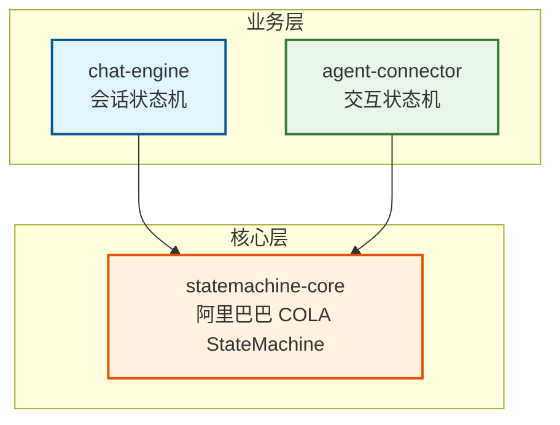
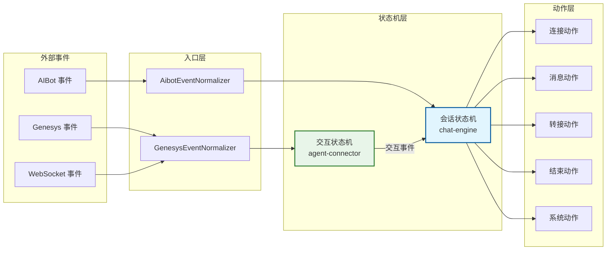

# 状态机文档

> 基于阿里巴巴 COLA StateMachine 的多模块状态机项目设计文档和使用指南。

## 文档索引

| # | 文档 | 描述 |
|---|------|------|
| 00 | [架构概览](./00-Architecture-Overview.md) | 高层架构、多模块结构、设计原则、包结构、关键决策 |
| 01 | [状态机核心设计](./01-State-Machine-Core-Design.md) | 基于阿里巴巴 COLA StateMachine 的核心框架：Action、Condition、State、Transition、Builder DSL、StateMachineFactory、性能特性 |
| 02 | [业务层设计](./02-CBOL-Business-Layer-Design.md) | chat-engine（会话状态机）+ agent-connector（交互状态机）：状态/事件、上下文、多市场配置、监控器、服务、连接器 |
| 03 | [状态转换图](./03-State-Transition-Diagrams.md) | Mermaid 状态图、转换表、监控流程图、事件分类、默认配置 |
| 04 | [使用指南](./04-Usage-Guide.md) | 快速开始、COLA Builder DSL、多市场、监控器、异步动作、错误处理、测试、最佳实践、Spring Boot 集成、Demo 使用 |
| 05 | [高级特性](./05-Advanced-Features.md) | 持久化与乐观锁、构建时验证、幂等性、指标、事件溯源、弹性/故障处理、超时事件、故障转移、装饰器组合 |
| 06 | [多市场设计](./06-Multi-Market-Design.md) | 多市场架构：配置控制 vs 每市场 vs 混合、市场感知守卫/动作/扩展、实施路线图、风险评估 |
| 07 | [多市场最佳实践](./07-Multi-Market-Best-Practices/README.md) | 8 个详细最佳实践指南：三层配置继承、市场差异可视化、路由与隔离、配置即代码 GitOps、金丝雀发布、熔断与降级、模式验证、测试矩阵 |

## 项目架构

### 模块依赖图



### 事件驱动编排流程



## 更新日志

### v4.0 (2026-09-05)
- **事件驱动编排设计 (v4.0)**：将两个状态机与最新设计文档对齐
- **chat-engine 重构**：
  - 更新 ConversationState：7 个状态（NEW, INITIATED, ACTIVE, IN_PROGRESS, TRANSFERRED, ENDING, CLOSED）— 新增 ACTIVE，移除 ERROR
  - 更新 ConversationFact：25+ 个事件，对齐 ConversationFactEvent 定义
  - 重写 ConversationStateMachineFactory，定义新的状态转换
  - 创建 13 个新的 action 类，按 lifecycle/transfer/ending/system 分类
  - 删除 15 个旧的 action 类
  - 更新监控器、归一化器、demo 和测试
- **agent-connector 重构**：
  - 更新 InteractionState：8 个状态（INITIATED, CONNECTED, IN_PROGRESS, DEGRADED, RECONNECTING, CONSULT_TRANSFER, TRANSFERRED, CLOSED）
  - 更新 InteractionFact：20+ 个事件，对齐 InteractionFactEvent 定义
  - 重写 InteractionStateMachineFactory，定义 30+ 个状态转换
  - 创建 14 个新的 action 类，按 connection/messaging/heartbeat/reconnection/genesys/transfer/ending/system 分类
  - 删除 9 个旧的 action 类
  - 更新 GenesysEventNormalizer、demo 和 InteractionInstance（添加 withState 方法）
  - 添加 InteractionStateMachineTest，包含 21 个测试用例
- **测试结果**：所有 69 个测试通过（48 个 chat-engine + 21 个 agent-connector），BUILD SUCCESS

### v3.0 (2026-09-04)
- **核心引擎替换**：用阿里巴巴 COLA StateMachine（`com.alibaba.cola.statemachine`）替换自定义状态机实现
  - COLA GitHub：https://github.com/alibaba/COLA
  - 状态机模块：`cola-components/cola-component-statemachine`
  - 包名：`com.alibaba.cola.statemachine`
- **API 变更**：
  - `StateMachine.fireEvent(S sourceState, E event, C ctx)` 直接返回目标状态 `S`
  - `Action.execute(S from, S to, E event, C context)` — COLA Action 接口
  - Builder API：`StateMachineBuilderFactory.create()` + `externalTransition()` + `from().to().on().when().perform()`
  - 状态机注册：`StateMachineFactory.register(sm)` / `StateMachineFactory.get(machineId)`
- **chat-engine 适配**：
  - 7 个 Action 实现直接实现 COLA `Action<ConversationState, ConversationFact, CbolStateContext>`
  - `ConversationStateMachineFactory` 用 COLA Builder API 重写
  - `ChatEngineStateMachineService.fire()` 返回 `ConversationState`
  - 添加工厂缓存机制，防止重复构建状态机
- **agent-connector 适配**：
  - 9 个 Action 实现直接实现 COLA `Action<InteractionState, InteractionFact, AgentConnectorStateContext>`
  - `InteractionStateMachineFactory` 用 COLA Builder API 重写
  - `AgentConnectorStateMachineService` 用 COLA API 重写
  - 在 `create()` 方法中添加工厂缓存机制
- **测试结果**：所有测试通过（chat-engine：36 个测试，statemachine-core：219 个 COLA 测试）
- **移除**：自定义 `StateMachineRegistry`、`StateContext`、`CbolAction` 接口、自定义持久化层

### v2.4 (2026-09-03)
- **注册表重构（方案 A）**：
  - 在 statemachine-core 中为 `StateMachineRegistry` 添加 `getInstance()` 静态方法用于全局单例访问
  - 移除重复的业务层注册表类
  - 更新所有业务代码直接使用 `StateMachineRegistry.getInstance()`

### v2.3 (2026-09-03)
- **代码质量修复（P0）**：
  - 修复 3 个 Monitor 类的参数命名
  - 修复 CustomerIdleMonitor 中过时的 Javadoc
- **ActionWorker 改进（P1）**：
  - 添加 `submitWithResult()` 方法，返回 `CompletableFuture<Void>`
  - 添加 `submitWithCallback()` 方法，带成功/失败回调

### v2.2 (2026-09-03)
- **状态重命名**：`ACTIVE` → `IN_PROGRESS`
- **移除状态**：`SURVEY_IN_PROGRESS` — 问卷现在是 `IN_PROGRESS` 内的内部子阶段
- **新增状态**：`NEW` — 初始状态，会话记录已创建但未初始化
- **问卷重新设计**：`SURVEY_START` 现在是内部转换（`IN_PROGRESS → IN_PROGRESS`）

### v2.1 (2026-09-03)
- 添加 Action-First Transition 设计原则
- 添加 6 个具体动作实现

## 多模块结构

```
state-machine/
├── pom.xml                          # 父 POM（packaging=pom）
├── statemachine-core/               # 阿里巴巴 COLA StateMachine 核心引擎
│   └── com.alibaba.cola.statemachine
├── chat-engine/                     # 会话状态机（业务层）
│   └── com.selfdevelopment.chatengine
├── agent-connector/                 # 交互状态机（通道层）
│   └── com.selfdevelopment.agentconnector
└── docs/                            # 本文档
```

### 模块职责

| 模块 | 包名 | 职责 |
|------|------|------|
| **statemachine-core** | `com.alibaba.cola.statemachine` | 阿里巴巴 COLA StateMachine 核心引擎：Action、Condition、State、Transition、Builder、StateMachineFactory、StateMachineException |
| **chat-engine** | `com.selfdevelopment.chatengine` | 会话状态机：7 个状态（NEW、INITIATED、ACTIVE、IN_PROGRESS、TRANSFERRED、ENDING、CLOSED）、25+ 个事件、13 个动作、多市场配置、监控器、仓库、Demo |
| **agent-connector** | `com.selfdevelopment.agentconnector` | 交互状态机：8 个状态（INITIATED、CONNECTED、IN_PROGRESS、DEGRADED、RECONNECTING、CONSULT_TRANSFER、TRANSFERRED、CLOSED）、20+ 个事件、14 个动作、通道连接器、Demo |

## 关键设计原则

1. **Action-First 转换**：动作在状态转换之前同步执行。如果动作失败，抛出异常，状态保持不变。
2. **无状态引擎**：状态机引擎只存储转换规则；当前状态由业务层注入。
3. **表驱动**：ConcurrentHashMap O(1) 查找转换。
4. **泛型类型安全**：COLA StateMachine 使用泛型实现类型安全的状态、事件和上下文。
5. **多市场支持**：配置驱动的每市场行为（HK、SG、UK 等）。
6. **独立状态机**：会话和交互是独立的状态机，具有独立的上下文。

## 快速开始

```java
// 1. 构建状态机（COLA Builder API）
StateMachineBuilder<ConversationState, ConversationFact, CbolStateContext> builder =
        StateMachineBuilderFactory.create();

builder.externalTransition()
        .from(ConversationState.NEW)
        .to(ConversationState.INITIATED)
        .on(ConversationFact.SESSION_STARTED)
        .perform(new SessionStartedAction());

StateMachine<ConversationState, ConversationFact, CbolStateContext> sm =
        builder.build("conversation");
StateMachineFactory.register(sm);

// 2. 触发事件
CbolStateContext ctx = buildContext();
ConversationState newState = sm.fireEvent(ConversationState.NEW, ConversationFact.SESSION_STARTED, ctx);
```

## 参考资料

- 阿里巴巴 COLA StateMachine：https://github.com/alibaba/COLA
- COLA StateMachine 模块：`cola-components/cola-component-statemachine`

---

*最后更新：2026-09-05（v4.0 — 事件驱动编排设计对齐）*
